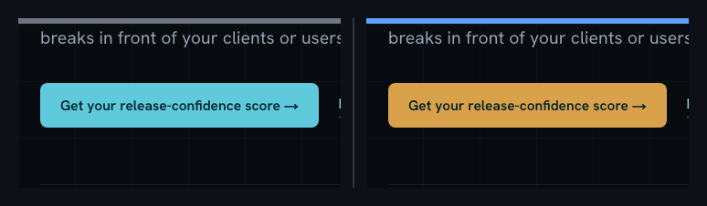

# StyleProof

> **Prove a CSS refactor changed nothing.** Capture the browser's _computed styles_ and diff before against after. If the diff is empty, the refactor is certified: not "looks the same", but _resolves byte-for-byte the same_.

[](https://www.npmjs.com/package/styleproof)
[](https://github.com/BenSheridanEdwards/styleproof/actions/workflows/ci.yml)
[](./LICENSE)

StyleProof captures every resolved CSS longhand on every element, every
pseudo-element (`::before`/`::after`/`::marker`/`::placeholder`), and every forced
`:hover`/`:focus`/`:active` state, swept across your breakpoints, keyed by DOM
structure rather than class names. Then it diffs two captures and tells you the exact
element, property, and state that drifted, or certifies that nothing did.

Built for CSS-to-Tailwind migrations, design-system swaps, stylesheet consolidation,
and any refactor where "trust me, it's identical" isn't good enough.

```
home@1280: 1 element(s) differ
  body > main:nth-child(2) > section:nth-child(5) > a:nth-child(1)  (.cta)
    border-bottom-color: rgb(95, 202, 219) → rgb(229, 231, 235)
    border-bottom-style: none → solid

  [:hover] body > nav:nth-child(1) > a:nth-child(3)
    border-color: rgb(95, 202, 219) → (state no longer changes it)

✗ 1 DOM change(s), 2 computed-style difference(s), 1 state-delta difference(s) across 12 surfaces
```

---

## Why computed styles certify a refactor where pixels cannot

Pixel diffing is the right tool for _catching_ visual drift, but it cannot _certify_ a
refactor, because most of a stylesheet is invisible to a screenshot:

- **Hover, focus, and active states.** A deleted `:hover` rule renders identically
  until a human points a mouse at it. This tool forces each pseudo-class through the
  Chrome DevTools Protocol (`CSS.forcePseudoState`) and records exactly what each
  state changes, including parent-state rules that restyle descendants. (`:focus`
  forces `:focus` and `:focus-visible` together.)
- **Hidden elements.** A closed mobile menu is `display: none` in every screenshot,
  but its panel, items, and animations still have computed styles, and they're
  compared.
- **Between-breakpoint rules.** Screenshots sample two or three viewports. The style
  map sweeps one width per `@media` band, so a dropped `max-width: 680px` override is
  caught even if your screenshot widths never land in that band.
- **Sub-threshold drift.** Every pixel comparison needs a tolerance for antialiasing,
  and a tolerance is a place for a real 1px change to hide. Computed values need no
  tolerance: `13.5px` either equals `13.5px` or it doesn't.
- **Declared motion.** Transitions and animations are captured as declared longhands
  (then frozen so every other value is a settled end state), so changing
  `transition: all .2s` to `.3s` is a diff even though no still image could see it.

Screenshots and style maps complement each other: pixels catch what you forgot to
model, the style map certifies what pixels can't see. Use both.

## Install

```sh
# from npm (peer dep: @playwright/test):
npm i -D styleproof @playwright/test
```

Until the first npm release you can install straight from GitHub:

```sh
npm i -D github:BenSheridanEdwards/styleproof @playwright/test
```

Requirements: Node 18+, `@playwright/test` >= 1.40, a Chromium-capable Playwright
install (`npx playwright install chromium`). The only runtime dependency is
[`pngjs`](https://www.npmjs.com/package/pngjs) (pure JS, no native build).

A runnable spec lives in [`example/`](example/).

## 60-second quickstart

**1. Write a capture spec** listing your **surfaces** — each one a deterministic page
state plus the viewport widths to sweep. `npx styleproof-init` scaffolds the file below
(with a `settle()` helper and a `playwright.config.ts` if you don't have one); or write
it by hand:

```ts
// e2e/styleproof.spec.ts
import { defineStyleMapCapture, type Surface } from 'styleproof';

const SURFACES: Surface[] = [
  {
    key: 'home',
    go: async (page) => {
      await page.goto('/', { waitUntil: 'networkidle' });
      await page.evaluate(() => document.fonts.ready);
    },
    ignore: ['.live-feed'], // nondeterministic regions, skipped entirely
    widths: [1280, 768, 390], // one per @media band of the route's CSS
  },
  {
    key: 'home-menu-open', // states matter: model them as surfaces
    go: async (page) => {
      await page.goto('/', { waitUntil: 'networkidle' });
      await page.getByRole('button', { name: 'Menu' }).click();
    },
    widths: [390],
  },
];

defineStyleMapCapture({ surfaces: SURFACES, dir: process.env.STYLEMAP_DIR });
```

The spec is **inert** unless `STYLEMAP_DIR` is set, so it costs nothing in a normal
test run.

**2. Capture a baseline and commit it** — **always against a production build**, dev
servers inject their own styles:

```sh
STYLEMAP_DIR=baseline npx playwright test styleproof   # writes __stylemaps__/baseline/*.json.gz + *.png
git add e2e/__stylemaps__/baseline && git commit -m "stylemap baseline"
```

The `.json.gz` maps are small (a content-heavy page gzips to ~80 KB); the `.png`
full-page screenshots let the report crop changed regions later.

**3. Let CI diff every push** against that committed baseline:

```sh
STYLEMAP_DIR=ci npx playwright test styleproof
npx styleproof-diff e2e/__stylemaps__/baseline e2e/__stylemaps__/ci
```

An empty diff exits `0` (certified). A non-empty diff exits `1` and names every
element, property, and state that drifted. After an _intentional_ change, regenerate
the baseline and commit it with your diff — the gate is a ratchet, not a freeze.

## Core concepts

### StyleMap

A `StyleMap` is the JSON snapshot of one page state at one width. It has three layers:

- **`elements`** — every element's computed style, pruned against per-tag UA defaults
  (measured live in a stylesheet-free iframe) so files stay small, plus its
  pseudo-elements and its document-space bounding box (so reports can crop the
  screenshot around it).
- **`states`** — for every interactive element (`a, button, input, textarea, select,
summary, [role="button"], [tabindex]`), the delta that `:hover`, `:focus` /
  `:focus-visible`, and `:active` apply, forced via CDP with no real mouse or focus,
  captured over the element's whole subtree so parent-state descendant rules are seen.
- **`defaults`** — the per-tag UA baseline used to prune `elements`, kept so the diff
  can resolve a pruned property back to its default when only one side set it.

### Surfaces

A **surface** is one deterministic page state worth certifying. You give it a `key`, a
`go(page)` function that navigates and drives the page to that state (ending
_settled_: fonts loaded, entrance animations done), an optional `ignore` list of
selectors for nondeterministic regions, and the `widths` to sweep. Distinct states
(menu open, dialog open, selected tab, form error) are distinct surfaces.

### DOM-structure keys

Every element is keyed by its structural path, `body > nav:nth-child(3) >
a:nth-child(2)`, **never by class name**. A migration can rewrite every `class`
attribute freely while the map stays comparable. If the DOM itself changes, the diff
says so loudly under a `DOM` finding: a CSS-only refactor must not touch structure.

Custom properties (`--*`) are deliberately ignored: they are inputs, not outcomes.
Every visual effect of a variable lands in a real longhand that _is_ compared, so
renaming a token is invisible while changing what an element resolves to is not.
(This also silences Tailwind's `--tw-*` machinery.)

### Derived / reflow-noise filtering

The **certification differ** (`styleproof-diff`) compares everything, including
layout-derived longhands (`width`, `height`, `top`, `transform-origin`…), because a
reflow _is_ a change to certify. The **report** filters those by default: on a reflow
they change all the way up the ancestor chain (`body`, `main`, `section`…), and an
element whose _only_ changes are derived is a reflow casualty, not a styling change,
so it must not anchor a crop region (that would zoom the crop to the whole page).
Pass `includeLayoutNoise: true` to keep them in the report too.

### The readable report

When a diff is _intentional_, you want to look at it, not read a wall of longhands.
`styleproof-report` crops the before/after screenshots around the **outermost changed
element** (descendants fold into their ancestor, nearby regions merge), stitches each
pair into one labelled side-by-side image (grey bar = before, blue bar = after), and
writes the exact changes as a per-element table. It collapses the noise: shorthand
families (`padding: 26px 24px → 28px`), logical / `currentColor` duplicates dropped,
repeated tokens folded (`368px ×3`), identical sibling elements grouped (`×5`),
labelled by their semantic class, colours in their own cells so GitHub renders
swatches.



<sub>◀ before · after ▶ — grey bar = before, blue bar = after</sub>

> **`div.who-grid`**
>
> | Property                | Before               | After                |
> | ----------------------- | -------------------- | -------------------- |
> | `grid-template-columns` | `368px ×3`           | `548px ×2`           |
> | `gap`                   | `1px`                | `12px`               |
> | `border-color`          | `rgb(150, 172, 205)` | `rgb(229, 231, 235)` |
>
> **`h3`** ×5 · **`div.who`** ×3 …

The whole imaging pipeline is Playwright + Node, **no browser interaction**. Captures
save a full-page screenshot next to each map by default, so the committed baseline
carries both the facts and the pixels; generating a report never rebuilds the old code.

## API reference

Everything is exported from the package root:

```ts
import {
  captureStyleMap,
  saveStyleMap,
  loadStyleMap,
  defineStyleMapCapture,
  diffStyleMaps,
  diffStyleMapDirs,
  findingLabel,
  generateStyleMapReport,
  summarizeProps,
  prettyLabel,
} from 'styleproof';
```

| Export                   | Signature                                                                         | Description                                                                                                                                                                                                                                           |
| ------------------------ | --------------------------------------------------------------------------------- | ----------------------------------------------------------------------------------------------------------------------------------------------------------------------------------------------------------------------------------------------------- |
| `captureStyleMap`        | `(page: Page, options?: CaptureOptions) => Promise<StyleMap>`                     | Capture the page's complete style map. Drive the page to the target state first; it reads whatever is in front of it. Records elements, pseudo-elements, forced `:hover`/`:focus`/`:active` deltas, declared motion, and each element's bounding box. |
| `saveStyleMap`           | `(filePath: string, map: StyleMap) => void`                                       | Write a map to disk; gzipped when the path ends in `.gz`. Creates parent dirs.                                                                                                                                                                        |
| `loadStyleMap`           | `(filePath: string) => StyleMap`                                                  | Read a map written by `saveStyleMap` (`.json` or `.json.gz`).                                                                                                                                                                                         |
| `defineStyleMapCapture`  | `(opts: DefineOptions) => void`                                                   | Generate one Playwright test per surface × width, saving `<baseDir>/<dir>/<key>@<width>.json.gz` (+ `.png`). Skips entirely when `dir` is undefined, so the spec is inert in normal runs. Call at module top level in a `.spec.ts`.                   |
| `diffStyleMaps`          | `(a: StyleMap, b: StyleMap) => Finding[]`                                         | Structured diff of two maps for the same surface: DOM, style, and state findings.                                                                                                                                                                     |
| `diffStyleMapDirs`       | `(dirA: string, dirB: string) => { surfaces: SurfaceDiff[]; counts: DiffCounts }` | Diff every same-named capture between two directories. Throws if neither dir has any `.json(.gz)` captures.                                                                                                                                           |
| `findingLabel`           | `(path: string, cls: string) => string`                                           | Human label: structural path plus a truncated `.class` hint (first 3 classes).                                                                                                                                                                        |
| `generateStyleMapReport` | `(opts: ReportOptions) => ReportResult`                                           | Crop the before/after screenshots around changed regions and write `report.md`, `report.json`, and `crops/*.png`.                                                                                                                                     |
| `summarizeProps`         | `(props: PropChange[]) => PropChange[]`                                           | The report's property collapser: dedupe logical aliases, fold `currentColor` echoes, collapse shorthand families (`padding: 26px 24px`), round and run-length values. Exported for downstream report builders.                                        |
| `prettyLabel`            | `(path: string, cls: string) => string`                                           | Label an element by its semantic marker class (`div.who-grid`) rather than its structural path.                                                                                                                                                       |

### Key exported types

```ts
type Rect = [number, number, number, number]; // document-space [x, y, w, h], rounded

type StyleMap = {
  defaults: Record<string, Props>; // per-tag UA baseline
  elements: Record<string, ElementEntry>; // keyed by structural path
  states: Record<string, Record<string, Record<string, Props>>>; // path → state → subpath → props
};

type ElementEntry = {
  tag: string;
  cls: string;
  rect?: Rect;
  style: Props; // Record<string, string>
  pseudo?: Record<string, Props>; // '::before' | '::after' | '::marker' | '::placeholder'
};

type CaptureOptions = {
  ignore?: string[]; // selectors skipped with their subtrees
  captureStates?: boolean; // capture forced :hover/:focus/:active deltas (default true)
  maxInteractive?: number; // cap forced-state elements per surface (default 800)
};

type Surface = {
  key: string; // unique file-name prefix
  go: (page: Page) => Promise<void>;
  ignore?: string[];
  widths: number[]; // one per @media band
  height?: number | ((width: number) => number); // default 800
};

type DefineOptions = {
  surfaces: Surface[];
  dir: string | undefined; // capture label; undefined = skip
  baseDir?: string; // default '__stylemaps__'
  screenshots?: boolean; // default true
};

type PropChange = { prop: string; before: string; after: string };

type Finding =
  | { kind: 'dom'; path: string; cls: string; change: 'added' | 'removed' | 'retagged'; detail?: string }
  | { kind: 'style'; path: string; cls: string; pseudo: string | null; props: PropChange[] }
  | { kind: 'state'; path: string; cls: string; state: string; sub: string; props: PropChange[] };

type SurfaceDiff = { surface: string; missing?: 'before' | 'after'; findings: Finding[] };
type DiffCounts = { dom: number; style: number; state: number };

type ReportOptions = {
  beforeDir: string;
  afterDir: string;
  outDir: string;
  imageBaseUrl?: string; // prefix for image URLs in report.md (default: relative paths)
  pad?: number; // padding around changed rects (default 24)
  minWidth?: number; // default 320
  minHeight?: number; // default 180
  maxHeight?: number; // crops clamped to this (default 1600)
  maxCrops?: number; // regions per surface before collapsing to one (default 6)
  includeLayoutNoise?: boolean; // keep size/position-derived longhands (default false)
};

type ReportResult = {
  changedSurfaces: number;
  totalFindings: number;
  reportMdPath: string;
  reportJsonPath: string;
};
```

```ts
// Example: programmatic use, same engines as the CLIs.
const map = await captureStyleMap(page, { ignore: ['.live-feed'] });
saveStyleMap('maps/home@1280.json.gz', map);
const before = loadStyleMap('maps/home@1280.json.gz');

const findings = diffStyleMaps(before, map);
const { surfaces, counts } = diffStyleMapDirs('maps/before', 'maps/after');
generateStyleMapReport({ beforeDir: 'maps/before', afterDir: 'maps/after', outDir: 'report' });
```

## CLI reference

The three bins are installed on your PATH (run via `npx` or an npm script). They read
the built `dist/`, so they work from the installed package out of the box. Each takes
`-h`/`--help`.

### `styleproof-init` — scaffold a capture spec

```
styleproof-init [--dir <path>] [--base-url <url>] [--force]
```

| Flag               | Default                  | Description                                                             |
| ------------------ | ------------------------ | ----------------------------------------------------------------------- |
| `--dir <path>`     | `e2e/styleproof.spec.ts` | Where to write the starter spec (with a `settle()` helper + a Surface). |
| `--base-url <url>` | `http://localhost:3000`  | `baseURL` for a generated `playwright.config.ts` (only if none exists). |
| `--force`          | off                      | Overwrite the spec if it already exists. Idempotent without it.         |

Exit `0` on success (or nothing to do), `2` on a usage error. An existing
`playwright.config.ts` is never touched.

### `styleproof-diff` — the certification gate

```
styleproof-diff <beforeDir> <afterDir> [--max N] [--json <file>]
```

| Flag                                 | Default | Description                                                                                   |
| ------------------------------------ | ------- | --------------------------------------------------------------------------------------------- |
| `<beforeDir>`                        | —       | Directory of baseline `.json(.gz)` captures (required).                                       |
| `<afterDir>`                         | —       | Directory of fresh `.json(.gz)` captures (required).                                          |
| `--max N` (or `--max=N`)             | `40`    | Max diff lines printed per surface before truncating. (The GitHub Action passes `--max=200`.) |
| `--json <file>` (or `--json=<file>`) | —       | Also write the structured `{ counts, surfaces }` result to `<file>`.                          |

| Exit code | Meaning                                                                                        |
| --------- | ---------------------------------------------------------------------------------------------- |
| `0`       | Identical — every computed style, pseudo-element, and state matches. **Certified.**            |
| `1`       | Differences found (DOM, style, and/or state).                                                  |
| `2`       | Usage or capture error (bad args, missing dir, no captures, non-finite `--max`, unknown flag). |

### `styleproof-report` — the reviewable visual report

```
styleproof-report <beforeDir> <afterDir> --out <dir> [options]
```

| Flag                                   | Default             | Description                                                                                                                   |
| -------------------------------------- | ------------------- | ----------------------------------------------------------------------------------------------------------------------------- |
| `<beforeDir>`                          | —                   | Baseline captures (`.json.gz` + `.png` for crops).                                                                            |
| `<afterDir>`                           | —                   | Fresh captures (`.json.gz` + `.png` for crops).                                                                               |
| `--out <dir>` (or `--out=<dir>`)       | `styleproof-report` | Output directory: writes `report.md`, `report.json`, `crops/*.png`.                                                           |
| `--image-base-url <url>` (or `=<url>`) | relative paths      | Prefix for image URLs in `report.md` (e.g. a raw GitHub URL). Omit to keep relative paths that render from a committed file.  |
| `--pad <px>`                           | `24`                | Padding around the changed rects when cropping.                                                                               |
| `--max-crops <n>`                      | `6`                 | Max crop regions per surface before collapsing to one union crop.                                                             |
| `--min-width <px>`                     | `320`               | Minimum crop width, for context around tiny changes.                                                                          |
| `--min-height <px>`                    | `180`               | Minimum crop height.                                                                                                          |
| `--include-layout-noise`               | off                 | Keep size/position-derived longhands (`height`, `width`, `transform-origin`, `top`…) in the report instead of filtering them. |

| Exit code | Meaning                                                                       |
| --------- | ----------------------------------------------------------------------------- |
| `0`       | No changes — an empty report was written.                                     |
| `1`       | Report generated (one or more changed surfaces).                              |
| `2`       | Usage error (wrong arg count, unknown/non-numeric flag, or capture/IO error). |

Numeric flags also accept the `--flag=value` form. The remaining `maxHeight` knob
(crop height clamp, default 1600) is available through the programmatic
`generateStyleMapReport` API.

## GitHub Action

The repo ships a composite action that diffs two capture dirs and, on changes, commits a
compact report to an orphan branch and posts it to the PR. The comment updates in place on
every push and flips to ✓ when clean. It runs in one of two modes — **certify a refactor**
(default) or **review visual changes** with per-change sign-off (`require-approval`); see
[Two modes](#two-modes-certify-a-refactor-or-review-visual-changes) below.

```yaml
- name: Capture style maps
  run: STYLEMAP_DIR=ci npx playwright test styleproof

- name: Style-map report
  uses: BenSheridanEdwards/styleproof@v1
  with:
    baseline-dir: e2e/__stylemaps__/baseline
    fresh-dir: e2e/__stylemaps__/ci
    # report-branch: styleproof-reports   # default (orphan; created on first run)
    # inline-images: auto               # auto | always | never
    # fail-on-diff: 'true'              # default
```

### Inputs

| Input              | Required | Default               | Description                                                                                                                     |
| ------------------ | -------- | --------------------- | ------------------------------------------------------------------------------------------------------------------------------- |
| `baseline-dir`     | yes      | —                     | Directory with the committed baseline captures (`.json.gz` + `.png`).                                                           |
| `fresh-dir`        | yes      | —                     | Directory with the freshly captured maps to compare.                                                                            |
| `report-branch`    | no       | `styleproof-reports`  | Orphan branch that stores reports (created on first run). One `pr-<n>/` folder per PR; never pruned.                            |
| `inline-images`    | no       | `auto`                | `auto` \| `always` \| `never`. `auto` embeds composites in the comment for public repos and links the report for private repos. |
| `github-token`     | no       | `${{ github.token }}` | Token used to push the report branch and post the comment.                                                                      |
| `fail-on-diff`     | no       | `'true'`              | Legacy refactor mode: fail the job on any diff. Ignored when `require-approval` is `'true'`.                                    |
| `require-approval` | no       | `'false'`             | Review-gate mode: set a `StyleProof` commit status (red until each change is approved) instead of failing the job. See below.   |
| `status-context`   | no       | `StyleProof`          | Name of the commit status set in review-gate mode (must match the approve workflow + branch protection).                        |

### Outputs

| Output       | Description                                                         |
| ------------ | ------------------------------------------------------------------- |
| `changed`    | `"true"` when any computed style, pseudo-element, or state changed. |
| `report-url` | Blob URL of the committed report (when changed).                    |

### Two modes: certify a refactor, or review visual changes

- **Certify (default, `fail-on-diff: true`).** Any computed-style change fails the job.
  Right for a refactor you expect to be a no-op (a CSS-to-Tailwind migration); "approving"
  a change means regenerating the committed baseline and pushing it.
- **Review gate (`require-approval: true`).** The report is the product: every PR shows
  _what changed visually_, and a reviewer signs each change off against the PR's stated
  intent. Instead of failing the job, the Action sets a **`StyleProof` commit status** —
  green when nothing changed, red until approved — and posts **one approval checkbox per
  change**. The gate goes green only when **every** box is ticked.

To enable the review gate:

1. Set `require-approval: 'true'` on the Action, and grant the job `statuses: write`
   (plus the existing `contents: write` / `pull-requests: write`).
2. Copy [`example/styleproof-approve.yml`](example/styleproof-approve.yml) to
   `.github/workflows/` **on your default branch** (`issue_comment` workflows only run
   from the default branch).
3. Add a branch-protection rule that **requires the `StyleProof` status** to pass.

A reviewer with write access walks the report change-by-change and ticks each box; the
status updates ("2 of 3 approved") and flips green at full approval. A new push that
changes styles re-opens the gate. The approval is bound to the exact reviewed commit and
acts only on a human edit of the bot's own comment, so it can't be flipped green by a
later push, by the bot's own comment updates, or by anyone without write access. Pair it
naturally with a head-vs-**base-branch** diff (capture the base branch into `baseline-dir`)
so each PR's report is exactly _what this PR changes_.

Two things to know about the trust model:

- **Single-reviewer by design.** Any write-access user can tick the boxes, **including the
  PR author on their own PR** — the sign-off is "I confirm this is intentional," not
  multi-party review. If you need a different person to approve, add a branch-protection
  rule requiring a review from someone other than the author (CODEOWNERS); this gate
  doesn't enforce that itself.
- **Use the default `GITHUB_TOKEN`.** The approve workflow only acts on a comment authored
  by a bot (so an attacker-authored comment can never trigger it). If you post the report
  with a personal access token (a `User`), the workflow won't fire and the gate can never
  go green. A GitHub App token works; a PAT does not.

### Why two image modes (and why it's automatic)

The two ways an image can appear on a PR have **opposite** privacy behaviour, so
`inline-images: auto` picks per repo:

| Placement                                             | How GitHub fetches it                  | Private repo                                        |
| ----------------------------------------------------- | -------------------------------------- | --------------------------------------------------- |
| **comment body** ``                           | anonymously, via the Camo proxy        | private URL **404s → broken**; needs a public URL   |
| **committed file** (`report.md` + relative `crops/…`) | through **your authenticated session** | **renders inline** — like a private README's images |

- **Public repo** → composites are embedded **directly in the comment** via the public
  `raw.githubusercontent.com/…` URL; you see the side-by-side without clicking.
- **Private repo** → the comment **links** the committed `report.md`; one click shows
  the crops inline, no public hosting, no browser.

(Embedding an image _directly in a private comment body_ is genuinely impossible from
CI — GitHub's only private-friendly image URL is `user-attachments`, whose upload
endpoint rejects API tokens with HTTP 422 and needs a logged-in browser session.)

### Orphan-branch layout and stable links

The report branch is an **orphan** (reports only, never your code), so its root is one
folder per PR plus a README:

```
styleproof-reports (orphan)
├── README.md
├── pr-9/   report.md + crops/*-composite.png
└── pr-12/  …
```

- **Stable links.** Each run overwrites `pr-<n>/`, so
  `…/blob/styleproof-reports/pr-9/report.md` is permanent for the life of the PR.
  Reports are **never pruned**; per-run history lives in the branch's git commits.
- **Compact.** Only the **composite** is committed (alpha dropped, max deflate,
  adaptive filtering): ~30–90 KB per change, a few hundred KB per PR.
- **Concurrency-safe.** Different PRs touch different folders; a rejected push just
  rebase-replays (the action retries).
- **Reclaiming history.** Git keeps every overwritten image, so a busy repo's branch
  history grows. The _tree_ (what serves the links) stays small; to shrink `.git`,
  squash the orphan branch when it's quiet — current reports keep their URLs:
  ```sh
  git checkout --orphan tmp styleproof-reports && git commit -qm "squash reports" \
    && git branch -M tmp styleproof-reports && git push -f origin styleproof-reports
  ```

## CI recipes

Every recipe is the same shape: produce a **production build**, serve it, point
`BASE_URL` (or your Playwright `baseURL`) at it, capture, diff against the committed
baseline. Use the Action step from above to also post a PR comment.

### Next.js

```yaml
- uses: actions/checkout@v4
- uses: actions/setup-node@v4
  with: { node-version: 20, cache: npm }
- run: npm ci
- run: npx playwright install --with-deps chromium
- run: npm run build
- run: npx next start -p 3000 &
- run: npx wait-on http://localhost:3000
- run: BASE_URL=http://localhost:3000 STYLEMAP_DIR=ci npx playwright test styleproof
- run: npx styleproof-diff e2e/__stylemaps__/baseline e2e/__stylemaps__/ci
```

### Vite / SPA

```yaml
- run: npm ci && npx playwright install --with-deps chromium
- run: npm run build # → dist/
- run: npx vite preview --port 4173 & # serves the production build
- run: npx wait-on http://localhost:4173
- run: BASE_URL=http://localhost:4173 STYLEMAP_DIR=ci npx playwright test styleproof
- run: npx styleproof-diff e2e/__stylemaps__/baseline e2e/__stylemaps__/ci
```

### Plain static site

```yaml
- run: npm ci && npx playwright install --with-deps chromium
- run: npm run build # → public/ or dist/
- run: npx serve -l 5000 dist & # any static server
- run: npx wait-on http://localhost:5000
- run: BASE_URL=http://localhost:5000 STYLEMAP_DIR=ci npx playwright test styleproof
- run: npx styleproof-diff e2e/__stylemaps__/baseline e2e/__stylemaps__/ci
```

### Generic build → serve → capture → diff

```sh
<your build command>                         # produce a PRODUCTION build
<your static/app server> &                   # serve it on a known port
npx wait-on http://localhost:<port>          # wait until it answers
BASE_URL=http://localhost:<port> STYLEMAP_DIR=ci npx playwright test styleproof
npx styleproof-diff e2e/__stylemaps__/baseline e2e/__stylemaps__/ci
```

Your `playwright.config.ts` reads `BASE_URL` for `use.baseURL`; surfaces use relative
paths (`page.goto('/')`).

## Baselines and the env-parity gotcha

A baseline is the committed `before` of your refactor and the certified state CI
compares against. **Capture it in the same environment CI uses.** Anything that
changes what renders must match between the baseline capture and CI's fresh capture:

- **Feature flags** that show or hide a panel.
- **API tokens** that gate a section (e.g. a live-data widget only present when a key
  is set).
- **Env-dependent copy** (a `mailto:` line built from an env var, a conditional embed).

If your local `.env` makes the page render _more_ than CI will, baselines captured
locally can never pass on the runner: the extra elements exist on one side only and
show up as DOM findings. The fix is to capture the baseline with the **same** env the
runner has (typically no `.env.local`), then commit it. After an _intentional_ style
change, regenerate the committed baseline from a production build in that same
environment and commit it with your diff.

## Determinism

Captures read whatever is in front of them, so the page must be **settled and
repeatable** before `captureStyleMap` runs. The differ has zero tolerance, so any
nondeterminism becomes a false diff. In your surface's `go`:

- **Fonts.** `await page.evaluate(() => document.fonts.ready)` before capturing —
  unloaded fonts change `font-family` fallbacks and metrics.
- **Animations / transitions.** The capture freezes them so every value is a settled
  end state, but _entrance_ animations driven by JS or IntersectionObserver must
  already have finished. Scroll the page to trigger reveals, then wait; or inject CSS
  forcing your reveal classes to their final values
  (`.reveal{opacity:1!important;transform:none!important}`).
- **Scroll-reveal.** Walk the page top to bottom (see `example/styleproof.spec.ts`'s
  `settle` helper) so every observer fires, then scroll back to `0`.
- **Live / nondeterministic regions.** List them in `ignore` (live feeds, ads,
  third-party embeds, timestamps); the elements and their subtrees are skipped.
- **Same build state.** Layout-derived values are part of the map by design, so if
  text content differs between captures, expect diffs. Capture the same build.

## Limitations

- **Chromium only for forced-state capture.** The `:hover`/`:focus`/`:active` deltas
  use CDP (`CSS.forcePseudoState`), which is Chromium-only. Base element and
  pseudo-element capture work in any Playwright browser.
- **Same machine, same browser version for before/after.** Computed values are far
  less platform-sensitive than pixels, but font metrics can still differ across OSes
  and browser builds. Capture both sides on the same runner image.
- **No shadow-DOM piercing.** Capture walks `document.querySelectorAll('body *')`; it
  does not descend into shadow roots, so a refactor inside a web component's shadow
  tree would be falsely certified identical. Capture emits a one-time warning counting
  the shadow hosts it skipped, so the gap is loud, not silent.
- **No iframe piercing.** Iframe content (same- or cross-origin) is not traversed for
  the same reason; same-origin frames are counted in the same warning. To certify a
  frame, point a separate surface at its document directly.
- **Layout-derived values are included** (used track sizes, element heights, offsets).
  This is intentional for the certification differ, but it means a content or reflow
  change produces diffs; the report filters these unless `includeLayoutNoise: true`.
- **Forced-state capture is O(interactive elements × 3 states).** A content-heavy page
  takes a few seconds per surface.

## Troubleshooting

| Symptom                                                                   | Likely cause / fix                                                                                                                                                                                                                                                    |
| ------------------------------------------------------------------------- | --------------------------------------------------------------------------------------------------------------------------------------------------------------------------------------------------------------------------------------------------------------------- |
| `npx playwright test styleproof` does nothing / spec skipped              | `STYLEMAP_DIR` is unset. The capture spec is inert by design until you set it (`STYLEMAP_DIR=before …`).                                                                                                                                                              |
| `no .json(.gz) captures found in …`                                       | You diffed before capturing, or pointed at the wrong dir. Check `<baseDir>/<label>/`.                                                                                                                                                                                 |
| `styleproof: interactive-element count skew …; skipping forced … capture` | The DOM changed between the CDP query and the page evaluate (e.g. a late-rendering widget). The base + pseudo capture still succeed; only the forced-state layer is skipped for that surface. Settle the surface fully, or `ignore` the unstable region, then re-run. |
| Capture warns about shadow hosts / iframes                                | Styles inside shadow roots and frames are not captured (see Limitations). Point a separate surface at the frame's document, or accept the gap.                                                                                                                        |
| Diffs you didn't expect, all `width`/`height`/`top`/…                     | A real reflow (content or layout changed). The differ keeps these; use the _report_ (which filters them) to see the styling intent, or capture the identical build state.                                                                                             |
| Baseline passes locally, fails in CI with DOM findings                    | Env parity: your local env renders elements CI doesn't (or vice versa). Capture the baseline in CI's environment — see _Baselines and the env-parity gotcha_.                                                                                                         |
| Diffs every run, fonts-related                                            | Fonts weren't ready at capture. Await `document.fonts.ready` (and any web-font load) in `go`.                                                                                                                                                                         |
| Private-repo PR comment shows no images, only a link                      | Expected: GitHub can't render images in a private comment body. Click the link — the committed report renders the crops inline through your session.                                                                                                                  |
| `styleproof-diff: command not found` from a fresh clone                   | The bins import the built `dist/`. Run `npm run build` first (the published npm package ships a prebuilt `dist/`).                                                                                                                                                    |

## How this compares to pixel snapshot tools

|                                                                            | **StyleProof**                  | **Percy / Chromatic**     | **Playwright `toHaveScreenshot`** |
| -------------------------------------------------------------------------- | ------------------------------- | ------------------------- | --------------------------------- |
| Compares                                                                   | computed CSS longhands          | rendered pixels           | rendered pixels                   |
| Certifies invisible state (hover/focus/active, hidden, between-breakpoint) | **yes**                         | no                        | no                                |
| Tolerance needed                                                           | **none** (exact values)         | antialiasing threshold    | `maxDiffPixels` threshold         |
| Cross-browser / cross-OS fidelity                                          | values only (no real render)    | **strong** (real renders) | good                              |
| Catches what it wasn't told to model                                       | no (model your surfaces)        | **yes** (whole frame)     | yes (the frame)                   |
| Hosted dashboard / approvals UI                                            | git-based (commit the baseline) | **yes** (SaaS)            | local/CI files                    |
| Cost                                                                       | free, MIT, self-hosted          | paid SaaS (free tiers)    | free                              |

They solve different halves of the problem. Pixel tools _catch_ drift you didn't think
to check, across real browser renders. The style map _certifies_ that a refactor
changed nothing, including the states and rules a screenshot can never see, with no
tolerance to hide a real change in. **Run both:** screenshots for discovery, the style
map for proof.

## Battle-tested: what it caught

This tool was extracted from a real CSS-to-Tailwind migration (~680 lines of bespoke
CSS across four stylesheets, certified to zero diff). Every one of these was caught by
the style map and invisible or ambiguous to pixels:

- **A base-layer reset eating button borders.** `button { border: none }` in the
  global stylesheet meant `border` + `border-color` utilities (width and colour only)
  rendered _no border at all_. Every bordered button needed an explicit
  `border-solid`. The diff named all of them.
- **`grid-cols-2` is not `1fr 1fr`.** Tailwind's `repeat(2, minmax(0, 1fr))` removes
  the min-content floor. One panel had been quietly overflowing its grid track by 8px;
  the utility version clamped it, reflowing 50 elements. On `display: none` elements
  the two forms even serialize differently.
- **`outline-none` is not `outline: none`.** Tailwind's utility is a 2px transparent
  outline (an accessibility affordance). The forced-`:focus` capture flagged three new
  longhands the original never set.
- **Shorthand resets.** `border-bottom: none` resets style _and_ colour to initial;
  zeroing just the width (`border-b-0`) leaves the preflight's gray `solid` behind.
  Same story for `hover:shadow-*` (ring placeholders), `rounded-full` (`9999px` vs
  `50%`), `items-start` (`flex-start` vs `start`), and named font utilities (dropped
  fallbacks from the stack).
- **A dropped `:hover` rule on a link** that every screenshot tool sailed past, because
  nothing hovers in a screenshot.

## Contributing

Issues and PRs welcome. See [CONTRIBUTING.md](CONTRIBUTING.md) for the dev setup, the
build/test loop, and the release process. Changes are recorded in
[CHANGELOG.md](CHANGELOG.md).

## License

MIT © Ben Sheridan-Edwards. See [LICENSE](LICENSE).
