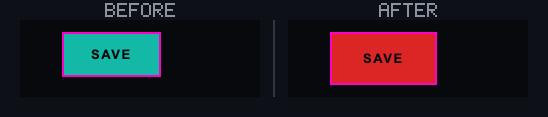
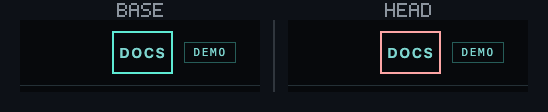
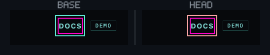
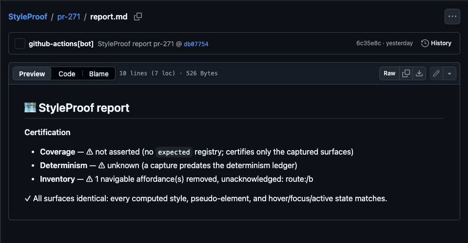
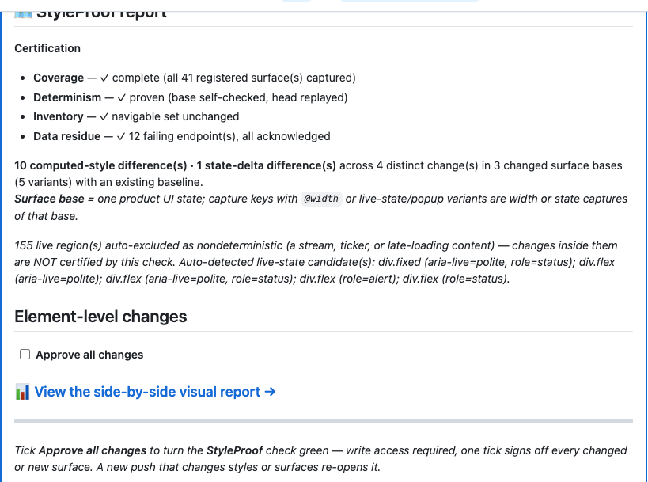
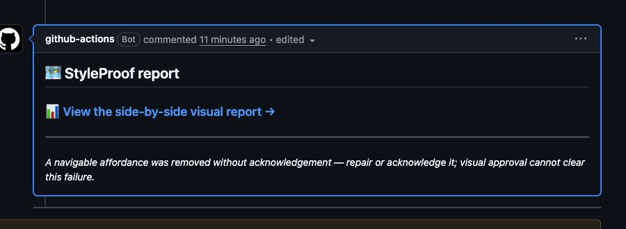

# StyleProof

**StyleProof's job is a deterministic way to see visual regressions on the
frontend. Here's what a report looks like.**

StyleProof opens the app states you care about in a real browser, compares the
base and head by computed CSS, and posts the evidence to the pull request.
Intentional changes get approved. Unexpected changes block.

[](https://www.npmjs.com/package/styleproof)
[](https://github.com/BenSheridanEdwards/StyleProof/actions)
[](https://github.com/BenSheridanEdwards/StyleProof/blob/main/LICENSE)

On a pull request, the PR comment is the same linked summary for public and private repositories.
Crops stay as relative files inside the committed report instead of being duplicated into the comment.
Private-repository viewers need repository access and an authenticated GitHub session.
If publication or receipt verification fails, StyleProof posts no delivery claim for that run.
The README can carry the crops directly. This is the unmodified product report: Save at rest comes
first, followed by Docs hover, focus, and active. Both sides of each interaction-state crop are in
that state.

<!-- styleproof-report -->

## 🗺️ StyleProof report

**2 computed-style difference(s) · 3 state-delta difference(s)** across 1 distinct change(s) in 1 changed surface base with an existing baseline.
_**Surface base** = one product UI state; capture keys with `@width` or live-state/popup variants are width or state captures of that base._

## Element-level changes

### `button.btn` · 1 element restyled

_demo-button @ 900_

`padding` `14px 28px` → `18px 32px`<br>
`background-color` `#14b8a6` → `#dc2626`


<sub>◀ before · after ▶ — demo-button @ 900</sub>



<sub>🔍 magenta boxes mark each change — changed: `button.btn`</sub>

**`button.btn`**

Style:

| Property           | Before      | After       |
| ------------------ | ----------- | ----------- |
| `padding`          | `14px 28px` | `18px 32px` |
| `background-color` | `#14b8a6`   | `#dc2626`   |

### `a.link` · 1 element restyled `:hover`

_demo-button @ 900_

_Both sides are :hover. Left is the old :hover. Right is the new :hover._

`:hover` `color` `#a5f3fc` → `#fca5a5`


<sub>◀ base :hover · head :hover ▶ — both sides are :hover</sub>


<sub>🔍 magenta boxes mark each change — changed: `a.link`</sub>

**`a.link`**

Interactive-state changes:

| State    | Property | Before → After        |
| -------- | -------- | --------------------- |
| `:hover` | `color`  | `#a5f3fc` → `#fca5a5` |

### `a.link` · 1 element restyled `:focus`

_demo-button @ 900_

_Both sides are :focus. Left is the old :focus. Right is the new :focus._

`:focus` `outline-color` `#5eead4` → `#fca5a5`



<sub>◀ base :focus · head :focus ▶ — both sides are :focus</sub>



<sub>🔍 magenta boxes mark each change — changed: `a.link`</sub>

**`a.link`**

Interactive-state changes:

| State    | Property        | Before → After        |
| -------- | --------------- | --------------------- |
| `:focus` | `outline-color` | `#5eead4` → `#fca5a5` |

### `a.link` · 1 element restyled `:active`

_demo-button @ 900_

_Both sides are :active. Left is the old :active. Right is the new :active._

`:active` `color` `#2dd4bf` → `#f87171`


<sub>◀ base :active · head :active ▶ — both sides are :active</sub>


<sub>🔍 magenta boxes mark each change — changed: `a.link`</sub>

**`a.link`**

Interactive-state changes:

| State     | Property | Before → After        |
| --------- | -------- | --------------------- |
| `:active` | `color`  | `#2dd4bf` → `#f87171` |

- [ ] **Approve all changes**

---

_Tick **Approve all changes** to turn the **StyleProof** check green — write access required, one tick signs it off. A new push that changes styles or surfaces re-opens it._

**[Quickstart](#quickstart)** ·
**[Read the catch contract](docs/what-it-catches.md)**

## See the gate work

### Comment states

A StyleProof pull-request comment is a trust state, not a score. Reviewer
approval can clear only `STYLE_REVIEW_REQUIRED`. Each state appears once.

| State                              | What the comment means                                                             | Approval box                           |
| ---------------------------------- | ---------------------------------------------------------------------------------- | -------------------------------------- |
| `NO_REVIEWABLE_STYLE_CHANGES`      | Captured computed styles match. Content/structure may still be advisory.           | Hidden. Check is green.                |
| `STYLE_REVIEW_REQUIRED`            | Reviewable style or new-surface evidence exists.                                   | Shown. One tick signs off this commit. |
| `INVENTORY_REMOVAL_UNACKNOWLEDGED` | A navigable affordance disappeared without a reasoned exclusion.                   | Hidden. Approval cannot clear it.      |
| `DATA_RESIDUE_UNACKNOWLEDGED`      | A data-boundary request failed during capture, so a fallback branch was certified. | Hidden. Approval cannot clear it.      |
| `CERTIFICATION_FAILED`             | Coverage, determinism, or report/diff consistency is incomplete.                   | Hidden. Approval cannot clear it.      |
| `PARTIAL_BASELINE`                 | The base capture missed registered surfaces.                                       | Hidden. Repair the base branch.        |
| `DEGRADED_BASELINE`                | The base capture failed. This is a head-only receipt.                              | Hidden. Not a comparison.              |
| `REPORT_PUBLICATION_FAILED`        | The comment or report branch could not be published.                               | Hidden. Delivery failed.               |

### Certified clean

[](docs/readme/certified-clean-report.md)

This report earns every green claim: the registered surface was captured, both
base and head passed the self-check, the navigable set stayed intact, no failing
data boundary was captured, and no reviewable computed-style or forced-state
change was detected among semantically matched elements.

### Review required: approve the visual changes



This is the normal feature-work state, captured from an actual production pull
request with repository details cropped out. StyleProof has found reviewable
visual changes and kept the check red. A reviewer ticks **Approve all changes**
to sign off that commit. Any later push that changes the evidence reopens the
gate.

### A safety policy blocks

[](https://github.com/BenSheridanEdwards/StyleProof/pull/284#issuecomment-4984031529)

An unacknowledged navigation removal cannot be waived as a visual change. Repair
it or acknowledge it in policy. The approval box cannot clear it.

## Enterprise fit

- **Auditable decisions.** Every approval is tied to a commit and a report with
  the rendered evidence behind the decision.
- **Fail-closed safety rails.** Coverage gaps, unproved determinism, removed
  navigation, failed data boundaries, and incompatible captures stay explicit.
- **No StyleProof-hosted service.** The CLI, Action, maps, reports, and approval
  workflow run in your repository and GitHub environment.
- **Framework and styling agnostic.** Tailwind, CSS Modules, Sass,
  styled-components, design systems, and inline styles resolve to the same
  browser-computed contract.
- **Adopt without a rewrite.** Start with discovered routes or rendered links,
  then add high-value states such as open dialogs, tabs, loading views, and
  responsive breakpoints.

## Contents

- [See the gate work](#see-the-gate-work)
  - [Comment states](#comment-states)
  - [Certified clean](#certified-clean)
  - [Review required: approve the visual changes](#review-required-approve-the-visual-changes)
  - [A safety policy blocks](#a-safety-policy-blocks)
- [Enterprise fit](#enterprise-fit)
- [Why](#why)
- [How it works](#how-it-works)
- [Quickstart](#quickstart)
- [What the PR gets](#what-the-pr-gets)
- [Two modes: review or certify](#two-modes-review-or-certify)
- [What a green certifies](#what-a-green-certifies)
- [Coverage: what you own, what's discovered](#coverage-what-you-own-whats-discovered)
- [Declaring surfaces](#declaring-surfaces)
- [Deterministic by default](#deterministic-by-default)
- [Any styling system, real breakpoints](#any-styling-system-real-breakpoints)
- [Match a design pixel-for-pixel](#match-a-design-pixel-for-pixel)
- [Forks and Dependabot](#forks-and-dependabot)
- [Optional: content layer](#optional-content-layer-advisory)
- [Optional: React component layer](#optional-react-component-layer-advisory)
- [Optional: selective remap](#optional-selective-remap-advisory)
- [Reference](#reference)
  - [Blocking without branch protection](#blocking-without-branch-protection)
- [Contributing](#contributing)
- [License](#license)

## Why

Use StyleProof when a PR can change CSS, design tokens, component classes,
layout, or hidden/open UI states and you want CI to say whether the browser's
rendered styles actually changed. Unit and e2e tests prove behavior; StyleProof
proves the visual contract for the states you declared.

It catches:

- a button recoloured by a token, utility class, CSS module, inline style, or
  design-system change;
- a layout shift at one breakpoint but not another;
- a dropped `:hover`, `:focus`, or `:active` style;
- a modal, menu, listbox, popover, sheet, or toast whose open state changed;
- a supposedly no-op refactor, such as CSS-to-Tailwind, that changed rendered
  output;
- a restyle on an element the PR also re-nested (a wrapper added or removed),
  paired back by geometry so the structural churn cannot hide it;
- a required route, component, or UI state that exists but has no capture.

The end-to-end catch contract lives in
[docs/what-it-catches.md](docs/what-it-catches.md).

## How it works

1. A **surface** is one UI state to certify: a route, tab, modal-open state,
   dropdown-open state, toast-visible state, loading state, etc.
2. You list or auto-discover surfaces in a Playwright-style spec.
3. StyleProof opens each surface at real breakpoint widths and records computed
   styles for every captured element.
4. On a PR, it compares base vs head and reports exactly which rendered styles
   changed.
5. The PR gets a `StyleProof` status: green when nothing changed, red until
   someone approves intentional changes, or failing when certification mode is
   configured.

StyleProof is not a screenshot diff. Screenshots appear in the report so humans
can see the change, but the gate compares browser-computed CSS: resolved
longhands, pseudo-elements, layout boxes, motion longhands, and forced
`:hover`/`:focus`/`:active` deltas.

Maps travel via the SHA-keyed `styleproof-maps` branch (or a CI artifact for
forks) — **never as files committed to the PR branch**. Committed maps show up
as changed files in every review, and because every PR writes the same paths,
each merge forces every other open PR to rebase. `.styleproof/` and
`stylemaps/` are gitignored to keep that door shut.

## Quickstart

### 0. Set up everything

```bash
npx styleproof setup
```

That one command detects npm, pnpm, Yarn, or Bun; installs StyleProof and
Playwright; installs Chromium; scaffolds the capture spec, dedicated Playwright
config, split GitHub workflows, and pre-push integration; then verifies every
machine-owned file against the installed release. Preview the exact operations
without writing with `npx styleproof setup --dry-run`. Existing installations
can use `styleproof setup --skip-install --skip-browser` to refresh scaffolding
without network work. In a monorepo, target the consumer application explicitly:

```bash
styleproof setup --project-dir apps/web
```

`--project-dir` changes where dependencies are installed and all setup commands
run. `--dir` remains the capture-spec path inside that project, for example
`--project-dir apps/web --dir e2e/styleproof.custom.spec.ts`.

Requires **Node ≥ 18** (ESM). Forced states are Chromium-only.

### 1. Understand the one CLI

```bash
styleproof capture          # capture this commit from the generated spec
styleproof crawl <url>       # direct URL or rendered-nav crawl
styleproof compare [base]    # fail-closed base/head comparison
styleproof report [base]     # generate the review report on command
styleproof variants          # inspect surface/state variants
styleproof affected          # resolve surfaces affected by source changes
styleproof ci                # cache-aware CI orchestration
styleproof store import ...  # migrate a v1 bundle into immutable evidence
styleproof store verify ...  # verify a ref and every referenced byte
styleproof store restore ... # atomically restore a verified ref
```

Run `styleproof --help` for the whole journey or `styleproof <command> --help`
for command-specific options. The existing `styleproof-*` binaries remain as
backwards-compatible aliases.

**Exact-source certification:** the composite Action binds both `compare` and
`report` to the trusted pull-request base and head SHAs and to a canonical
SHA-256 receipt over every regular artifact byte in both capture directories.
Each command checks that receipt before and after consuming the evidence, then
the Action validates the closed receipt, requires exact diff/report equality,
and rejects impossible `no-capture` claims when maps exist. An ancestor-reused
baseline is still useful as diagnostic/cache evidence, but it cannot certify
an exact base SHA. Dirty captures also cannot bind to a trusted commit.
Recapture the exact clean base for the certifying Action.

The experimental v2 evidence store separates immutable bytes from mutable refs:

```bash
styleproof store import .styleproof/maps/current --json
styleproof store verify commits/<sha>/<compatibility-key> --json
styleproof store restore commits/<sha>/<compatibility-key> ./restored-maps
```

Import derives coverage and determinism from the bundle's own ledgers, excludes
HAR and unrelated user files by default, and fails on malformed trust evidence.
`verify` hashes the capture manifest and every referenced object. `restore`
verifies first, writes into a temporary directory, then exposes the result with
one atomic rename. Git-backed remote publication still uses the v1 adapter while
the dual-write and remote CAS migration is completed; see
[`docs/evidence-store-v2.md`](docs/evidence-store-v2.md).

For canonical exact-source release evidence, see the
[Release Confidence Manifest v0.1 contract](docs/release-confidence-manifest.md).
It projects existing capture, comparability, ledger, source-binding and verified
evidence-store artifacts without replacing their truth rules. The manifest is not
yet the report or Action gate; that consumer policy remains separate.

`styleproof setup` detects your app and wires **surface discovery** for you — there is nothing to hand-list for the first capture:

- **Next.js** — it discovers your routes (`app/` + `pages/`) at run time and derives _both_ the captured surfaces and the coverage guard from them, so a route you add later is captured automatically, never a guard failure.
- **Any other app** — it scaffolds a **nav crawl**: StyleProof loads `/`, reads the rendered `<a href>` links, and captures every same-origin surface they point to. The surface set _is_ the visible nav, so it cannot drift from that nav.

The distinction matters. Next.js supplies an enumerable route registry, so the generated gate can certify completeness immediately. A generic nav crawl cannot prove that invisible, auth-gated, or no-longer-linked routes do not exist. Its first comparison therefore fails closed with `completeness NOT asserted` until you add the generated spec's `expected` registry (and reasoned `exclude` entries). Use `--allow-unasserted` only for an explicit diagnostic comparison; its JSON receipt says `certifiesFully: false`.

Either way the generated spec runs as-is. It also wires everything around it so the gate behaves the same locally and in CI:

- a dedicated **`playwright.styleproof.config.ts`** that builds and serves a **production build** (never a flaky dev server), scopes discovery to the StyleProof spec, and captures surfaces **in parallel** (`fullyParallel`) without disturbing your app's existing Playwright config;
- widths you never set — **omit `widths`** and StyleProof sweeps your app's real `@media` breakpoints automatically;
- determinism you never set up — network settle, frozen clock, animation freeze, and framework-noise filtering are all on by default (see [Deterministic by default](#deterministic-by-default));
- `.gitignore` entries for `.styleproof/`, `test-results/`, and `playwright-report/`;
- a **cache-first CI workflow** that restores reusable maps from the `styleproof-maps` branch, captures only a missing head when the base is compatible, and publishes every cold fallback so later runs stay browserless;
- a **pre-push hook** (`.husky/` if present, else `.githooks/`) that restores an already-published commit or captures and publishes it once — CI's hot path stays report-only, repeated pushes do no browser work, and maps never get committed to the PR branch;
- the **approval workflow** (`styleproof-approve.yml`) that turns the `StyleProof` status green when a reviewer ticks **Approve all changes** — so the review gate is complete, not half-wired (it activates once the init PR merges, since GitHub runs `issue_comment` workflows only from your default branch).

### 2. Capture, then diff

```bash
npx styleproof-map    # capture this commit's computed styles
npx styleproof-diff   # compare against the base branch
```

`styleproof-map` captures the current commit into `.styleproof/maps/current`,
writes a manifest, and uploads the bundle
to the dedicated `styleproof-maps` branch when the working tree was clean and a
git remote is available. Nothing under `.styleproof/` belongs in the PR branch.
HAR recordings are removed before upload by default so private API responses do
not land in the map store. Keep them locally only for an explicit record/replay
workflow with `styleproof-map --keep-har` (or `STYLEPROOF_KEEP_HAR=1`).

`styleproof-diff` restores the base and head maps from `styleproof-maps`
automatically: in GitHub Actions it uses the PR base/head SHAs; locally it checks
`branch.<name>.gh-merge-base`, then the current GitHub PR base via `gh pr view`
(handy for stacked PRs), then `origin/main`, `origin/master`, `main`, and
`master`. Pin the base with `styleproof-diff main` or `styleproof-diff master`.

**That's the whole loop.** The map is built outside CI by default: the
pre-push hook `styleproof-init` installs runs `styleproof-map` on every push
that can affect render (skip one with `STYLEPROOF_SKIP_CAPTURE=1 git push`).
On the PR, CI first restores the base/head bundles and only generates the
report — no build, no browser. If only the head bundle is missing, CI keeps the
compatible restored base and captures/publishes only the head. If the base
bundle is missing or incompatible, CI recaptures and publishes both sides in
the same pinned environment before reporting. Cold fallback work therefore
becomes reusable instead of recurring on the next PR. Correctness wins over a
stale cache, but the hot path is report-only.

> **Same-environment note.** Computed styles depend on the browser build and installed fonts, so maps are only comparable when captured in the same runtime environment. StyleProof records a compatibility key to select the right cached bundle and refuses to compare maps captured under different browser/platform settings; CI then recaptures both sides instead of producing a bogus report. Each capture also records the **real browser build** (`browser().version()`) in its manifest — the npm `@playwright/test` version is only a proxy, and the actual Chromium binary can change while it holds constant (a `playwright install` re-download, a different `PLAYWRIGHT_BROWSERS_PATH`, a CI image bump). When both sides carry it, a differing build refuses to compare (exit 2, both builds named) instead of walling the PR with false diffs. This guard needs a `styleproof-manifest.json` on **both** sides. Since **v4** a two-directory `styleproof-diff`/`styleproof-report` where a side ships maps but no manifest **refuses to compare**: it exits `2` (usage/capture error) naming the bare side(s), because the environment can't be verified and captures from different browser builds or platforms would diff as false changes. Re-capture with current StyleProof — `styleproof-map`, or `styleproof-capture` for a one-shot design diff (both write a manifest); maps without one are unsupported. (A dir with _no maps at all_ is "no baseline yet", not a bare bundle — that stays the first-adoption review path, exit `3`.) **Installed fonts are your responsibility:** they are noisy across machines (user-installed families, OS updates, and no cheap cross-platform enumeration), so StyleProof does not fingerprint them — capture both sides on the same fonts, which is what CI's pinned image already gives you.

**Want the local side-by-side report** (not just a pass/fail diff)? Run `npx
styleproof-report` after `styleproof-map`; it uses the same inferred base ref and
the same cached-map defaults as `styleproof-diff`. Pin the base with
`styleproof-report main` or keep the manual form with `styleproof-report before
after --out report`.

### 3. Wire it by hand instead (optional)

`styleproof-init` scaffolds **both** the report workflow _and_ the
`styleproof-approve.yml` handler that flips the `StyleProof` status when a
reviewer ticks the box. GitHub only runs `issue_comment` workflows from the
default branch, so the checkbox goes live the moment you merge the init PR — no
manual copy. If you wire it by hand instead, restore or capture two dirs first,
then use the Action on those dirs:

```yaml
# .github/workflows/styleproof.yml
- uses: actions/checkout@v4
  with:
    fetch-depth: 0
# One command: restore both exact-SHA maps, or capture-and-publish on a miss
# (cold base rebuild under the head's exact release, HAR replay for the head).
- id: maps
  run: npx styleproof-ci --base "${{ github.event.pull_request.base.sha }}" --head "${{ github.event.pull_request.head.sha }}" --base-dir __stylemaps__
- uses: BenSheridanEdwards/StyleProof@v6
  with:
    baseline-dir: __stylemaps__/base
    fresh-dir: __stylemaps__/head
    base-capture-failed: ${{ steps.maps.outputs.base-capture-failed }}
    require-approval: true # review-gate mode (omit / use fail-on-diff: true to certify)
```

A note on the base commit, because it surprises people: `github.event.pull_request.base.sha` is the base branch tip **as of the PR's last sync** (open/synchronize), not the base branch's current tip or the merge target. That is by design and it is the commit you want: it names the base your branch actually diverged from, so the restored base map matches the code your change is diffed against. A stale-but-consistent base beats a moving one — comparing against a base tip your branch has never seen would attribute other people's merged changes to your PR. Updating the branch (merge or rebase, which fires `synchronize`) refreshes it.

Only for this hand-wired path: copy [`example/styleproof-approve.yml`](https://github.com/BenSheridanEdwards/StyleProof/blob/main/example/styleproof-approve.yml) to `.github/workflows/` **on your default branch** (GitHub only runs `issue_comment` workflows from there, so the approval checkbox is inert until it's merged). `styleproof-init` writes this file for you, so you can skip this step if you used it.

**Prefer to always capture in CI?** For a repo with many outside contributors on different machines, StyleProof can capture **both** base and head in CI and diff them there. See **[Forks and Dependabot](#forks-and-dependabot)** for that flow (it's also the fork-safe split). The default cache-first flow is faster for same-repo teams because the pre-push hook builds the head map before CI starts.

**Want to skip work safely?** Skip the **whole** StyleProof workflow only for
changes that cannot affect rendered output, such as docs-only edits, using your
CI provider's native path filters. Do not skip individual surfaces from a
StyleProof run based on a changed-file guess: shared CSS, tokens, resets,
themes, layout primitives, and runtime styling can repaint any surface, and a
missed surface would certify green without being measured. If you want faster
feedback, order the highest-signal surfaces first in your spec, but still let
the full sweep finish before treating the gate as passed.

```yaml
on:
  pull_request:
    paths-ignore:
      - '**/*.md'
      - 'docs/**'
      - '.github/ISSUE_TEMPLATE/**'
```

## What the PR gets

On every PR, StyleProof posts a small summary comment that links to the committed
full report. GitHub comments cannot carry the crops, so the link is a product
limit, not a design choice. This README inlines that same report. The report
groups each distinct visual change with:

- before/after crops from the same page rectangle;
- highlighted crops that box the changed element;
- a plain-English summary such as `columns: 2 -> 3` or
  `background brand-cyan -> brand-amber`;
- the exact computed CSS properties that changed.

In review-gate mode, one **Approve all changes** checkbox turns the `StyleProof`
status green for that commit. Clean runs still leave a receipt: `No visual
changes detected.` New surfaces are shown as new baselines and require approval;
coverage gaps are handled by `expected`. Element additions, removals, and
retags inside an existing surface are content/structure changes: they stay out
of style certification by default and appear only in the opt-in advisory
content section.

### What a report looks like

New pages, states, and surfaces appear before element-level changes. Existing
surfaces render one distinct change per section, with aligned crops, truthful
annotations, a one-line summary, and exact properties under a toggle.

Headline counts cover **matched-element restyles** ("N computed-style
difference(s)") and interaction-state differences. One-sided DOM structure has
no like-for-like style baseline, so it cannot certify a style change. Turn on
`--include-content` when copy and element structure belong in the review; that
section stays advisory and never changes the style verdict.

CSSOM resolves layout-dependent values to pixels. StyleProof also records the
browser's CSS Typed OM computed value, so an `auto` margin or percentage width
can move with surrounding content without being mistaken for a stylesheet
change. If the computed value itself changes — including a deliberate `width`,
`margin`, colour, font, grid, or state change — it remains a blocking finding.

Tiny changes also receive a magnified crop. Structural matching avoids painting
an unchanged shifted subtree as changed, while ambiguous duplicate elements stay
explicit rather than receiving invented provenance.

**[Open the full generated report](docs/demo/report.md).** The fixture includes a
new surface, two real restyles, an added element, and a structural insertion.
With content comparison off, only the new surface and real restyles appear;
`npm run demo:check` verifies that this default report matches current code.

The report shown at the top of this README renders this exact entry:

```text
### `button.cta` · 1 element restyled
_home @ 900_

- **`button.cta`** — background blue (`#2563eb`) → red (`#dc2626`)

▾ Show the property change
   | Property         | Before  | After   |
   | background-color | #2563eb | #dc2626 |
```

## Two modes: review or certify

**Review-gate mode** (`require-approval: true`) is for normal feature work:
every visual change is reported with evidence, the `StyleProof` status stays red
until a reviewer ticks **Approve all changes**, and approved changes become the
new baseline on merge. A surface that exists only on the PR head is still
reviewable: it holds the status red until approved, then becomes part of the
baseline once merged.

**Certify mode** (`fail-on-diff: true`) proves a change touched _nothing_
visual: any difference at all fails the job. It's the job StyleProof was born
for — certifying a CSS-to-Tailwind migration rendered byte-for-byte identical.
Reach for it on any change whose whole promise is "the output is unchanged": a
utility-class migration, a design-system swap, a dependency or build-tooling
bump. Zero diff is the contract; one drifting longhand is a regression to
investigate, not a change to approve.

There's also a third, spec-less use — pointing the one-shot capture at a design
mockup and diffing your build against it until the number hits zero. See
[Match a design pixel-for-pixel](#match-a-design-pixel-for-pixel).

## What a green certifies

A passing check is more than "no style changed". Four gates qualify it, and the
report leads with their verdicts:

- **Coverage** — the `expected` registry travels with the captured bundle as a
  ledger, so the gate states its completeness basis: `✓ coverage complete`,
  `✗ coverage INCOMPLETE` (blocks — a registered surface wasn't captured, even
  on an empty diff), or `✗ completeness NOT asserted` (no registry / filtered
  capture — blocks certification unless `--allow-unasserted` diagnostic mode).
- **Determinism** — the ledger records how each capture proved itself
  (`self-checked` / `replayed`); a green from an `unproven` **or unknown**
  capture blocks, because a clean diff of two nondeterministic (or pre-ledger)
  reads could just be luck. Pass `--allow-unasserted` only for explicit
  diagnostic compares (`certifiesFully: false` in JSON).
- **Inventory** — with `inventory: true` (on in `styleproof-init` scaffolds),
  each capture harvests the surface's navigable affordances (links, tabs, menu
  items, keyed by stable identity, not label text). A removal that makes a
  feature unreachable **gates** — in the `styleproof-diff` CLI and in the
  Action, both modes — until acknowledged in `styleproof.inventory.json`
  (`{"<key>": "<why>"}`); a stale acknowledgement is flagged so the ledger
  can't rot. Details and the keying rules:
  [docs/inventory-guard.md](docs/inventory-guard.md). Make it advisory in the
  Action with `"gateInventoryRemovals": false` in `styleproof.config.json`.
- **Failed data request**: a data-boundary request that **failed** during capture
  means the fallback UI was captured, not the state its responses drive.
  Gating is the default (`dataResidue: 'gate'`): an unacknowledged failing
  endpoint blocks until declared in `styleproof.data-residue.json`, and a
  stale declaration also fails. Opt down with `dataResidue: 'warn'`. See
  [Failed data request](#failed-data-request-a-failed-api-call-is-named-not-swallowed).

Those verdicts roll up into one more line the report always states: the
**confidence ledger** (`styleproof-confidence.json`, bundled next to the maps).
It assigns every surface one status — `captured`, `excluded-with-reason`,
`inaccessible` (an auth wall or blocked continuation), `unknown` (declared but
never captured), or `unproven-determinism` — and renders a completeness badge
(`✓ complete`, `⚠ limited`, `⚠ unasserted`, `⚠ unknown`) **separate from the
visual verdict**: a visual PASS and a complete capture are two claims, never one
green. Crawl captures persist the ledger themselves (auth walls travel with the
bundle); spec captures derive it from the coverage ledger; bundles from before
the ledger existed read `⚠ unknown` and are never blocked retroactively. No
coverage percentage is ever invented for surfaces that cannot be enumerated.
The same summary lands machine-readably in `report.json` (`confidence`).

## Coverage: what you own, what's discovered

The important boundary: **StyleProof only certifies states it can reach.** It
diffs the surfaces your spec lists or discovers — so a page nobody added to
either set is invisible to the gate. Its change has no base capture _and_ no
head capture, so it never appears in any diff, and the status goes green having
never looked at it. This is the one thing the captures can't catch on their
own: a capture that was never taken.

Auto-discovery keeps the boring inventory out of your hands where it can be
inferred safely: Next.js routes, crawlable links, component files, semantic
popups, one-step variants, breakpoints, and volatile/live candidates. You own
the app-specific list of states that matter:

- routes and views belong in `surfaces`;
- open states belong in `variants` or `popups`;
- loading/loaded/empty/error states belong in `liveStates`;
- component catalogs can be wired through `discoverComponentFiles`;
- required-but-not-yet-captured states belong in `expected`, where the coverage
  guard fails until they are captured or explicitly excluded with a reason.

That boundary is deliberate. StyleProof should not guess destructive flows,
auth-only fixtures, or which product state your component needs. It should make
missing coverage loud.

`expected` is what makes it loud. Declare your app's route/view universe in
`expected` and StyleProof emits a coverage-guard test in your **normal** suite
(it runs even without `STYLEMAP_DIR` — it's a static check, no browser). It
fails when `expected` and your captured surfaces diverge — a route you listed in
`expected` with no surface and no `exclude` entry fails as missing coverage, so
a registry entry can't quietly ship uncaptured:

```ts
import { defineStyleMapCapture } from 'styleproof';
import { ROUTES } from '../app/routes'; // your registry — wherever routes live

defineStyleMapCapture({
  dir: process.env.STYLEMAP_DIR,
  surfaces: SURFACES,
  expected: ROUTES.map((r) => r.id), // every route StyleProof should cover
  exclude: { checkout: 'auth-gated — capture fixture pending' }, // visible, reviewed opt-outs (key → reason)
});
```

A route that's neither a captured surface nor an `exclude` entry fails the guard; an `exclude` key that isn't in `expected` (a renamed/removed route) fails too, so the opt-out ledger can't quietly rot. Captured surfaces beyond `expected` are fine — one route can have several states (`landing`, `landing-nav-open`). Omit `expected` and behaviour is unchanged.

What's guarded depends on how `expected` is fed —

- **Next.js:** auto-covered. `styleproof-init` derives both `surfaces` and
  `expected` from the same `discoverNextRoutes()` call, so a new static route lands
  in both at once — captured and expected together, with nothing to keep in sync.
- **Link-crawled SPAs:** pass `expected` to `defineCrawlCapture` and the crawl
  reconciles it against the _rendered nav_ (the route universe for such an app),
  both directions — a new linked route with no `expected` entry fails, and an
  `expected` route the nav stopped linking fails. This runs inside the capture, so
  it fires when you capture (unlike the Next guard, which runs in your plain suite).
- **Other frameworks:** point `expected` at your own route registry.
- **Modals, dropdowns, toasts:** guarded only for the state keys you enumerate in
  `expected` (e.g. `dashboard-dialog-open`) — nothing discovers UI states for you.

### The un-exercised-state gap: an honest green gate can still miss a real restyle

The sharpest form of the boundary, observed end-to-end on a real consumer: a PR
restyled a view's **conditional render branch** (a fault overlay repainting
indicators green→amber when a probe reports a fault) and shipped through a
fully-wired gate with every layer passing _honestly_. The capture spec served no
fixture that put the view into the fault state, so the changed branch never
rendered on either side — an honest recapture produced **byte-identical maps**,
the diff was trivially clean, and the green gate certified a restyle it never
saw. No component lied. The gap is structural: **maps prove only the states the
spec exercises.** A restyle confined to an un-exercised conditional state
(fault / error / empty / permission branches behind data) is invisible to any
amount of honest recapturing, and the coverage guard cannot substitute — it
checks that declared keys have captures, not that your branches have keys.

So the rule is: **every conditional render branch whose styling matters needs a
surface that exercises it.** The recommended wiring is two-part:

1. a **dedicated capture surface** (a `liveState` or variant) driving the
   branch via a **per-surface fixture override** — `page.route` in that
   surface's `setup`, per-surface rather than global, so other surfaces reading
   the same endpoint keep their own state (exactly the shape of the
   [`liveStates` example](#live-ui-states-capture-each-state-not-an-average));
2. a **browserless guard test** tied to the branch's source, failing loudly if
   the surface, fixture, or state assertion is removed while the conditional
   branch still exists — so the coverage can't silently rot.

This pairs with the [data-residue guard](#data-residue-a-failed-data-request-is-named-not-swallowed),
which names the _failing_ half of the same blind spot: a data request that
errors during capture is flagged as residue. An endpoint that **succeeds** with
healthy data — so the fault branch simply never renders — is this gap, and only
a fixture-driven surface closes it.

## Declaring surfaces

Discovery captures every route your app links to. It deliberately **won't
guess** app-specific states — a modal's open state, an auth-gated view, a
destructive flow, a loading/error render — because guessing one wrong is worse
than flagging it missing. Those are the only things you list by hand, and you
add them to the spec `styleproof-init` already generated. This section covers
each kind.

### Next.js routes: wired for you

Run `styleproof-init` in a Next.js project and the generated spec discovers your routes (App Router `app/` + Pages Router `pages/`) at run time and derives **both** the surfaces and `expected` from that same `discoverNextRoutes()` call. Because they share one source, a static route you add later is captured and expected in the same step — auto-covered, never a guard failure, with nothing to keep in sync. The guard exists for the cases where the two genuinely diverge: a dynamic `[param]` route (it can't be navigated without a value, so it's placed in `exclude` with a reason rather than captured), a registry you hand-maintain instead of the live call, or a route you drop from `surfaces` while it's still `expected`:

```ts
import { defineStyleMapCapture, discoverNextRoutes } from 'styleproof';

const ROUTES = discoverNextRoutes(); // [{ key, path, dynamic }, …] from app/ + pages/
defineStyleMapCapture({
  surfaces: ROUTES.filter((r) => !r.dynamic).map((r) => ({
    key: r.key,
    go: (p) => p.goto(r.path),
    widths: [1280, 768, 390],
  })),
  expected: ROUTES.map((r) => r.key),
  exclude: Object.fromEntries(
    ROUTES.filter((r) => r.dynamic).map((r) => [
      r.key,
      `dynamic route ${r.path} — add a surface with a concrete param`,
    ]),
  ),
  dir: process.env.STYLEMAP_DIR,
});
```

`discoverNextRoutes(cwd?)` reads the filesystem only (route groups `(group)` and `@slots` stripped, `[param]`/`[...catchall]` flagged `dynamic`) — a heuristic, not a router; edit the generated spec for exotic routing. For any other framework, point `expected` at your own route registry as above.

### Single-route SPAs: crawl the nav

Filesystem discovery can't see a surface that isn't a page — a tab SPA where every view is `/?tab=overview` on one `app/page.tsx`, or anything client-routed. There the surfaces exist only in the rendered nav, as its links. `defineCrawlCapture` discovers them at run time: it loads a root URL, reads its same-origin `<a href>`s, and captures each — so the surface set _is_ the nav, with no list to hand-maintain (and so none to drift).

```ts
import { defineCrawlCapture } from 'styleproof';

defineCrawlCapture({
  from: '/', // crawl the app root for links
  match: /\?tab=/, // keep just the tab views (omit to take every same-origin link)
  widths: [1440, 1024, 768],
  dir: process.env.STYLEMAP_DIR,
});
```

Each discovered link becomes a surface keyed by its URL (`/?tab=overview` → `overview`; pass `key` for a different scheme). The app only has to render its nav as real `<a href>` links — a button-only nav (`<button onClick>`) exposes nothing to crawl. Replay, self-check and clock-freeze behave exactly as for explicit surfaces; one Playwright test runs the whole sweep (the link set isn't known until the page renders).

Pass `expected` (a route registry) to turn the crawl into a coverage guard: the crawl reconciles the rendered link set against it, both directions — a rendered link with no `expected` entry fails as a new route with no owner, and an `expected` route the nav stopped linking fails as a nav regression. For a link-crawled SPA the rendered nav _is_ the route universe, so this is the same list-vs-ledger discipline as the spec guard with the nav as the source of truth. Because the link set isn't known until the page renders, this reconciliation runs _inside the capture test_ — so it fires when you capture (`STYLEMAP_DIR` set), not in every `npm test`, unlike the static Next guard. A link that renders conditionally (behind auth or a feature flag) would otherwise make the guard flaky either direction; list it in `exclude` (`key → reason`) to opt it out visibly — an `exclude` key in neither `expected` nor the rendered nav fails as stale, so the ledger can't rot. Omit `expected` and the crawl keeps its default: capture what the nav links to, assert no completeness.

```ts
defineCrawlCapture({
  from: '/',
  expected: ['index', 'pricing'], // the routes the nav must link to
  exclude: { admin: 'feature-flagged, renders only for staff' },
  dir: process.env.STYLEMAP_DIR,
});
```

### Component inventory: fail when the catalog misses a component

StyleProof cannot render arbitrary component files by itself across frameworks;
props, providers, loaders, portals, and app shell context are app-owned. What it
can do reliably is inventory component files and make your catalog/story route
prove it has a capture for each one:

```ts
import { componentCatalogSurfaces, defineStyleMapCapture, discoverComponentFiles } from 'styleproof';

const COMPONENTS = discoverComponentFiles({
  roots: ['src/components'],
  ignore: [/\/icons\//],
});

defineStyleMapCapture({
  surfaces: componentCatalogSurfaces(COMPONENTS, {
    url: (component) => `/styleproof/components/${component.key}`,
    widths: [390, 1024],
  }),
  expected: COMPONENTS.map((component) => component.key),
  exclude: {
    'component-payment-card': 'needs a billing provider fixture',
  },
  dir: process.env.STYLEMAP_DIR,
});
```

Use Storybook, Ladle, a framework route, or a tiny app-specific catalog for
`/styleproof/components/:key`. The inventory feeds both `surfaces` and
`expected`, so a new component file appears immediately and CI fails until it has
a rendered surface or an explicit exclusion.

### Dialogs, popovers and menus: capture the open state as a variant

StyleProof cannot guess which app-specific button opens a modal, but once you
tell it the interaction, it compares matching states on base and head
(`home-dialog-open` to `home-dialog-open`). Keep these under the route/view that
owns them:

```ts
const SURFACES: Surface[] = [
  {
    key: 'home',
    go: (page) => page.goto('/'),
    variants: [
      {
        key: 'dialog-open',
        go: async (page) => {
          await page.getByRole('button', { name: /open settings/i }).click();
          await page.getByRole('dialog').waitFor();
        },
      },
      {
        key: 'popover-open',
        go: async (page) => {
          await page.getByRole('button', { name: /more/i }).click();
          await page.locator('[popover], [role="menu"]').first().waitFor();
        },
      },
    ],
  },
];
```

Non-live `variants` add captures; the owning surface still captures too. Use
`liveStates` instead when the default live state is too fuzzy and only pinned
states such as `loading`, `loaded`, `empty`, or `error` should be compared.

### Popups, discovered automatically

When `popups: true` is enabled, StyleProof also tries visible safe triggers and
captures opened dialogs, menus, listboxes, modal roots, popovers, tooltips, and
toast/status roots. Each saved map includes `overlays` proof metadata for
semantic roots that were actually present in the computed-style map, so tests can
assert a capture reached `role="dialog"`, `aria-modal`, `role="menu"`,
`role="listbox"`, or hot-toast text.

Triggers are enumerated once per surface and every reopen re-binds to that same
element by identity — its DOM path **and** its accessible label — never by
position. Between popups the surface is reset (Escape + `go()`) and the reset is
verified: if an overlay a previous popup left behind is still visible (Escape
closes dialogs, not toasts or status regions), or an enumerated trigger
disappeared or changed identity (e.g. a same-tag sibling shifted in earlier),
that candidate is **skipped loudly** — a `styleproof:` warning names the popup and
why — instead of capturing contaminated state or keying a popup under the wrong
trigger. Dismiss the leaking overlay in the surface's `go()`, or capture it as an
explicit variant.

### Harvest one-step variants

Routes are not the whole UI: drawers, tabs, dialogs, empty form errors, selects,
and other one-step states need their own captures. `styleproof-variants` opens a
running app, tries semantic controls (`[aria-expanded]`, tabs, summaries,
selects, required forms, etc.), captures a baseline and post-action StyleMap, and
keeps only actions that change computed styles. It also reports live-state
candidates that need fixtures or opt-outs.

```bash
styleproof-variants --base-url http://localhost:3000 --route / --route settings=/settings
```

Use it as a manifest generator, not a replacement for review. To refresh that
manifest as part of the map loop, pass the same crawl inputs to `styleproof-map`;
it runs the crawler before Playwright captures the maps:

```bash
styleproof-map --crawl-base-url http://localhost:3000 --crawl-route / --crawl-route settings=/settings
```

The app must already be reachable at `--crawl-base-url`. If Playwright's
`webServer` is the thing starting the app, keep route-link crawling inside the
capture run with `defineCrawlCapture`.

```json
{
  "routes": [
    {
      "key": "settings",
      "url": "/settings",
      "variants": [
        {
          "key": "plan-selected",
          "action": "select-option",
          "selector": "select[aria-label=\"Plan\"]",
          "value": "pro"
        }
      ],
      "liveStates": [{ "key": "status", "fixtureRequired": true }],
      "skipped": []
    }
  ]
}
```

```ts
defineStyleMapCapture({
  surfaces: [
    {
      key: 'settings',
      go: (page) => page.goto('/settings'),
      variants: [
        {
          key: 'plan-selected',
          go: (page) => page.locator('select[aria-label="Plan"]').selectOption('pro'),
        },
      ],
    },
  ],
});
```

Destructive labels are skipped, duplicate computed-style outcomes are deduped,
and `--strict` exits non-zero when live-state fixtures or skipped candidates
remain unresolved. The harvester only finds states **reachable by interacting**
— it clicks, selects, and expands. A data-driven conditional branch (a fault
overlay, an empty render) has no control to click, so it never appears in the
manifest; those need `liveStates` fixtures, per the
[un-exercised-state gap](#the-un-exercised-state-gap-an-honest-green-gate-can-still-miss-a-real-restyle).

### State recipes: explicit interaction, transient, and network-error variants

For states that must be driven as **independent, named captures** (not multi-step
choreography), StyleProof exports a typed **state recipe** contract and wires it
through `Surface.stateRecipes` (and the same field on crawl capture options):

```ts
import {
  defineStyleMapCapture,
  parseStateRecipes,
  stateRecipeGo,
  applyStateRecipe,
  type SurfaceVariant,
} from 'styleproof';

const recipes = parseStateRecipes([
  { action: 'hover', selector: '#plan-card', label: 'Plan card' },
  { action: 'focus', selector: '#email', label: 'Email' },
  { action: 'press', selector: '#menu', key: 'ArrowDown', label: 'Open menu' },
  { action: 'click', selector: '#menu', label: 'Open menu' },
  {
    action: 'click',
    selector: '#notify',
    stateKey: 'toast-visible',
    observeSelector: '[aria-live]',
    observeMs: 250,
  },
  {
    action: 'route',
    stateKey: 'plans-network-error',
    urlPattern: '**/api/plans',
    status: 503,
  },
]);

// Preferred: declare on the surface — each recipe expands to
// `<surface>-<stateKey>` after parent `go`, with `variantKind: 'state-recipe'`
// and report-only provenance (stable key, action, optional safe interaction
// selector / press key / observation window / response status). Declared labels,
// route patterns, and observation selectors are runtime-only. Metadata is ignored
// by the certification diff.
defineStyleMapCapture({
  dir: process.env.STYLEMAP_DIR,
  surfaces: [
    {
      key: 'pricing',
      go: (page) => page.goto('/pricing'),
      stateRecipes: recipes,
    },
  ],
});

// Still supported: hand-wire a single recipe through SurfaceVariant.go
const variant: SurfaceVariant = {
  key: 'plan-card-hover',
  go: stateRecipeGo(recipes[0]),
};

// Or drive ad hoc when you need AppliedStateRecipe provenance:
// const applied = await applyStateRecipe(page, recipes[0]);
```

Rules for this slice:

- Interaction actions are `hover`, `focus`, `press`, and `click`. Their fields
  are `action`, `selector`, optional `key`, `label`, `stateKey`, and paired
  `observeSelector` / `observeMs`. A `route` recipe instead requires explicit
  `stateKey`, value-free `urlPattern`, and integer `status` from 400–599; it
  rejects every interaction field. All shapes are closed-world.
- Every interaction, including `press`, requires an explicit **CSS-only, value-free**
  selector (`#id`, `.class`, `[aria-expanded]`, `input[name]`, `li:nth-child(2)`,
  `nav > a`, …). Quotes/backticks, attribute-equality, Playwright engine prefixes
  (`text=`, `xpath=`, `css=`, …), Playwright locator chaining (`>>`,
  `button >> …`; single CSS `>` is fine), and value-carrying functions
  (`:text()`, `:has-text()`, `url()`) are rejected so secrets never enter keys,
  provenance, or error messages. Public `stateRecipeKey` runs full
  `validateStateRecipe` then shared internal key derivation. Labels and
  `stateKey` are length-bounded and control-sanitized; labels/`stateKey` that
  cannot produce a non-empty safe slug fragment (emoji/CJK/punctuation-only)
  are rejected before browser I/O (no generic `state` collision key). Bare
  Escape / ambient keyboard is deferred rather than unsafe.
- A collection is a set of **independent variants** from a known baseline, not a
  multi-step choreography. Interaction expansion runs parent `go` then one
  recipe. A route recipe installs its one-shot intercept, parks the inherited
  pointer outside the viewport, and only then runs parent `go`, so navigation
  cannot dispatch a sticky `mouseenter` from prior hover discovery. Duplicate
  derived keys are rejected; order is sorted by stable key. Declared invalid/unsafe
  recipes fail closed at expansion (before browser tests register); unsafe live
  targets still fail the capture with a privacy-safe `StateRecipeError`.
- Stable keys come from declared `stateKey` / label / selector. Live accessible
  labels still feed the destructive-action guard (so a benign declared label
  cannot authorize a control whose live label is `Delete` / `Remove` / …).
- `press` keys are a fixed disclosure/navigation allowlist (`Enter`, `Escape`,
  `Space`, `Tab`, arrows, `Home`, `End`). The driver focuses the target, then
  presses — never ambient page focus.
- Transient observation requires an explicit state key and paired structural
  selector/window. StyleProof waits at most one second for appearance, proves
  continuous visibility for the bounded 50–5000 ms window, then checks again
  before, during, and after map extraction. Disappearance fails with state key
  and phase only; the observation selector and rendered copy are never persisted
  or echoed.
- `route` recipes install one empty-body error response only. No request values,
  inline payloads, arbitrary headers, or success fixtures enter the recipe. Use a
  consumer-owned `liveStates.setup` fixture for loaded/empty payload states.
- Expanded keys participate in `assertUniqueExpandedKeys` alongside variants and
  live states (collision messages name origins without selectors/secrets).
  Coverage translation treats recipe expansions like other metadata-bearing
  captures.

#### Safe discovery ledger

`styleproof variants` performs one bounded semantic scan per route and records
hover/focus candidates separately in `route.stateCoverage`. It never clicks these
candidates during discovery. CSS pseudo-state evidence comes from the same CDP
forced-state layer used by certification; a real browser action is only a fallback
for JS-driven effects when no pseudo-state delta exists.

```sh
styleproof variants \
  --base-url http://localhost:3000 \
  --route home=/ \
  --max-state-actions 40
```

Every entry has a stable hashed `stateKey`, a value-free structural selector, and
one exact outcome: `captured`, `deduplicated`, `skipped`, `timed-out`, or
`requires-fixture`. Unsafe labels are checked inside the browser and discarded;
the new ledger never persists the label, role, rendered text, attribute value, or
exception string.

Detected live regions produce a typed `consumer-owned-setup` recommendation with
an `observeSelector` and 250 ms observation window. They remain
`requires-fixture`. StyleProof does not fabricate the missing application state or
guess which control should trigger it. In `--strict` mode, skipped, timed-out, and
fixture-required outcomes fail the command.

Config-file recipe parsing and bare Escape without a target selector remain
follow-up slices.

Before promoting a new state class, capture it in at least five fresh browser
contexts and pass the public determinism oracle:

```ts
import { assessDeterminismOracle, hashDeterminismMap } from 'styleproof';

const runs = captureDirs.map((dir) => ({
  stateKeys: orderedKeys,
  mapHashes: Object.fromEntries(orderedKeys.map((key) => [key, hashDeterminismMap(loadMap(dir, key))])),
}));

const verdict = assessDeterminismOracle(runs);
if (verdict.status !== 'deterministic') throw new Error(JSON.stringify(verdict));
```

`deterministic` means exactly five valid runs were supplied and all five match.
Every other result is `flake`, with a machine-readable reason: `run-count`,
`invalid-receipt`, or `mismatch`. Receipts require unique non-empty ordered state
keys, an exact matching hash-key set, and 64-character SHA-256 hexadecimal map
hashes. CI prints and uploads `test-results/determinism-oracle.json`; use that
artifact as the review receipt instead of inferring determinism from a green test
count. Do not retry or weaken the assertion until a `flake` turns green; diagnose
the unstable or malformed input.

### Live UI states: capture each state, not an average

StyleProof automatically detects semantic live-state candidates (`aria-live`,
`role=status`, `role=alert`, `aria-busy=true`) and keeps stable ones in the
normal diff. If a stream, poll, or live region represents product states you
want certified (`loading`, `loaded`, `empty`, `error`), list only those pinned
states with `liveStates`. StyleProof writes separate captures such as
`dashboard-loading@1440` and `dashboard-loaded@1440`, so the base branch's
loading state compares to the feature branch's loading state, and loaded
compares to loaded.

This is also how you close the
[un-exercised-state gap](#the-un-exercised-state-gap-an-honest-green-gate-can-still-miss-a-real-restyle):
a conditional branch that only renders under specific data (a fault overlay, an
empty list, a permission wall) needs its own pinned state here, with the
fixture in **that surface's** `setup` — per-surface, not a global route
override, which would leak the faulty payload into every other surface reading
the same endpoint. Note both fixtures in the example below are scoped this way.

```ts
defineStyleMapCapture({
  dir: process.env.STYLEMAP_DIR,
  surfaces: [
    {
      key: 'dashboard',
      go: (page) => page.goto('/dashboard'),
      widths: [1440, 768],
      liveStates: [
        {
          key: 'loading',
          setup: (page) =>
            page.route('**/api/widgets', (route) => route.fulfill({ json: { status: 'loading', widgets: [] } })),
        },
        {
          key: 'loaded',
          setup: (page) =>
            page.route('**/api/widgets', (route) =>
              route.fulfill({ json: { status: 'loaded', widgets: [{ label: 'Revenue' }] } }),
            ),
        },
      ],
    },
  ],
});
```

## Deterministic by default

A style diff only means something if both sides saw the same inputs; otherwise live-data drift (a backend blip, a `5m ago` timestamp, a status chip that flips) reads as a style change on a PR that touched no CSS. StyleProof handles this for you — **no fixtures required**:

- **Record / replay.** The base capture records each surface's data responses (anything matching `**/api/**`) to a HAR; the head capture replays them, so the head renders _its_ code against the _base's_ data — the app's own JS/CSS still load live. Backend down during a run? Both sides replay the same recording, so there's no phantom diff. Point the head capture at the base's recording with `STYLEPROOF_REPLAY_FROM=<base dir>` (set on the head capture); tune the data boundary with `STYLEPROOF_REPLAY_URL` / `replayUrl` if your API isn't under `/api`.
- **Frozen clock.** `Date.now()` / `new Date()` are pinned to a fixed instant, so time-derived styling (`stale > 1h → red`) can't drift. Timers keep running, so settling still works. Both clocks are covered: the **browser** clock on every captured page, and the **spec process** — `styleproof-map` sets `STYLEPROOF_FREEZE_SPEC_CLOCK=1` so that importing `styleproof` pins Node's `Date` before your spec's module body runs. A fixture stamped `new Date().toISOString()` at module level is therefore identical on the base and head captures, instead of leaking each run's wall clock into the rendered page as phantom text-width diffs (the in-run self-check can't see that class — both of its captures share one process and therefore one stamp). Align a custom instant with `STYLEPROOF_CLOCK_TIME`; opt out with `STYLEPROOF_FREEZE_SPEC_CLOCK=0` or `freezeClock: false`.
- **Self-check** — captures each surface twice and fails if they differ, so a replay gap or unseeded randomness surfaces as a clear _"non-deterministic capture"_ error, never as a phantom change on an unrelated PR. **On by default while recording** (where live nondeterminism shows up); off on the replay run, which renders against the recorded HAR and is deterministic by construction. `STYLEPROOF_SELFCHECK=1` forces it on for both; `selfCheck: false` opts out.
- **Framework noise is skipped by default.** Non-visual and framework-injected elements never count as a change — `<meta>`/`<title>`/`<script>`/`<style>`/… (which Next.js streams into the body then hoists) and live regions like Next's `next-route-announcer`. A real stylesheet change still shows up in the affected elements' computed styles, not in the `<style>` tag. Add your own selectors with `ignore` — they extend this default, they don't replace it.
- **Layout-equivalent margin noise is normalised.** If the browser reports
  horizontal auto-centering margins (`margin-left`/`margin-right` and logical
  equivalents) differently but the captured document-space rectangle is
  identical, StyleProof treats that as the same rendered layout, including in
  forced `:hover`/`:focus`/`:active` deltas. The suppression only fires when the
  sides drift **together** (no demonstrable px imbalance between a side and its
  opposite): a one-sided change like `margin-left: 0 → 40px` still reports even
  when something else compensates and the box doesn't move, and if the box moves
  or resizes, any margin change reports.

> Replay covers data the page _fetches_. If your app **server-renders** differently per environment (SSR feature flags, locale), still capture both sides with the same server env so the rendered HTML matches.

**Live pages just work when the intended state is deterministic.** Before each capture, StyleProof settles the page, and the settle is **network-aware**: it holds while the page's data requests are in flight (excluding long-lived `EventSource`/WebSocket streams, which never finish) _and_ until the computed-style map stops changing. So async content (a fetch backfilling a grid, an SSE stream) is captured **loaded, not mid-load** — and, crucially, it **can't false-settle on the loading state before a slow backend's response arrives**. That's the failure mode of a fixed wait: against a slow server (e.g. a dev server under CI load) a timer settles on the loading skeleton one run and the loaded deck the next — a phantom diff / self-check flake. Waiting on the actual request removes it.

Anything still moving on its own after that is detected as a volatile region and excluded from direct element comparison, so a stream or ticker never reads as a change just because its value changed. That is not the same as certifying every state of the live UI: an ignored or volatile subtree can still change `html`/`body` layout if its height changes. When those states matter, make them deterministic `liveStates` (`loading`, `loaded`, `empty`, `error`) and capture each on both branches. Self-check and reports automatically mention detected live-state candidates when volatile layout drift appears. `defineStyleMapCapture` arms the request tracker before each `go()` automatically; for a direct `captureStyleMap` call, arm one before you navigate with `trackInflightRequests(page)` and pass `{ pendingRequests }`. Disable or tune with `{ stabilize: false }` / `{ stabilize: { quietFor, timeout, waitForRequests } }`.

**At a glance — almost everything is automatic.** The few knobs exist only for what StyleProof can't know about your app, and each says why:

| Handled for you — zero config                               | How                                                                                                              |
| ----------------------------------------------------------- | ---------------------------------------------------------------------------------------------------------------- |
| In-flight data, fonts, late layout                          | network-aware settle holds until requests finish _and_ the computed styles stop changing                         |
| Animations, transitions, real hover/focus, caret            | frozen / neutralised before the map is read; forced states are captured separately                               |
| Clock-derived styling (`stale > 1h → red`)                  | `Date.now()` / `new Date()` frozen to a fixed instant                                                            |
| Framework & non-visual noise (`<script>`, route announcers) | skipped by default                                                                                               |
| Layout-equivalent horizontal auto margins                   | ignored only when the rectangle is unchanged **and** the sides drift together — a one-sided change still reports |
| Semantic live-state candidates (`aria-live`, `role=status`) | auto-detected and kept in the diff when stable                                                                   |
| Live / volatile regions (tickers, third-party embeds)       | auto-detected as still-moving and excluded from direct element comparison                                        |
| Non-deterministic capture (replay gap, unseeded randomness) | self-check flags it _while recording_, with a named error                                                        |

| You set this — only because it's app-specific | Why it exists                                                                                                                                                                                                                                                                                            |
| --------------------------------------------- | -------------------------------------------------------------------------------------------------------------------------------------------------------------------------------------------------------------------------------------------------------------------------------------------------------- |
| `STYLEPROOF_REPLAY_FROM` (record / replay)    | Base and head capture at different times against a live backend; replaying the base's recorded data pins the head to the same inputs, so the diff is **your code, not data drift**. The one piece of real setup.                                                                                         |
| `replayUrl` / `STYLEPROOF_REPLAY_URL`         | Your data endpoints aren't under `**/api/**`.                                                                                                                                                                                                                                                            |
| `ignore: ['.selector']`                       | You want a region gone **explicitly** — auto-exclude already handles most live regions, but a known-noisy element reads clearer named.                                                                                                                                                                   |
| `liveStates: [{ key, setup, go }]`            | A live feature has real states to certify. Capture each state on base and head (`surface-loading`, `surface-loaded`) instead of relying on a single moving page state.                                                                                                                                   |
| `variants: [{ key, setup, go }]`              | Non-live deterministic variants, such as nav-open, modal-open, toast-visible, or overlay-expanded states.                                                                                                                                                                                                |
| `popups: true`                                | Visible click-triggered overlays should be discovered automatically. Captures each matching trigger's persistent dialogs, modal roots, popovers, menus, listboxes, toast/status roots, and open data-state overlays as `surface-popup-XX`; keep hover-only or destructive states as explicit `variants`. |
| `clockTime`                                   | Your styling keys off a **specific** date, not just "now".                                                                                                                                                                                                                                               |
| `stabilize: { quietFor, timeout }`            | An unusually slow surface needs a longer quiet window before the map is read.                                                                                                                                                                                                                            |

### Failed data request: a failed API call is named, not swallowed

A subtler gap than a _missing_ surface is a surface that renders the **wrong** state, silently. If a surface requests a data endpoint that nothing routes — no fixture, no `liveStates` — the request falls through and **fails during capture**, so the view paints its _fallback_ branch. Every capture then embeds that fallback; the state its real responses would drive is never captured, and a restyle confined to it ships green. StyleProof used to watch that request fail and say nothing.

Now it names it. During a spec-driven capture, any request matching the data boundary (`replayUrl`, default `**/api/**`) that **fails** — a network error, or a 4xx/5xx — is:

- **warned on stderr, always**, naming the surface and endpoint, what it means (the fallback branch was captured; the response-driven states are unproven), and what to do — fixture it with `page.route`/`liveStates`, or acknowledge it;
- **recorded on the capture** (`StyleMap.dataResidue`) so `styleproof-diff` and the report's certification block surface it, deduped per surface·endpoint across widths and the self-check re-run;
- **gated by default.** An _unacknowledged_ failing endpoint blocks the diff (exit 1): a silently-failing endpoint means the fallback branch shipped as the certified state, so gating is the correct default, not an opt-in. Acknowledge intentional ones in `styleproof.data-residue.json` (`{"<surface·endpoint>": "why"}`) — they render as visible opt-outs — and a **stale** acknowledgement (the endpoint no longer fails or isn't present) also fails, so the ledger can't rot. The same `exclude`-ledger discipline as the [inventory guard](docs/inventory-guard.md). Set `dataResidue: 'warn'` to opt down to record-and-warn without gating.

A 2xx endpoint that merely wasn't fixtured is **never** flagged: in recording mode every live response is legitimately recorded, so a blanket "uncontrolled" flag would fire on every healthy record run. Only _failures_ are residue. And StyleProof never synthesises the missing state for you — declaring an app's data states stays app-owned (see the un-exercised-state gap this pairs with). A capture with no failing data request is byte-identical whichever mode you run, so a clean app is unaffected.

```ts
// Gate by default — an unacknowledged failing data endpoint blocks the diff.
defineStyleMapCapture({ surfaces: SURFACES, dir: process.env.STYLEMAP_DIR });

// Opt down to record-and-warn without gating:
defineStyleMapCapture({ surfaces: SURFACES, dir: process.env.STYLEMAP_DIR, dataResidue: 'warn' });
```

## Any styling system, real breakpoints

StyleProof reads the browser's **computed styles** — the values it actually resolves — never your source CSS. Tailwind, CSS Modules, styled-components, Sass, vanilla CSS, inline styles: all produce the same computed output, and that's what it diffs. Elements are keyed by **DOM structure, not class name**, so a refactor that rewrites every `class` still lines up element-for-element.

Breakpoints are detected the same way: omit `widths` on a surface and StyleProof reads your app's real `@media` breakpoints from the **loaded CSSOM** at capture time and sweeps one viewport per band — no config. It's framework-agnostic for the same reason the diff is: it reads the rules the browser actually parsed, not your source, so Tailwind / CSS Modules / Sass / vanilla all resolve to the same `@media` boundaries. And it's authoritative **or it fails** — an unreadable cross-origin stylesheet throws rather than silently miss a band; it never guesses. Pin `widths` explicitly when you want a fixed sweep, or to cover a JS-only (`matchMedia`) breakpoint that has no CSS rule.

## Match a design pixel-for-pixel

When you build a design in production, "looks the same" is a judgement call — and small gaps ship. `styleproof-capture` makes it an objective check: point it at the **design** (a deployed mockup, a static export, a standalone HTML file), point it at your **build**, and diff. Zero diff means the production UI renders _identically_ to the design; anything else is named exactly, down to the computed style, so you know precisely what's still off.

```bash
styleproof-capture https://example.com/pricing --key pricing --widths 1440,1024,768 --out design
styleproof-diff design .styleproof/maps/current   # design vs build — zero diff = pixel-identical
```

You watch one number as you implement: the diff starts large and shrinks toward zero, and it hits zero the moment the built page matches the design. It's the objective version of putting the mockup and the app side by side and squinting.

(`styleproof-map` is the spec-driven flow for your own app's surfaces, with the coverage guard, map store, and record/replay; `styleproof-capture` is the one-shot for a page you just point at.) It writes `design/pricing@1440.json.gz` (+ `.png`) and a `styleproof-manifest.json`, the same shape any capture writes, so `styleproof-diff` compares it against anything — the manifest is what lets the two-directory compare verify both sides came from the same environment (v4 refuses a manifest-less side). Omit `--widths` to auto-detect the page's own `@media` breakpoints; pin them for a page whose CSS is cross-origin (a font stylesheet, say), since detection reads every sheet and fails loudly rather than guess. `--wait <selector>` holds until the intended state is on screen; `--ignore <selector>` skips a live region. Capture both sides in the same browser + fonts, since that's what "identical" is measured against.

### Crawl the whole interactive design: `--crawl`

A design is mostly _behind clicks_ — modals, drawers, popovers, tabs that don't exist in the DOM until you open them. A single capture sees only the landing state. `--crawl` maps the rest for you: point it at the URL and it drives every non-destructive control, keeps whatever opens a structurally new surface, and recurses into it — a modal's tabs, a drawer's sub-views, a popover's panels — capturing each under a derived key. No spec, no selectors, no hand-holding.

It follows the nav too: every same-origin page the site links to is crawled the same way, keyed by its route (`about`, `pricing`, `blog-post`, …), with class coverage aggregated across the pages that share stylesheets. `--no-follow-links` keeps the sweep to the entry page's interactive surface only.

```bash
styleproof-capture https://example.com --crawl --out design    # maps every reachable surface
styleproof-diff design .styleproof/maps/current                # diff the whole surface vs your build
```

It's **exhaustive by default**: the crawl stops when there is nothing left to drive — every control tried once, every structurally new surface captured — not at a budget. Dedup bounds the normal case — controls dedup by selector, surfaces by a structural fingerprint, so a finite UI runs out of new surfaces — and the `--max-depth` cap bounds the pathological one: an append-generator (a composer that appends a fresh-identity node per click) never repeats a fingerprint, so dedup can't stop it; the depth cap (16 by default) does. `--max-depth` / `--max-actions` / `--max-states` are otherwise deliberate throttles. It's deterministic (document order; the same surface reached two ways is captured once) and self-settling — it waits for an async app (React/Vue/Babel that boots after `load`) to mount before reading, so a bare crawl of a client-rendered page still captures the mounted UI.

What makes exhaustive affordable is that the sweep works **in place**: standing in a state, each control is clicked right where the page is, and a cheap DOM fingerprint decides what happened — a no-op click costs nothing, and only a state-changing click pays a reset (fresh navigation + replay of the click-path), which is then **verified by fingerprint** so children are never attributed to the wrong parent. New surfaces are captured at every width the moment they're reached — a deep or animated click-path is never re-driven to capture, so it can't be the thing that drops a surface. Progress streams as it goes, one line per captured surface. And it's **parallel by default** — `--workers <n>` (default 4) sweeps states concurrently on isolated browser contexts with the exact same surface set as a serial crawl (dedup is shared; children only enter the queue when their parent's sweep completes); `--workers 1` if you want byte-stable dup-key attribution.

**And it proves nothing was missed.** After the crawl, StyleProof compares every class the page's own stylesheets define (read from the parsed CSSOM) against the classes actually rendered across the captured surfaces, and prints what — if anything — was never seen. `--require-full-coverage` turns any residue into exit code 4, so "the design is fully covered" is a CI-checkable property, not a judgement call. What's left is either dead CSS (delete it) or a state the crawl couldn't reach (drive it with a spec, or file the gap). When coverage is the goal rather than the map, `--until-covered` stops the crawl early the moment every class has rendered — the fast check, vs the exhaustive default.

**Destructive-looking controls (delete, deploy, pay, revoke…) are never clicked** — mapping must not mutate; states gated behind one of those need a spec. Prefer the spec-driven `defineStyleMapCapture` when you want stable, named keys and the coverage guard; reach for `--crawl` to map a design (or a third-party page) you don't have a spec for.

### Data states, out of the box

Every data-driven page has states that almost never sit on a click path: the **loading skeleton** and the **error render**. The crawl captures both automatically — it watches the entry page's data requests, then re-loads once with them **stalled** (the skeleton is the settled state, captured as `loading`) and once with them **fulfilled as 500** (captured as `error`). States that render identically to the base (e.g. server-rendered pages) dedup away silently. On by default; `--no-data-states` to skip. Deeper data states — a specific empty list, a partial payload — are fixture territory: model them as `liveStates`/`variants` in a spec.

### Input-gated states: `--setup`

A crawler clicks and selects; it does not guess your password. States behind typed input — a login, an unlock code, a seeded search — become crawlable with a deterministic setup file, run after **every** fresh navigation so each reset re-establishes the gate identically:

```json
[
  { "action": "fill", "selector": "#user", "value": "${CAPTURE_USER}" },
  { "action": "fill", "selector": "#pass", "value": "${CAPTURE_PASS}" },
  { "action": "click", "selector": "#sign-in" },
  { "action": "waitFor", "selector": ".dashboard" }
]
```

```bash
CAPTURE_USER=demo CAPTURE_PASS=… styleproof-capture https://example.com --crawl --setup login.json --out design
```

`${ENV_VAR}` in `value`/`url` is interpolated from the environment at load time — **credentials never live in the file, the shell history, or the captured maps.** A non-optional step that fails aborts the crawl loudly (a half-established gate must never silently crawl the ungated page); mark a step `"optional": true` when it legitimately may not apply (a cookie-session app that shows the login form only once).

### What the crawler can and cannot reach — honestly

The crawl's vocabulary is **click, select, neutral typing, scrolling, and your setup steps** — and it sweeps the page's real `@media` breakpoints automatically when you give it none. Within it, mapping is exhaustive. Outside it, states are not reached by crawling — and the coverage verifier is what keeps that honest: anything unreached is _named_, never silently missed.

### Authentication boundaries and crawl confidence

When a crawl lands on a sign-in form or is redirected (document navigation 3xx) to an auth route, StyleProof records a **redacted** auth-boundary observation (route path, selector structure, reason — never field values, cookies, tokens, or query strings) and sets run-level confidence to `incomplete-auth`. Fetch/XHR 3xx responses are not auth boundaries. Surfaces behind the wall are **unknown**; no coverage percentage is invented for them. Unacknowledged boundaries **fail closed** (`styleproof-capture --crawl` exits 5). With `--require-full-coverage`, coverage residue exit **4** intentionally takes precedence over auth exit 5. The optional resolver status `incomplete-unknown` is for callers that pass `unknownIncompleteness`; crawl does not auto-emit it today.

Unlock protected surfaces with `--setup` and environment-interpolated values (the only credential path). To mark a wall deliberately outside certification scope without claiming full coverage:

```bash
styleproof-capture https://example.com --crawl \
  --auth-boundary-exclude auth-exclude.json --out design
```

```json
{ "/login": "SSO entry — outside certification scope" }
```

Empty exclusion reasons are rejected. Acknowledged exclusions keep status `incomplete-auth` and `certifiesFully: false` so a visual PASS is never confused with complete surface access. Programmatic consumers read `CrawlReport.confidence` from `crawlAndCapture`.

### Incomplete UI: blocked continuations fail closed

A visually clean capture can still be incomplete when the page contains a form whose submitted state was never reached, an empty required field, a disabled/inert/`aria-disabled` control, a button blocked by `pointer-events: none`, or a closed `details`/`aria-expanded="false"` disclosure. The crawl records these as privacy-safe structural reasons only. It never stores field values, labels, text content, names, cookies, tokens, or query strings. Hidden leftovers (`display: none`, `visibility: hidden`, or no layout box) are ignored.

Unacknowledged incomplete UI exits **6**, persists `inaccessible` confidence rows, and blocks downstream diff and GitHub Action certification as `CERTIFICATION_FAILED`. Coverage exit 4 still wins; incomplete UI exit 6 wins over auth exit 5. The report keeps the visual diff and completeness separate, names each blocked surface and reason, and never invents a coverage percentage.

Prefer a deterministic fixture or `--setup` step that reaches the blocked state. That increases the certified area. If the surface is deliberately outside this certification scope, acknowledge it with a non-empty reason:

```bash
styleproof-capture https://example.com --crawl \
  --incomplete-ui-exclude incomplete-ui-exclude.json --out design
```

```json
{ "base": "Contact submission is certified by the isolated component fixture." }
```

Reasoned exclusions become `excluded-with-reason`: the capture may continue, but the report remains explicitly limited. Empty reasons are rejected. The same file can be configured as `crawl.incompleteUiExclude` in `styleproof.config.json`, or via `STYLEPROOF_INCOMPLETE_UI_EXCLUDE`.

| State                                                                        | Reached by                                                                                                                                                                            |
| ---------------------------------------------------------------------------- | ------------------------------------------------------------------------------------------------------------------------------------------------------------------------------------- |
| Click-opened surfaces (modals, drawers, popovers, tabs, toggles)             | crawl, automatically                                                                                                                                                                  |
| Mode × sibling combinations (a tab's edit state, a decided list's other tab) | crawl — family retry                                                                                                                                                                  |
| Loading / error data states of the entry page                                | crawl — automatic data states                                                                                                                                                         |
| Login / unlock / typed input                                                 | `--setup` steps                                                                                                                                                                       |
| `:hover` / `:focus` / `:active` styling                                      | the forced-state layer of every capture                                                                                                                                               |
| Deeper data states (empty, partial, streaming)                               | spec `liveStates` / `variants` with fixtures                                                                                                                                          |
| States behind destructive actions                                            | a spec, deliberately — the crawl never clicks them                                                                                                                                    |
| Drag-and-drop, keyboard-shortcut, scroll-triggered states                    | a spec driving them explicitly                                                                                                                                                        |
| Components not mounted anywhere in the UI                                    | a component catalog page (each component per prop-state is a surface — Storybook/Ladle stories work; `discoverComponentFiles` fails CI when a component file has no captured surface) |

The rule of thumb: **a rendered state is a function of props, data, and input.** Control all three — mock the data, script the input, mount the component — and every state a component can render is a capturable surface. The verifier tells you, by name, which ones you haven't controlled yet.

## Forks and Dependabot

If you **always capture in CI** rather than restoring maps from `styleproof-maps` (a better fit when many outside contributors push from different machines), the simplest setup runs the whole gate in one `pull_request` job that captures base + head and diffs them. That job needs a **write** token to push the report branch, post the comment, and set the `StyleProof` status. That's fine for same-repo PRs, but **fork and Dependabot PRs run with a read-only `GITHUB_TOKEN`** (GitHub's security default for untrusted PRs). So the job can't post the status — and a required `StyleProof` check then sits `pending` forever, blocking the PR even though a dependency or fork change usually touches no UI at all.

Fix it by splitting capture from reporting, the way the approve workflow is already split out:

- **[`example/styleproof-capture.yml`](example/styleproof-capture.yml)** runs `on: pull_request` with a **read-only** token and no secrets — safe to run untrusted PR code. It only builds, captures the style maps, and uploads them as an artifact.
- **[`example/styleproof-report.yml`](example/styleproof-report.yml)** runs `on: workflow_run` (after capture finishes) from your **default branch** with a write token. It downloads the artifact and does the diff, comment, and status — but **never checks out or runs the PR's code**, only the trusted style-map data.

That last point is why this works where `pull_request_target` does not: StyleProof builds and serves the PR's head, so running it under `pull_request_target` would hand a write token (and your secrets) to untrusted code — the exact supply-chain risk StyleProof exists to help you catch. The `workflow_run` split keeps the privileged half away from PR code entirely.

**Where the PR identity comes from.** The report stage comments on the PR and sets the `StyleProof` status against a specific PR number and head commit, so those values have to be trustworthy. It takes them from the trusted `workflow_run` event — `head_sha`, then the event's `pull_requests`, with a commit→PR lookup against that **same trusted head SHA** for fork PRs (whose association the event doesn't carry directly) — and **never** from the downloaded artifact. The artifact is produced by the untrusted capture job, so treating anything in it as identity would let a malicious PR point the privileged comment and status at a victim PR or an arbitrary commit (a confused-deputy attack). The artifact therefore carries only the style-map captures, consumed purely as diff input.

Copy both `capture` and `report` files to `.github/workflows/` (the `report` one must be on your default branch, like `styleproof-approve.yml`), then require the `StyleProof` status in branch protection. A single combined `pull_request` job that captures base + head and diffs them is fine for repos that never see fork or bot PRs; this split is only needed for untrusted PRs.

## Optional: content layer (advisory)

StyleProof is **computed-styles first**, and stays that way: copy and DOM
structure can change while the stylesheet remains identical, and live text (a
clock, "2m ago") must not read as a style regression. But content changes are
still important review evidence: new or longer text can overflow, and inserted
or removed elements can reflow the page. The content layer is therefore an
explicit **opt-in**, off by default, and **advisory** — it never feeds style
certification or the gate.

Turn it on in the report renderer. Enable text capture as well when copy changes
belong in the evidence; structural additions, removals, and retags are available
without storing text:

```ts
// styleproof.spec.ts — record each element's own text alongside its computed style
defineStyleMapCapture({ surfaces: SURFACES, dir: process.env.STYLEMAP_DIR, captureText: true });
```

```bash
# render the advisory content section (each change with a before/after crop)
styleproof-report before after --out report --include-content
```

For the GitHub Action, set the equivalent explicit input:

```yaml
- uses: BenSheridanEdwards/StyleProof@v6
  with:
    baseline-dir: __stylemaps__/base
    fresh-dir: __stylemaps__/head
    include-content: true
```

The report then carries a separate **📝 Content and structure changes
(advisory)** section. Element additions, removals, and retags are available from
every capture; set `captureText: true` to add before/after copy. Each entry gets
a side-by-side crop. The section does **not** affect `changed`, the `StyleProof`
status, or the diff exit code, by design. With `captureText` off, structural
evidence still renders but text values are never stored.

The first token of a developer-authored `data-style` value participates in the
capture's hashed semantic path when it uniquely identifies a sibling. This
prevents a new row, card, or control variant at the same `nth-child` position
from being compared as though it were the displaced element; the replacement
remains visible in this advisory section when content reporting is enabled.
Later tokens remain free for dynamic state (`status ok` → `status warn`) without
changing identity, so their real computed-style differences still gate.
When StyleProof aligns elements shifted by a sibling insertion, it normalizes
only numeric `nth-child` positions and preserves every one of those hashed
semantic segments in the ancestry. Correspondence therefore cannot undo the
identity boundary and compare two different semantic roles as a restyle.

Notes: only an element's _own_ text is recorded (so a parent and child never double-report the same string); text churn in a live region is auto-excluded by the same settle pass that guards styles; and the certification CLI (`styleproof-diff`) is deliberately left content-blind.

## Typed component manifests and catalog coverage

Capture isolated component states without putting a framework adapter in
StyleProof's production package. Scaffold explicit declarations from local
component roots:

```sh
npx styleproof-init --manifest styleproof.components.json \
  --component-roots src/components,src/widgets
```

The starter creates one `default` variant per discovered file and invents no
props or providers. Your development catalog statically imports the declared
modules, owns providers and committed serializable fixture data, and exposes a
registry to `collectManifestDiagnostics`. Stable
`componentManifestCatalogSurfaces` routes turn each declared variant into a
capture surface.

Audit completeness with:

```sh
npx styleproof-components --manifest styleproof.components.json \
  --component-root src/components --component-root src/widgets
```

Its JSON keeps `declared`, `excludedWithReason`, and `uncovered` separate. The
default exit is `1` while uncovered files remain; `--uncovered-ok` changes only
the exit code, never the evidence. Missing exports/providers, invalid props,
duplicate keys, malformed manifests, overlaps, and duplicate discovered paths
are explicit diagnostics, not silent omissions.

React is development-fixture-only. It is neither a runtime nor peer dependency,
and production-bundle plus packed-tarball oracles prove the catalog stays out
unless a consumer explicitly imports it. See the packaged
[component manifest guide](docs/component-manifest.md) for the full contract and
reference fixture.

## Optional: React component layer (advisory)

For a React app, knowing _which component_ rendered an element is often the fastest way to read a change. Off by default, opt in with `captureComponent`:

```ts
// styleproof.spec.ts — record the React component + props behind each element
defineStyleMapCapture({ surfaces: SURFACES, dir: process.env.STYLEMAP_DIR, captureComponent: true });
```

Capture reads the React fiber in-page (`__reactFiber$*`/`__reactProps$*` on React 17+, `__reactInternalInstance$*` on ≤16) and records the component display name plus a **sanitized** subset of its props (primitives only — `children`, handlers, and objects are dropped) on `ElementEntry.component`. The report then names the element — **`React component: Button (variant=primary, size=sm)`** — instead of showing a bare `<button>`.

Like the content layer it is **advisory**: never fed to the certification diff or the gate, so captures stay deterministic. Component names are mangled in minified production builds, so it's most useful against a dev / non-minified target; on a non-React page the fiber keys are absent and the field is simply omitted.

## Optional: selective remap (advisory)

On a large app, capturing every surface on every PR is the slow part. `affectedSurfaces` answers the question that lets you skip most of it: **given the files a change touched, which declared surfaces could have rendered differently?** Everything it doesn't return can reuse its restored base map.

It is **opt-in and never part of the default gate** — the gate still captures every surface and lets the map be the oracle. This is a helper for wiring a faster pre-push/CI path yourself, and it is built to be wrong only in the safe direction: when it cannot _prove_ a surface is unaffected, it returns the sentinel `'all'` (re-capture everything). A global stylesheet or token, a vanilla (unscoped) stylesheet, a `createGlobalStyle`, a design-system config, an unbounded `import(x)`, or a file it can't place — all resolve to `'all'`.

The module graph is an **input**, so StyleProof stays framework-agnostic and adds no dependency. Produce it with any tool whose output you can shape into `{ from, to }` edges — [dependency-cruiser](https://www.npmjs.com/package/dependency-cruiser)'s `modules[].dependencies[]` maps directly:

```ts
import { affectedSurfaces } from 'styleproof';
import { readFileSync } from 'node:fs';

// A dependency-cruiser run: `depcruise src --no-config --output-type json`
const cruise = JSON.parse(readFileSync('dc.json', 'utf8'));
const graph = cruise.modules.flatMap((m) =>
  (m.dependencies ?? []).map((d) => ({ from: m.source, to: d.resolved, dynamic: d.dynamic })),
);

const result = affectedSurfaces({
  changedFiles: ['src/components/PriceTable.tsx'], // e.g. `git diff --name-only origin/main`
  surfaces: { home: 'src/pages/Home.tsx', pricing: 'src/pages/Pricing.tsx' },
  graph,
  files: cruise.modules.map((m) => m.source),
  readFile: (p) => readFileSync(p, 'utf8'),
});
// → Set { 'pricing' }  (capture only these; reuse the base map for the rest)
// → 'all'              (some change couldn't be bounded — capture everything)
```

Two honest limits, both resolving to `'all'`: a computed `import(`../dir/${x}`)` is treated as a bundler **context module** (every file under that dir is a possible target, so precision there is directory-level, never a miss); and a CSS-Module (`.module.scss`/`.module.sass`) that carries a Sass `@use`/`@forward` load resolves to `'all'`, because those pull in a partial the JS import graph can't bound. One honest **residual** stays `'scope'` by design: the CSS-in-JS global list (`createGlobalStyle`, `injectGlobal`, `globalStyle`, …) must match the libraries you use — an allowlist can't fail closed on an _unknown_ member, so an unrecognized global API in a `.tsx` is the one way a scoped verdict could be unsound. Treat an unsupported styling system as a reason to skip selective remap. Because a PR-time miss would be silent, always let `main` (or a scheduled run) capture **all** surfaces as the trust-but-verify net.

### Show the skip list, then wire the pre-push hook

Before you trust a skip, print it. `explainAffectedSurfaces(result, allSurfaceKeys)` renders the verdict as reviewer-checkable lines — which surfaces re-capture and which reuse their restored base map — and takes an optional reason string for the `'all'` case:

```ts
import { affectedSurfaces, explainAffectedSurfaces } from 'styleproof';

const result = affectedSurfaces(/* … */);
console.log(explainAffectedSurfaces(result, Object.keys(surfaces)));
```

A scoped change (only `dashboard`'s subtree touched) prints:

```
selective remap: ON → re-capture 1, reuse 2 from base
  ↻ dashboard (re-capture — a changed file reaches it)
  ✓ home (reuse base map — no changed file reaches it)
  ✓ pricing (reuse base map — no changed file reaches it)
```

A global/token change fails closed to a full re-capture:

```
selective remap: OFF → re-capture all 3 surface(s) — src/tokens.css is a global (unscoped) stylesheet
  ↻ dashboard (re-capture)
  ↻ home (re-capture)
  ↻ pricing (re-capture)
```

The whole recipe is packaged as the **`styleproof-affected`** CLI — it maps a dependency-cruiser JSON into edges, derives the changed files from git (or takes them explicitly), calls `affectedSurfaces`, and prints `explainAffectedSurfaces`. Declare the key → entry-module map, graph path, and base ref once in the `affected` block of `styleproof.config.json` and the command runs bare; exit `0` is a scoped verdict, exit `3` means unbounded (re-capture everything):

```sh
#!/usr/bin/env sh
# .husky/pre-push (opt-in; the default CI gate still captures every surface)
npx dependency-cruiser src --no-config --output-type json > dc.json
if npx styleproof-affected --graph dc.json --surfaces styleproof.surfaces.json --base origin/main --json > verdict.json; then
  : # capture only .recapture from verdict.json; copy each .reuse surface's restored base map forward
else
  npx styleproof-map   # unbounded change (or usage error): capture everything
fi
```

The capture-the-subset step stays yours (it depends on your map layout), but the graph mapping, diffing, verdict, and skip-list printing no longer are. `main` re-captures everything, so a PR-time miss is still caught at merge. The programmatic `affectedSurfaces` API above remains for custom pipelines.

## Reference

**Action `BenSheridanEdwards/StyleProof@v6`** — key inputs:

| Input                 | Default      | Purpose                                                                                                    |
| --------------------- | ------------ | ---------------------------------------------------------------------------------------------------------- |
| `fresh-dir`           | _required_   | PR-head captures restored from `styleproof-maps` or freshly captured in CI.                                |
| `baseline-dir`        | _required_   | Base-branch captures dir restored from `styleproof-maps` or freshly captured in CI.                        |
| `base-capture-failed` | `false`      | Mark a bare baseline caused by a capture failure; publishes head-only evidence but hard-fails as degraded. |
| `include-content`     | `false`      | Render advisory content and DOM-structure evidence in the durable report; never changes the style verdict. |
| `require-approval`    | `false`      | Review-gate mode: set the `StyleProof` status instead of failing.                                          |
| `fail-on-diff`        | `true`       | Certify mode: fail on any diff. Ignored when `require-approval` is true.                                   |
| `status-context`      | `StyleProof` | Commit-status name. Must match the approve workflow and branch protection.                                 |

Outputs include `changed`, `content-changes`, `report-url`, `trust-state`, and `data-residue-keys`. `trust-state` distinguishes a clean style comparison (`NO_REVIEWABLE_STYLE_CHANGES`), style review (`STYLE_REVIEW_REQUIRED`), unapprovable evidence failures, `PARTIAL_BASELINE` (ledger-explained missing baseline surfaces — repair base capture; approval cannot clear), `DEGRADED_BASELINE` (the base capture failed with zero maps, so the receipt is head-only evidence rather than a comparison), and publication failure. `content-changes` is the advisory count rendered when `include-content` is enabled; it never changes `changed` or the gate status. `styleproof-diff --json` carries `explainedMissingBaselineSurfaces` and `partialBaseline` so consumers need not reimplement `@auto` width matching. The action **self-verifies** the publish before exposing `report-url`: it reads the report back at the exact commit it advertises and requires the embedded receipt to name this run's head SHA, run id, and attempt — a dead or mismatched report fails the action rather than shipping a green run with an untrustworthy URL, so consumers don't need their own read-back check. Other inputs (`report-branch`, `github-token`) have sensible defaults — see [`action.yml`](https://github.com/BenSheridanEdwards/StyleProof/blob/main/action.yml).

**Config file `styleproof.config.json`** (optional, at the repo root) — the one place a project declares its facts. The Action reads the gate-policy keys; every CLI reads the project-default keys as its lowest-precedence layer (explicit flag > environment variable > this file > built-in default). A malformed file or wrongly-typed key fails loudly — config you wrote is never silently dropped:

| Key                     | Default                  | Purpose                                                                                                                                                                                                                                                                                                                                                                                                          |
| ----------------------- | ------------------------ | ---------------------------------------------------------------------------------------------------------------------------------------------------------------------------------------------------------------------------------------------------------------------------------------------------------------------------------------------------------------------------------------------------------------- |
| `blocking`              | `true`                   | Review-gate mode only: on **unapproved** visual changes, also **fail the job** (red ✗), so the check blocks even without a branch-protection rule requiring the status. On by default; set `false` for advisory-only (status red, job green). See below.                                                                                                                                                         |
| `gateInventoryRemovals` | `true`                   | Fail the Action on an **unacknowledged navigable removal** (see [What a green certifies](#what-a-green-certifies)). Set `false` to make inventory advisory.                                                                                                                                                                                                                                                      |
| `spec`                  | `e2e/styleproof.spec.ts` | Capture spec path, used by `styleproof-map`/`-prepush`/`-ci` when no `--spec` is passed.                                                                                                                                                                                                                                                                                                                         |
| `dirtyAllow`            | `[]`                     | Tracked files/dirs a dev tool rewrites on every run (e.g. a regenerated `tsconfig.json`) that must never mark a capture dirty. Accumulates with `--dirty-allow` flags and `STYLEPROOF_DIRTY_ALLOW`.                                                                                                                                                                                                              |
| `cacheBranch`           | `styleproof-maps`        | Map store branch.                                                                                                                                                                                                                                                                                                                                                                                                |
| `remote`                | `origin`                 | Git remote for the map store.                                                                                                                                                                                                                                                                                                                                                                                    |
| `affected`              | —                        | `{ "surfaces": { key: entryModulePath }, "graph": "dc.json", "base": "origin/main" }` — pins `styleproof-affected`'s inputs so a configured repo runs it bare, with no flags.                                                                                                                                                                                                                                    |
| `crawl`                 | —                        | One-config crawl/auth defaults for `styleproof-capture`: `{ "baseUrl", "routes", "setup", "authBoundaryExclude", "strict", "out", "maxActions", "width", "height" }`. `setup` and `authBoundaryExclude` are repo-relative JSON files; setup values use `${ENV_VAR}` interpolation so secrets never enter config. `styleproof-map` refuses these auth knobs because its Playwright spec path cannot execute them. |

Example for a protected app:

```json
{
  "blocking": true,
  "crawl": {
    "baseUrl": "http://127.0.0.1:3000",
    "routes": ["/", "account=/account"],
    "setup": "styleproof.setup.json",
    "authBoundaryExclude": "styleproof.auth-boundary-exclude.json",
    "strict": true
  }
}
```

### Blocking without branch protection

A commit status only _blocks a merge_ where a branch-protection rule requires it — which needs GitHub Pro or a public repo. On a free private repo the `StyleProof` status is advisory. So review-gate mode is **blocking by default**: on unapproved changes it also fails the report job, and the PR shows a red check regardless of branch protection.

For advisory-only (the status goes red but the job stays green — useful when a branch-protection rule already requires the `StyleProof` status), opt out in `styleproof.config.json`:

```json
{ "blocking": false }
```

It's **asynchronous by design**: approval is a checkbox tick handled by a separate workflow, so to clear the red you tick **Approve all changes**, then **re-run the StyleProof job** — the re-run sees the sign-off on the commit status and passes. (A new push that changes styles re-opens it.)

**Capture spec `defineStyleMapCapture({ surfaces, … })`** — determinism is on by default; you rarely set more than `surfaces` and `dir`:

| Option             | Default                     | Purpose                                                                                                                                                                                                                                                                                                                                                                                                                                                                |
| ------------------ | --------------------------- | ---------------------------------------------------------------------------------------------------------------------------------------------------------------------------------------------------------------------------------------------------------------------------------------------------------------------------------------------------------------------------------------------------------------------------------------------------------------------- |
| `surfaces`         | _required_                  | Page states to certify — each `{ key, go, widths?, ignore?, height?, liveStates?, variants?, popups? }`. `go(page)` drives to a settled state. Omit `widths` to auto-detect the app's `@media` breakpoints and sweep one width per band.                                                                                                                                                                                                                               |
| `liveStates`       | _none_                      | Optional pinned live product states. Each `{ key, setup?, go?, widths?, height?, ignore? }` becomes `<surface>-<state>` and is labeled as a live state in reports.                                                                                                                                                                                                                                                                                                     |
| `variants`         | _none_                      | Optional non-live deterministic states under a surface. The base surface still captures; each variant becomes `<surface>-<variant>` so base/head compare matching states.                                                                                                                                                                                                                                                                                              |
| `popups`           | `false`                     | Optional automatic popup capture. Set `true` or `{ max, triggers, overlays, timeoutMs }` to click visible safe triggers and save each opened overlay state as `<surface>-popup-XX`; maps include `overlays` proof metadata for captured semantic roots.                                                                                                                                                                                                                |
| `expected`         | _none_                      | Your route/view/state/component universe. Emits a coverage-guard test (runs without a capture dir) that fails when a required key has no surface and isn't excluded.                                                                                                                                                                                                                                                                                                   |
| `exclude`          | `{}`                        | `key → reason` for routes deliberately not captured. Keeps the guard green for known gaps; a key absent from `expected` fails the guard, so the ledger can't go stale.                                                                                                                                                                                                                                                                                                 |
| `dir`              | `STYLEMAP_DIR`              | Output label (`base`/`head`); the spec is **inert until set**, so it sits safely beside your other specs.                                                                                                                                                                                                                                                                                                                                                              |
| `replayFrom`       | `STYLEPROOF_REPLAY_FROM`    | Baseline dir whose recorded responses to replay. Unset → this run **records** its HAR for the comparison to use.                                                                                                                                                                                                                                                                                                                                                       |
| `replayUrl`        | `**/api/**` (`…REPLAY_URL`) | URL glob for the data boundary to record/replay; everything else (JS/CSS/fonts) loads live so the code runs.                                                                                                                                                                                                                                                                                                                                                           |
| `dataResidue`      | `'gate'`                    | Name data-boundary (`replayUrl`) requests that **fail** during capture (network error / 4xx/5xx — the fallback branch got captured). Always warned + recorded; `'gate'` (the default) also blocks the diff on an unacknowledged one, `'warn'` is the opt-out that records + warns without gating. See [Data residue](#data-residue-a-failed-data-request-is-named-not-swallowed).                                                                                      |
| `freezeClock`      | `true`                      | Pin `Date.now()`/`new Date()` so time-derived styling can't drift; timers keep running so settling still works. Covers the browser clock and (via `STYLEPROOF_FREEZE_SPEC_CLOCK=1`, set by `styleproof-map`) the spec process's own clock, so module-level fixture stamps are identical across runs. `false` also restores the real spec-process clock.                                                                                                                |
| `clockTime`        | `2025-01-01T00:00:00Z`      | The frozen instant. Set `STYLEPROOF_CLOCK_TIME` to the same value on the capture command so spec-process fixture stamps (frozen at import time, before options are read) agree with it.                                                                                                                                                                                                                                                                                |
| `parallel`         | `true`                      | Run the generated capture tests across Playwright workers, even when the project config pins `fullyParallel: false` — every capture test is independent, so a multi-surface spec speeds up ~workers×. Set `false` only for a spec file whose own sibling tests read the captured maps in file order.                                                                                                                                                                   |
| `selfCheck`        | on while recording          | Capture each surface twice and fail on any difference — proves the capture is deterministic. Off on the replay run; `STYLEPROOF_SELFCHECK=1` forces both.                                                                                                                                                                                                                                                                                                              |
| `surfaceTimeoutMs` | `300000` (5 min)            | Per-surface capture ceiling, ms (`STYLEPROOF_SURFACE_TIMEOUT_MS` overrides when unset). On breach the capture fails loudly, naming the surface and the phase in flight (navigate / settle / capture / self-check), so one stuck surface can't silently consume the job budget. Each completed surface also logs a heartbeat line — `styleproof: surface 17/41 (factory@1280) captured in 42.1s (self-check 12.3s)` — so a slow run is distinguishable from a hung one. |
| `screenshots`      | `true`                      | Save full-page screenshots for the report's before/after crops.                                                                                                                                                                                                                                                                                                                                                                                                        |
| `baseDir`          | `__stylemaps__`             | Output root directory.                                                                                                                                                                                                                                                                                                                                                                                                                                                 |

Non-visual and framework-injected elements (`<meta>`/`<title>`/`<script>`/`<style>`/… and `next-route-announcer`) are skipped automatically; a surface's `ignore` adds to that default, it doesn't replace it.

**Capture env vars** (wire CI without editing the spec):

| Env                                  | Purpose                                                                                                                                                                                                                                                  |
| ------------------------------------ | -------------------------------------------------------------------------------------------------------------------------------------------------------------------------------------------------------------------------------------------------------- |
| `STYLEMAP_DIR`                       | Output label; the capture is skipped entirely when unset.                                                                                                                                                                                                |
| `STYLEPROOF_BASEDIR`                 | Output root dir (runner default `__stylemaps__`; `styleproof-map` CLI default `.styleproof/maps`).                                                                                                                                                       |
| `STYLEPROOF_SCREENSHOTS`             | `0` to skip full-page screenshots. The CLI keeps screenshots by default so reports can crop maps restored from cache.                                                                                                                                    |
| `STYLEPROOF_REPLAY_FROM`             | Baseline dir to replay recorded data from — set this on the **head** capture.                                                                                                                                                                            |
| `STYLEPROOF_REPLAY_URL`              | Override the `**/api/**` data-boundary glob.                                                                                                                                                                                                             |
| `STYLEPROOF_SELFCHECK`               | `1` to capture each surface twice and fail if the two differ.                                                                                                                                                                                            |
| `STYLEPROOF_SURFACE_TIMEOUT_MS`      | Per-surface capture ceiling in ms (default `300000`); a breach fails loudly naming the surface and phase in flight.                                                                                                                                      |
| `STYLEPROOF_UPLOAD`                  | `1` to require map-store upload; `0` to capture locally only.                                                                                                                                                                                            |
| `STYLEPROOF_CACHE_BRANCH`            | Map store branch (default `styleproof-maps`).                                                                                                                                                                                                            |
| `STYLEPROOF_SKIP_CAPTURE`            | `1` to skip the scaffolded pre-push capture/publish hook for one push.                                                                                                                                                                                   |
| `STYLEPROOF_DIRTY_ALLOW`             | Comma-separated tracked paths whose changes never mark a capture dirty (same as repeated `--dirty-allow`).                                                                                                                                               |
| `STYLEPROOF_CRAWL_BASE_URL`          | App URL for the optional pre-map `styleproof-variants` crawl.                                                                                                                                                                                            |
| `STYLEPROOF_CRAWL_ROUTES`            | Comma-separated routes for the optional pre-map crawl, e.g. `/,settings=/settings`.                                                                                                                                                                      |
| `STYLEPROOF_CRAWL_STRICT`            | `1` to fail the optional pre-map crawl on live-state fixtures or skipped candidates.                                                                                                                                                                     |
| `STYLEPROOF_ANCESTOR_BASELINE`       | `1` to let `styleproof-ci` reuse the nearest first-parent ancestor's stored bundle on a base cache miss, when nothing capture-relevant changed since it (see `styleproof-ci` below). Off by default.                                                     |
| `STYLEPROOF_ANCESTOR_BASELINE_ROOTS` | Comma-separated repo-relative app source directories (e.g. `src,styles`) whose changes are capture-relevant to the ancestor-reuse gate. The Playwright capture config is always relevant. With no roots declared, every changed path counts as relevant. |
| `STYLEPROOF_SKIP_BROWSER_PREFLIGHT`  | `1` to skip `styleproof-ci`'s pre-capture browser-build verification and always run the unconditional `playwright install`.                                                                                                                              |

**CLIs** (every flag accepts `--flag value` and `--flag=value`; `--help` lists all):

- `styleproof-init` — scaffold the gate: the capture spec (inventory guard on; Next.js repos get route discovery + the coverage guard, others a crawl-by-default spec), a dedicated `playwright.styleproof.config.ts` (production-build `webServer`, parallel capture), `.gitignore` cache entries, the read-only capture workflow, the trusted report workflow, the approval workflow, and the restore-or-publish pre-push hook. One command. In a Git worktree with no effective local, worktree, global, or system `core.hooksPath` and no existing default pre-push hook, init activates the generated `.githooks/pre-push` shim automatically. A matching `.githooks` path is reported active; an existing default or custom path is preserved and reported with an explicit inactive warning and opt-in replacement command; Husky is reported active only when Git's resolved shim exists. Repository-owned hook bytes are never replaced or silently activated. The CI hot path restores exact-SHA maps and runs no browser; a compatible base hit plus head miss captures only the head; a base miss captures the pair; every fallback is published for reuse. On the first adoption PR, if the base commit lacks either the capture spec or dedicated Playwright config, packaged `styleproof-ci` temporarily sources the complete harness from the PR head while still rendering the base application's code and dependencies. Generated commands follow the repo's lockfile (`bun.lock`/`bun.lockb`, `pnpm-lock.yaml`, `yarn.lock`, or npm by default), respect pnpm/Corepack version pins, and detect Vite/Next production preview commands instead of assuming every repo has `start`. Generated files carrying StyleProof's ownership marker are **machine-owned** thin wrappers over packaged commands: after upgrading styleproof, `styleproof-init --check` reports whether they drifted from the release's templates (exit 1 — wire it into CI), and `styleproof-init --upgrade` refreshes them in place without touching your spec, playwright config, or a repository-owned Husky hook. Custom spec paths are canonical-base64 data decoded and repository-bound by packaged Node code; generated YAML and shell remain fixed source. The generated workflow performs its freshness check immediately after dependency installation. Use the explicit `--hook` command only when you intend to replace that hook.
- `styleproof-map` — capture the current commit's computed-style map through Playwright. By default it writes `.styleproof/maps/current`, keeps screenshots for reports, writes a manifest, and uploads to `styleproof-maps` outside CI when the working tree was clean and a git remote exists. Pass `--crawl-base-url` plus repeated `--crawl-route` to run `styleproof-variants` before capture, `--no-upload`, `--restore --sha <commit>`, `--spec`, `--dir`, `--base-dir`, `--no-screenshots`, or repeated `--dirty-allow <path>` (a tracked file a dev tool rewrites on every run — e.g. `next dev` regenerating a `tsconfig.json` — that must not mark the capture dirty) for custom flows.
- `styleproof-diff` — the certify gate. With no args, it restores cached maps for the current commit and inferred base (`GITHUB_BASE_REF`, `branch.<name>.gh-merge-base`, `gh pr view`, then main/master fallbacks); `styleproof-diff main` / `styleproof-diff master` pins the base; `styleproof-diff <beforeDir> <afterDir>` keeps the manual two-directory form for CI fallback captures. Exits `0` certified (identical); `1` on a reviewable diff — matched-element computed-style/state differences, and equally an unacknowledged inventory removal, an unacknowledged failing data endpoint under an armed `dataResidue: 'gate'`, an incomplete coverage registry, or an unproven-determinism capture; `2` on a usage/capture error (including a **manifest-less side** — since **v4**, a two-directory compare where a side ships maps but no `styleproof-manifest.json` is refused loudly, naming the bare side(s), because the same-environment guard can't be enforced without one; re-capture with current StyleProof; **and** a **missing map** — a bundle that claims to exist yet holds zero captures, i.e. a `styleproof-manifest.json` present with no maps, on either side, or a head capture that produced nothing; refused loudly rather than mislabelled as all-new — **and** the no-args case where the cached base map can't be restored at all: no map-store remote, no cached bundle, nothing to compare. A "nothing was compared" outcome always exits `2`, never a soft `0` that would read as certified; the error names the two ways forward — run in CI where the base is restorable, or use the two-directory form); `3` when only new surfaces are present — surfaces captured only on the **head** side (a surface present only on the **base** side is a **removed** surface, a reviewable change: exit `1`) — (no baseline for _those_ surfaces to diff against — new surfaces against an existing baseline, or a base dir with no maps at all (and hence no manifest), meaning no baseline was ever captured: the first-adoption review path; approval policy decides whether to gate). Element additions, removals, and retags inside a paired surface belong to the advisory content layer and do not affect these exits. A clean run prints `0 changed surfaces across N captured surface(s)`, and `--json` includes `compared`. The human output **groups the same way the report does**: surfaces that changed identically collapse into one finding (with the per-surface count on its header), longhands fold into shorthands, and size/position-derived longhands fold behind a `(+N derived longhands)` count — so one real change reads as one entry, not dozens of raw lines. A change that rode the shared frame every view draws (a persistent nav/header/footer) is promoted to a "🧱 Global chrome change" callout up top. `--json` stays the complete, unchanged machine contract — every surface and every raw longhand — regardless of the human grouping.
- `styleproof-report` — render the diff to a Markdown report with before/after crops. With no args, it reports cached maps for the current commit against the inferred base; `styleproof-report main` / `styleproof-report master` pins the base; `styleproof-report <beforeDir> <afterDir> --out <dir>` keeps the manual two-directory form. Add `--include-content` for the opt-in, advisory content and structure section (see above). Shares the same comparison truth as `styleproof-diff` (`reviewableCounts` / `reportConsistency` in `report.json`): raw-only style evidence never claims “all surfaces identical.” Content/structure evidence remains separate and never affects the verdict.
- `styleproof-capture` — one-shot capture of any URL (no spec): `styleproof-capture <url> --key <name> --out <dir>`, with `--widths` (omit to auto-detect `@media` bands), `--wait <selector>`, `--ignore <selector>`, `--no-screenshots`, and the crawler flags (`--crawl`, `--setup <file>`, `--require-full-coverage` → exit 4 on residue, `--until-covered`, `--workers <n>`, `--no-data-states`) described in [Match a design pixel-for-pixel](#match-a-design-pixel-for-pixel).
- `styleproof-variants` — crawl a running app for one-step state variants and write `styleproof.variants.generated.json`. Pass `--base-url`, repeat `--route`, and use `--strict` when unresolved skipped/live candidates should fail automation.
- `styleproof-prepush` — the canonical pre-push flow, packaged: reads git's refspecs from stdin, captures the pushed commit only when its tip is the checked-out tree, skips docs-only pushes, restores an already-published exact-SHA map or captures and publishes once, then runs the advisory diff. The hook `styleproof-init` writes is a two-line shim that execs the installed local binary directly, so the rules update with each release instead of drifting in a copied hook file and a missing install fails instead of falling through to a package-registry download — refresh an old hook with `styleproof-init --hook`.
- `styleproof-ci`: the whole cache-first CI flow as one command: `--base <sha> --head <sha>` restores both exact-SHA bundles from `styleproof-maps` (failing loudly on a map-store/network fault, exit codes 0 hit / 4 miss / other fault come from `styleproof-map --restore`); restore probes and cold base capture run in detached ephemeral worktrees so the consumer checkout never visits `--base`; on a head-only miss captures just the head in the consumer (replaying the base's recorded data when HAR files are present); on a base miss rebuilds the pair under the head's exact StyleProof release, detecting the package manager independently at each checkout. For npm adopters, that exact StyleProof runtime is installed under the ephemeral session directory and linked into the base worktree without altering the dependency tree produced by `npm ci`. Pass `--spec-ref <ref>` to source the spec and its colocated harness from that ref for both base and head; when the checkout lacks `playwright.styleproof.config.ts`, the overlay sources that dedicated config from the ref as well. The product commits do not need to track the harness; each overlay is removed after the restore probe or capture while app code and lockfiles remain pinned to `--base` or `--head`. If base capture fails it replaces partial output with a bare baseline, captures the head, and emits `base-capture-failed=true`; head capture remains fail-closed. Writes `base-hit`/`head-hit`/`capture-needed`/`base-capture-failed` to `$GITHUB_OUTPUT`. Before each capture it verifies the pinned Playwright browser build exists on the host (resolving the executable through the consumer's own Playwright — webkit too when the capture config mentions it): a healthy host logs one `verified` line per browser and skips the install; a missing build (e.g. a re-provisioned runner with an empty ms-playwright cache) self-heals with one `playwright install`, and if that fails or leaves the executable missing the run exits non-zero immediately, naming the missing revision and the exact `npx playwright install …` remedy instead of dying minutes later at `browserType.launch`; `STYLEPROOF_SKIP_BROWSER_PREFLIGHT=1` skips the verification. It may `git checkout --force` the consumer to `--head` only; it refuses to run without `CI=1` unless `--force` is passed. The init-generated workflow step is a single invocation of this command and passes the degraded signal into the Action. **Opt-in nearest-ancestor baseline reuse** (`STYLEPROOF_ANCESTOR_BASELINE=1`, conservative — a moving base branch otherwise forces a full recapture pair on every merge): on a base miss it walks up to 50 first-parent ancestors of `--base` for the nearest commit with a stored bundle and, only when **no** path changed since it is capture-relevant (the capture spec's directory, the Playwright capture config, `styleproof.config.json`, package manifests/lockfiles, or a declared `STYLEPROOF_ANCESTOR_BASELINE_ROOTS` app source root — with no roots declared every changed path counts as relevant), restores that bundle **byte-for-byte** as the baseline; its manifest keeps naming the ancestor it was verified at, so reuse never relabels a map to a SHA it never rendered. Any error or doubt falls back to the ordinary capture path. Reuse is never silent: the run appends `base-restored-from-ancestor=<sha>` to `$GITHUB_OUTPUT`, records a `styleproof-baseline-provenance.json` sidecar, and the report and `styleproof-diff --json` state whether the baseline was restored from the exact SHA, reused from an ancestor (with the changed-path-count proof), or captured fresh.
- `styleproof-affected` — the selective-remap verdict as a command: `--graph dc.json --surfaces styleproof.surfaces.json --base origin/main` answers "which declared surfaces could this change have restyled?" from a dependency-cruiser graph and the git diff, printing the reviewer-checkable skip list and (with `--json`) a machine verdict of `recapture` vs `reuse` keys. Exit `0` = scoped, `3` = unbounded (`'all'` — re-capture everything), `2` = usage error. Advisory: it never captures or gates by itself (see **Optional: selective remap**).
- `styleproof-prune-maps` — bound the sha-keyed map store branch: prune bundles older than `--retention-days` (default 14) and beyond a `--max-bundles` cap (default 40), then squash the branch to a **single orphan commit** holding only the retained bundle trees. The map store is a cache — bundles for commits the base branch moved past can never be restored again, and nothing links into the branch's history — so unlike `styleproof-prune-reports` (fast-forward only, history preserved for pinned report links) the rewrite is total. Git-data API only, never a clone; retained bundles keep their existing tree SHAs so nothing re-uploads. Bundle ages come from the publish commit log merged over a `styleproof-map-store-prune.json` sidecar that carries dates across squashes; undated legacy bundles prune first. A quiet, already-compact branch (`--history-limit`, default 30 commits) is left untouched. Requires `GH_TOKEN` with `contents: write`; run it on a schedule next to the report prune.
- `styleproof-prune-reports` — delete `pr-<n>/` report folders from the report branch through the git-data API (never a clone): `--pull-request <n>` on PR close, or a scheduled sweep with `--retention-days` and `--budget-bytes` (oldest-closed first; open PRs never touched).

A programmatic API is also exported — `captureStyleMap`, `diffStyleMaps`, `generateStyleMapReport`, and the breakpoint helpers `detectViewportWidths` / `widthsFromBoundaries`, among others. For the capture internals, the approve-workflow trust model, and how to contribute, see [CONTRIBUTING](https://github.com/BenSheridanEdwards/StyleProof/blob/main/CONTRIBUTING.md) and the [`example/`](https://github.com/BenSheridanEdwards/StyleProof/tree/main/example) workflows.

## Contributing

See [CONTRIBUTING](https://github.com/BenSheridanEdwards/StyleProof/blob/main/CONTRIBUTING.md)
for the dev loop, and [AGENTS.md](https://github.com/BenSheridanEdwards/StyleProof/blob/main/AGENTS.md)
(the same file as `CLAUDE.md`) for the operating rules and agent tooling. The repo
is wired for Claude Code with **Ponytail** (default lazy-coding mode), **GitNexus**
(code-intelligence graph — MCP server in [`.mcp.json`](.mcp.json), skills in
`.claude/skills/gitnexus/`), and **Graphify** (`/graphify` knowledge graph). The
GitNexus index (`.gitnexus/`) and Graphify output (`graphify-out/`) are gitignored;
build the index with `npx gitnexus analyze`.

## License

MIT © Ben Sheridan-Edwards
