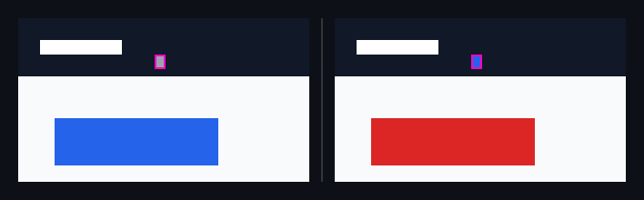

## 🗺️ StyleProof report

**2 computed-style difference(s)** across 1 distinct change(s) in 1 surface(s).

🆕 **1 new surface(s)** captured with no baseline to compare — shown below for reference. New surfaces don't block the check.

### `span.caret` · 1 element restyled

_home @ 900_

◀ before  ·  after ▶ — home @ 900

🔍 magenta boxes mark each change — changed: `span.caret`

🔬 magnified 5× — change too small to see at 1:1 — changed: `span.caret`

- **`span.caret`** — text gray (`#9ca3af`) → blue (`#2563eb`)

Show the property change

**`span.caret`**

Style:

| Property | Before | After |
| --- | --- | --- |
| `color` | `#9ca3af` | `#2563eb` |

### `button.cta` · 1 element restyled

_home @ 900_

◀ before  ·  after ▶ — home @ 900

🔍 magenta boxes mark each change — changed: `button.cta`

- **`button.cta`** — background blue (`#2563eb`) → red (`#dc2626`)

Show the property change

**`button.cta`**

Style:

| Property | Before | After |
| --- | --- | --- |
| `background-color` | `#2563eb` | `#dc2626` |

### `pricing@900` · new surface <!-- styleproof-new -->

_pricing @ 900_

after · pricing @ 900

_No baseline to compare against — this surface is new, so it doesn't block the check. It becomes part of the baseline once this merges._
