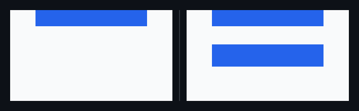
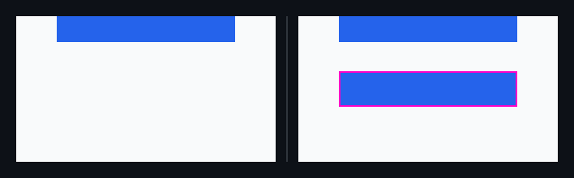
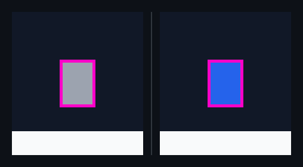
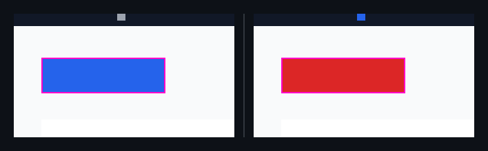
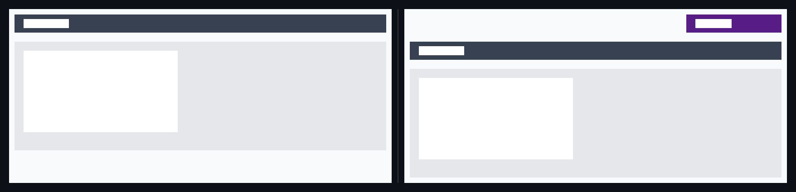
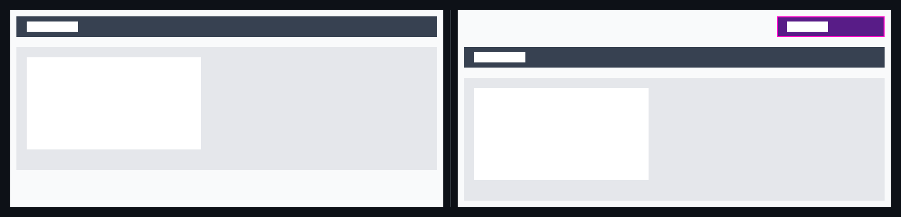

## 🗺️ StyleProof report

🆕 **1 new surface(s)** captured with no baseline to compare: `pricing @ 900`. Approve them before they become the baseline.

**5 DOM change(s) · 8 computed-style difference(s)** across 3 distinct change(s) in 3 changed surface bases with an existing baseline.
_**Surface base** = one product UI state; capture keys with `@width` or live-state/popup variants are width or state captures of that base._

## 🆕 New pages, states, or surfaces — review first

### `pricing@900` · new surface <!-- styleproof-new -->

_pricing @ 900_

after · pricing @ 900

_No baseline to compare against — this surface is new. Review and approve it before it becomes part of the baseline._

## Element-level changes

### `button.duplicate-control` · 1 element added

_duplicate-insertion @ 900_

◀ before  ·  after ▶ — duplicate-insertion @ 900

🔍 magenta boxes mark each change — changed: `button.duplicate-control`

- **1** element added

Show the property change

**Added** `button.duplicate-control`

Style:

| Property | Value |
| --- | --- |
| `background-color` | `#2563eb` |

### `span.caret` · 1 element restyled

_home @ 900_

◀ before  ·  after ▶ — home @ 900

🔍 magenta boxes mark each change — changed: `span.caret`

🔬 magnified 5× — change too small to see at 1:1 — changed: `span.caret`

- **`span.caret`** — text gray (`#9ca3af`) → blue (`#2563eb`)

Show the property change

**`span.caret`**

Style:

| Property | Before | After |
| --- | --- | --- |
| `color` | `#9ca3af` | `#2563eb` |

### `button.cta` · 1 element restyled

_home @ 900_

◀ before  ·  after ▶ — home @ 900

🔍 magenta boxes mark each change — changed: `button.cta`

- **`button.cta`** — background blue (`#2563eb`) → red (`#dc2626`)

Show the property change

**`button.cta`**

Style:

| Property | Before | After |
| --- | --- | --- |
| `background-color` | `#2563eb` | `#dc2626` |

### `div.toolbar` + 2 more · 3 elements added, 1 element removed, 2 elements restyled

_sibling-insertion @ 900_

◀ before  ·  after ▶ — sibling-insertion @ 900

🔍 magenta boxes mark each change — changed: `div.scope-switch`

- **1** element removed
- **3** elements added
- **`div.toolbar`** — background dark green (`#374151`) → dark indigo (`#581c87`)
- **`div.grid`** — background white (`#e5e7eb`) → dark green (`#374151`)

Show all 5 property changes

**`div.toolbar`**

Style:

| Property | Before | After |
| --- | --- | --- |
| `background-color` | `#374151` | `#581c87` |

**`div.grid`**

Style:

| Property | Before | After |
| --- | --- | --- |
| `background-color` | `#e5e7eb` | `#374151` |

**Removed** `article.card`

**Added** `button.filter`

Style:

| Property | Value |
| --- | --- |
| `color` | `#ffffff` |

**Added** `div.grid`

Style:

| Property | Value |
| --- | --- |
| `background-color` | `#e5e7eb` |

**Added** `article.card`

Style:

| Property | Value |
| --- | --- |
| `background-color` | `#ffffff` |

