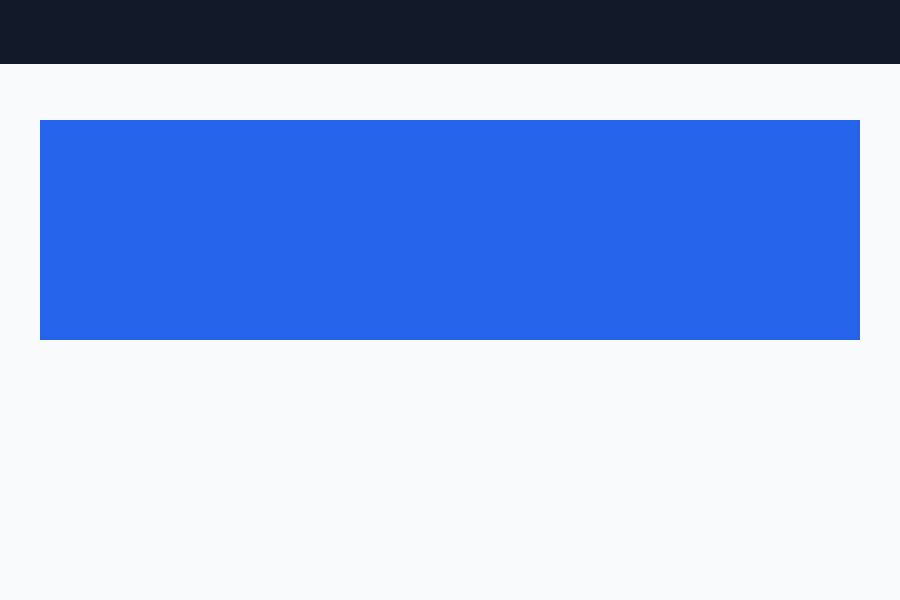
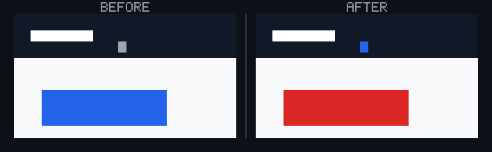
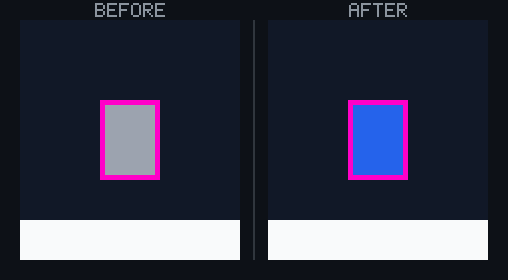
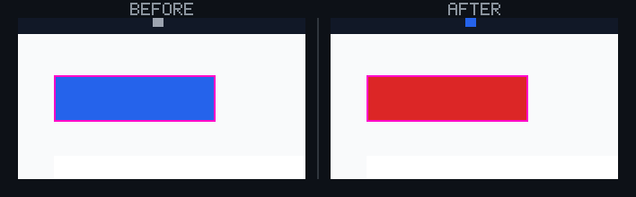

## 🗺️ StyleProof report

**Release confidence** — ⚠ not evaluated (no release-confidence manifest accompanied this comparison). The style comparison below stands on its own; release certification stays withheld.

⚠️ **Product-state comparison** — unproven on 3 undeclared legacy pair(s). Legacy compatibility preserves the existing visual-review path, but this is not proof that both captures reached the same product state.

🆕 **1 new surface(s)** captured with no baseline to compare: `pricing @ 900`. Approve them before they become the baseline.

**3 computed-style difference(s)** across 1 distinct change(s) in 1 changed surface base with an existing baseline.
_**Surface base** = one product UI state; capture keys with `@width` or live-state/popup variants are width or state captures of that base._

## 🆕 New pages, states, or surfaces — review first

### `pricing@900` · new surface <!-- styleproof-new -->

_pricing @ 900_

after · pricing @ 900

_No baseline to compare against — this surface is new. Review and approve it before it becomes part of the baseline._

## Element-level changes

### `span.caret` · 1 element restyled

_home @ 900_

`color` `#9ca3af` → `#2563eb`

◀ before  ·  after ▶ — home @ 900

🔍 magenta boxes mark each change — changed: `span.caret`

🔬 magnified 5× — change too small to see at 1:1 — changed: `span.caret`

- **`span.caret`** — text gray (`#9ca3af`) → blue (`#2563eb`)

Show the property change

**`span.caret`**

Style:

| Property | Before | After |
| --- | --- | --- |
| `color` | `#9ca3af` | `#2563eb` |

### `button.cta` · 1 element restyled

_home @ 900_

`background-color` `#2563eb` → `#dc2626`

◀ before  ·  after ▶ — home @ 900

🔍 magenta boxes mark each change — changed: `button.cta`

- **`button.cta`** — background blue (`#2563eb`) → red (`#dc2626`)

Show the property change

**`button.cta`**

Style:

| Property | Before | After |
| --- | --- | --- |
| `background-color` | `#2563eb` | `#dc2626` |

### `aside.off-canvas-status` · 1 element restyled

_home @ 900_

`opacity` `0.85` → `1`

_The changed element is not visible in the captured page (it is outside the screenshot canvas, hidden at this breakpoint, or background content behind an active modal), so a before/after crop would be misleading._

- **`aside.off-canvas-status`** — opacity 0.85 → 1

Show the property change

**`aside.off-canvas-status`**

Style:

| Property | Before | After |
| --- | --- | --- |
| `opacity` | `0.85` | `1` |

