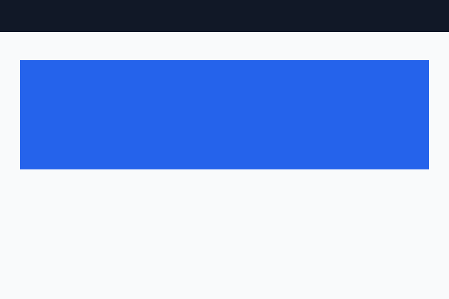
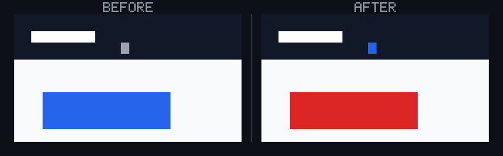
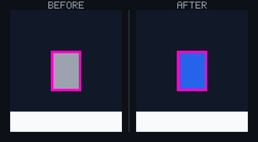
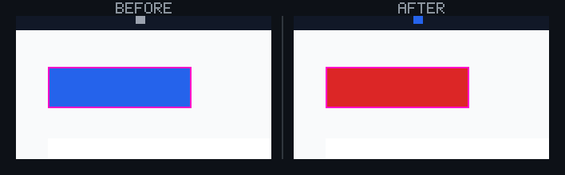
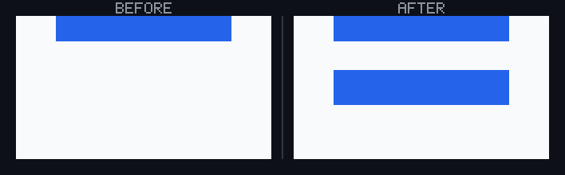
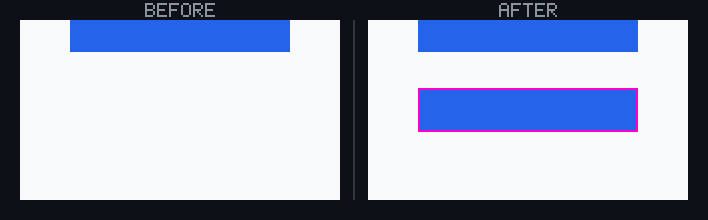
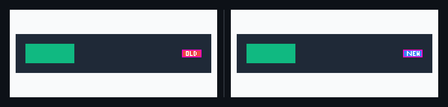
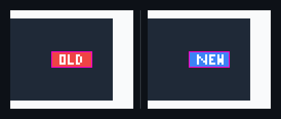
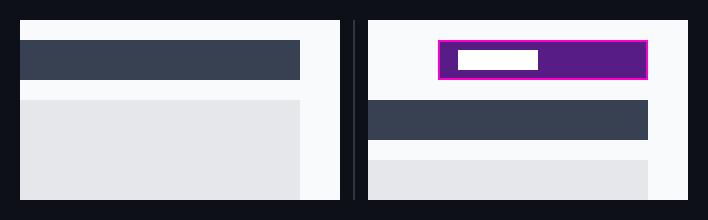

## 🗺️ StyleProof report

⚠️ **Product-state identity unproven** (undeclared legacy pair). Base and head used the same surface key, but product-state identity is unproven — treat the diff as visual-only, not a certified same-state compare.

**2 changes need review**

🆕 **1 new surface(s)** captured with no baseline to compare: `pricing @ 900`. These are reviewable first-adoption surfaces; approve them before they become the baseline.

**1 distinct change** (3 computed-style difference(s)) in 1 changed surface base with an existing baseline.

📝 _3 advisory content change(s) below — they don't affect the check._

## One-sided pages, states, or surfaces — review first

### `pricing@900` · new surface <!-- styleproof-new -->

_pricing @ 900_

after · pricing @ 900

_No baseline to compare against. This is a reviewable first-adoption surface; approve it before it becomes part of the baseline._

## Changes

### **Caret** `span.caret` · 1 element restyled

_home @ 900_

`color` `#9ca3af` → `#2563eb`

◀ before  ·  after ▶ — home @ 900

Show highlight overlay

🔍 magenta boxes mark each change — changed: `span.caret`

🔬 magnified 5× — change too small to see at 1:1 — changed: `span.caret`

- **`span.caret`** — text gray (`#9ca3af`) → blue (`#2563eb`)

Show the property change

**Caret** `span.caret`

Style:

| Property | Before | After |
| --- | --- | --- |
| `color` | `#9ca3af` | `#2563eb` |

### **Cta** `button.cta` · 1 element restyled

_home @ 900_

`background-color` `#2563eb` → `#dc2626`

◀ before  ·  after ▶ — home @ 900

Show highlight overlay

🔍 magenta boxes mark each change — changed: `button.cta`

- **`button.cta`** — background blue (`#2563eb`) → red (`#dc2626`)

Show the property change

**Cta** `button.cta`

Style:

| Property | Before | After |
| --- | --- | --- |
| `background-color` | `#2563eb` | `#dc2626` |

### **Off canvas status** `aside.off-canvas-status` · 1 element restyled

_home @ 900_

`opacity` `0.85` → `1`

_The changed element is not visible in the captured page (it is outside the screenshot canvas, hidden at this breakpoint, or background content behind an active modal), so a before/after crop would be misleading._

- **`aside.off-canvas-status`** — opacity 0.85 → 1

Show the property change

**Off canvas status** `aside.off-canvas-status`

Style:

| Property | Before | After |
| --- | --- | --- |
| `opacity` | `0.85` | `1` |

---

## 📝 Content and structure changes (advisory)

_3 content/structure change(s). **Advisory only** — content and DOM structure are not part of the computed-style certification and do not affect the check. Surfaced so copy, element, and reflow changes are visible when content comparison is enabled. Live/age/clock text (relative ages, clocks) is labeled below so it cannot be mistaken for a product style regression._

### `duplicate-insertion@900` · 1 content/structure change(s)

**`button.duplicate-control`**

- element added

◀ before  ·  after ▶ — duplicate-insertion@900

Show highlight overlay

🔍 magenta boxes mark the changed content

### `home@900` · 1 content/structure change(s)

**`span.content-label`**

- before: `Old`
- after: `New`

◀ before  ·  after ▶ — home@900

Show highlight overlay

🔍 magenta boxes mark the changed content

🔬 magnified 2×: content change too small to read at 1:1

### `sibling-insertion@900` · 1 content/structure change(s)

**`div.scope-switch`**

- element added

◀ before  ·  after ▶ — sibling-insertion@900

Show highlight overlay

🔍 magenta boxes mark the changed content

Evidence (warnings & failures)

⚠️ **Product-state comparison** — unproven on 3 undeclared legacy pair(s).

