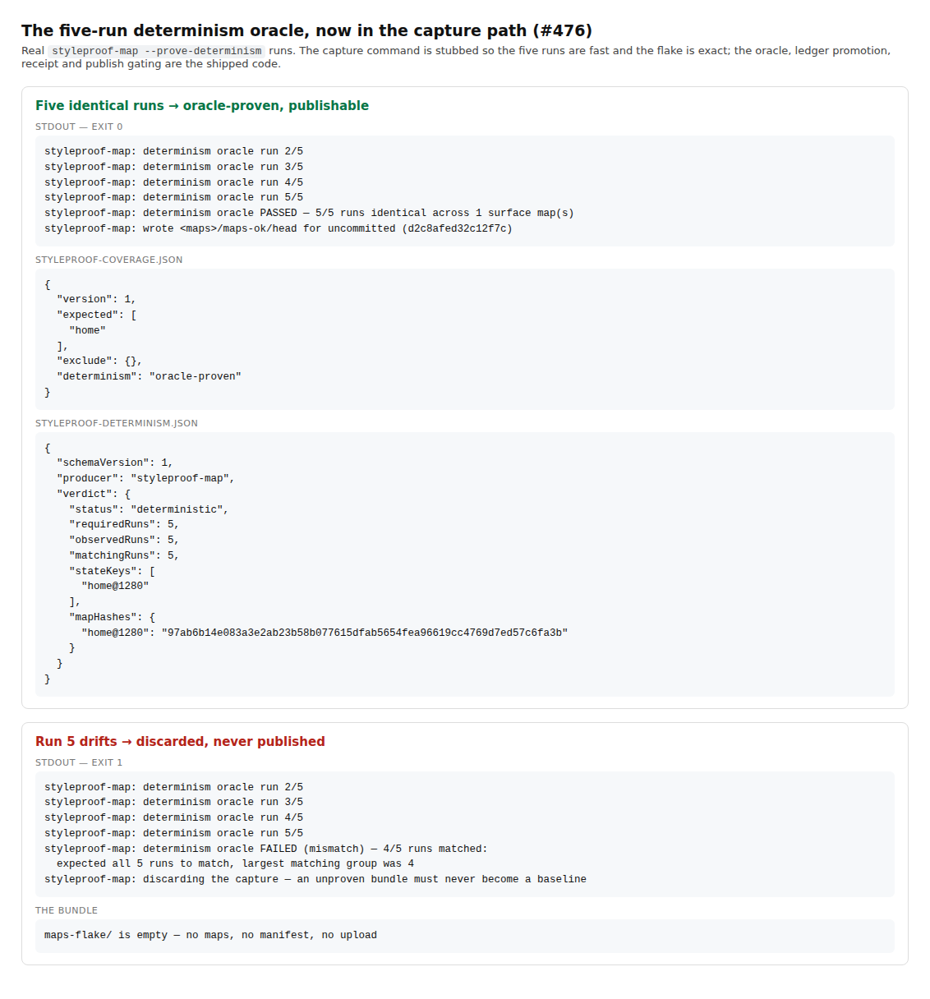

# Proof: the five-run determinism oracle runs in the capture path (#476)

`styleproof-map --prove-determinism`, both outcomes, from the real binary.



## What #476 actually found

The issue called the oracle "dead code" and an "unused proof". That is not quite
right, and the difference matters:

- The oracle **was** called — by `test/state-recipes-capture.e2e.spec.ts`, over five
  real fresh-context browser captures, on every CI run.
- CI **required** its receipt: `.github/workflows/ci.yml` fails if
  `test-results/determinism-oracle.json` is missing and uploads it for 30 days,
  and `test/ci-determinism-receipt.test.mjs` pins that wiring.

What was literally true is the issue's own first bullet: nothing in `src/runner.ts`
or any `bin/*.mjs` called it. So **StyleProof proved five-run determinism for its own
fixture, and no consumer could get that proof for their own surfaces.** Their
captures rested on the two-capture self-check alone.

Deleting the module would have destroyed a working, CI-exercised proof. Wiring it
into the product capture path closes the real gap.

## What the flag does

```bash
styleproof-map --prove-determinism
```

1. Captures the declared surface set five times, each into a fresh bundle.
2. Hashes every map canonically and runs `assessDeterminismOracle`.
3. On `deterministic`: writes `styleproof-determinism.json` beside the maps and
   records `determinism: oracle-proven` in the coverage ledger.
4. On `flake`: prints the diagnostics and **discards the bundle** — this happens
   before the manifest is stamped, so a nondeterministic capture can never be
   published or uploaded as a baseline.
5. Always deletes the four scratch bundles, on every exit path.

`oracle-proven` is the strongest of the four determinism bases and the gate accepts
it exactly like `self-checked`. It is the only basis that can see a flake which
happens to repeat twice.

## Cost

Five capture runs. That is inherent to a five-run oracle, which is why the flag is
opt-in and the default single run still self-checks.

## Reproducing

The transcript above stubs the capture command so the five runs are fast and the
drift is exact; the oracle, ledger promotion, receipt and publish gating are the
shipped code paths. The same two cases run in CI as
`test/determinism-oracle-cli.test.mjs`, and `test/determinism-oracle.test.mjs`
carries a regression guard asserting the capture CLI still calls the oracle before
writing the manifest.
