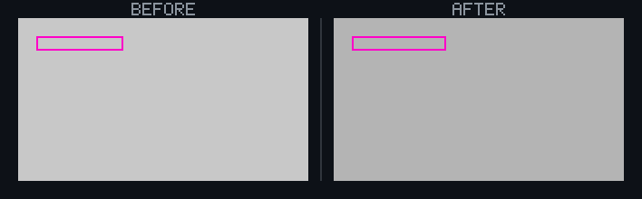

## 🗺️ StyleProof report

⚠️ **Product-state comparison** — unproven on 1 undeclared legacy pair(s). Legacy compatibility preserves the existing visual-review path, but this is not proof that both captures reached the same product state.

✓ No reviewable computed-style changes among semantically matched elements. See 1 advisory content/structure change(s) below.

---

## 📝 Content and structure changes (advisory)

_1 content/structure change(s). **Advisory only** — content and DOM structure are not part of the computed-style certification and do not affect the check. Surfaced so copy, element, and reflow changes are visible when content comparison is enabled. Live/age/clock text (relative ages, clocks) is labeled below so it cannot be mistaken for a product style regression._

### `dashboard@1280` · 1 content/structure change(s)

**`span.age.age`**

- **live/age/clock text** (advisory — clock or relative-age data, not a stylesheet edit)
- before: `open 102.1d`
- after: `open 103.1d`

◀ before  ·  after ▶ — dashboard@1280

🔍 magenta boxes mark the changed content
