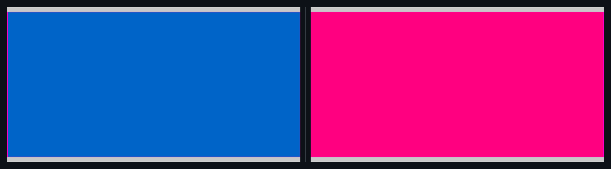

## 🗺️ StyleProof report

⚠️ **Product-state identity unproven** (undeclared legacy pair). Base and head used the same surface key, but product-state identity is unproven — treat the diff as visual-only, not a certified same-state compare.

**1 change needs review**

**1 distinct change** (1 computed-style difference(s)) in 1 changed surface base with an existing baseline.

## Changes

### **Band** `div.band` · 1 element restyled

_board @ 800_

`background-color` `#0064c8` → `#ff0080`

◀ before  ·  after ▶ — board @ 800

Show highlight overlay

🔍 magenta boxes mark each change — changed: `div.band`

- **`div.band`** — background blue (`#0064c8`) → magenta (`#ff0080`)

Show the property change

**Band** `div.band`

Style:

| Property | Before | After |
| --- | --- | --- |
| `background-color` | `#0064c8` | `#ff0080` |

_Nothing else — no other element or inventory changes in this compare._

Evidence (warnings & failures)

⚠️ **Product-state comparison** — unproven on 1 undeclared legacy pair(s).

