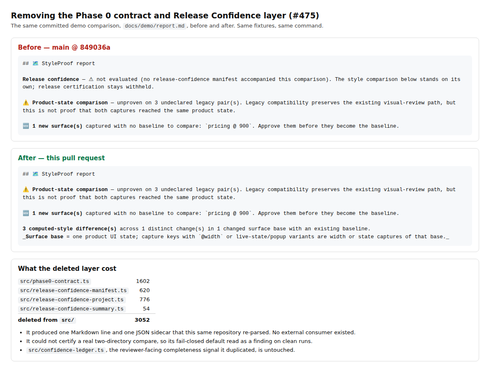

# Proof: the Phase 0 contract and Release Confidence layer are gone (#475)

The committed demo comparison (`docs/demo/report.md`), regenerated by
`npm run demo:report` from the same fixtures, before and after this change.



## What was deleted

| Module                               | Lines |
| ------------------------------------ | ----: |
| `src/phase0-contract.ts`             |  1602 |
| `src/release-confidence-manifest.ts` |   620 |
| `src/release-confidence-project.ts`  |   776 |
| `src/release-confidence-summary.ts`  |    54 |
| **Total from `src/`**                |  3052 |

Plus their two docs, seven test files, sixteen JSON fixtures, every `phase0*` and
`releaseConfidence*` package export, the `releaseConfidence` field in
`report.json`, the `styleproof-release-confidence.json` sidecar, the
`--manifest-digest` flag on `styleproof-publish-report`, and the Action's
`release-confidence-digest` output.

## Why

The layer validated a JSON document against itself and then wrapped it in a
digest. It produced one Markdown line and one JSON sidecar that this same
repository re-parsed, and no external consumer ever existed. It also could not
certify a real two-directory compare, so its fail-closed default read as a
finding on clean runs.

## What replaced it — nothing, on purpose

`src/confidence-ledger.ts` already carries the reviewer-facing completeness
signal the layer duplicated, and `docs/product-state-comparability.md` is still
the four-valued comparability clause. Both are untouched.

One real guarantee the layer was providing by accident is now stated directly in
`bin/styleproof-report.mjs`: an **unverified source binding** (no
`--expected-before-sha` / `--expected-after-sha`) exits 1 and is labelled
`⚠ UNVERIFIED DIAGNOSTIC`, which is what the CLI already printed. The exit code
and the label can no longer disagree.

## Verify it yourself

Two captures of the same page, compared with the real report CLI:

```
$ styleproof-capture <url> --out base --key home --widths 1280
$ styleproof-capture <url> --out head --key home --widths 1280
$ styleproof-report base head --out out
⚠ UNVERIFIED DIAGNOSTIC: no reviewable computed-style changes — content/structure not evaluated
report: out/report.md
exit 1
```

Nothing is printed on stderr, `out/report.md` contains no `Release confidence`
line, `out/report.json` has no `releaseConfidence` field, and no
`styleproof-release-confidence.json` is written. That run is asserted end to end
in `test/pr-surfacing.e2e.spec.ts`.

A **fully bound** clean compare (both trusted SHAs supplied) now exits 0 in
`styleproof-report` as well as `styleproof-diff`; the two disagreed on the same
two directories before this change. That is asserted in
`test/product-state-comparability-cli.test.mjs`.
