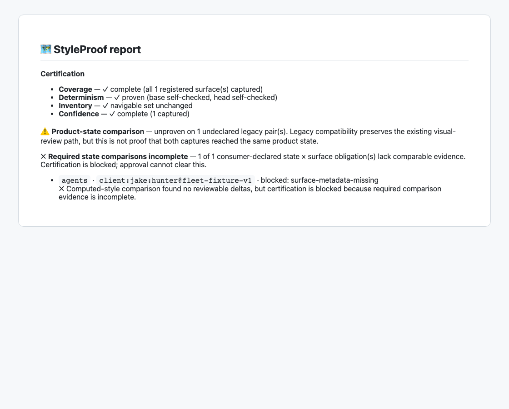

# Required state comparison proof

This fixture renders the fail-closed reviewer report when checked-in policy requires `client:jake:hunter` on the `agents` surface but both otherwise-identical capture bundles omit the declared surface and product-state metadata.

Source: [`blocked-report.md`](blocked-report.md). Generated with the production `styleproof-report` CLI. Expected exit: `1`. Approval cannot clear this certification failure.
