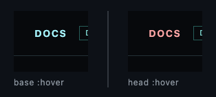
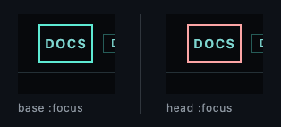
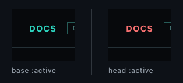

## 🗺️ StyleProof report

**5 computed-style difference(s) · 3 state-delta difference(s)** across 1 distinct change(s) in 1 changed surface base with an existing baseline.
_**Surface base** = one product UI state; capture keys with `@width` or live-state/popup variants are width or state captures of that base._

## Element-level changes

### `button.btn` · style and size

_demo-button @ 900_

`padding` `14px 28px` → `18px 32px` 
`border-color` `#38d6c6` → `#f87171` 
`background-color` `#14b8a6` → `#dc2626` 
`font-size` `13px` → `16px` 
`letter-spacing` `1.56px` → `1.92px`

◀ before  ·  after ▶ — Save at rest

🔍 magenta boxes mark each change — changed: `button.btn`

### `a.link` `:hover`

_Both sides are :hover. Left is the old :hover. Right is the new :hover._

`:hover` `color` `#a5f3fc` → `#fca5a5`

◀ base :hover  ·  head :hover ▶

### `a.link` `:focus`

_Both sides are :focus. Left is the old :focus. Right is the new :focus._

`:focus` `outline-color` `#5eead4` → `#fca5a5`

◀ base :focus  ·  head :focus ▶

### `a.link` `:active`

_Both sides are :active. Left is the old :active. Right is the new :active._

`:active` `color` `#2dd4bf` → `#f87171`

◀ base :active  ·  head :active ▶
