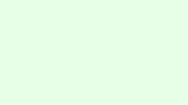

## 🗺️ StyleProof report

⚠️ **1 baseline capture failure(s)** — these surfaces failed on the **base branch** and were omitted from the baseline bundle. **Repair base capture** on the base branch; do not approve indefinitely as if they were greenfield new surfaces.
- `about@auto`: viewport detection failed on base

⚠️ **1 head surface(s)** have no base map because baseline capture failed (not first adoption): `about @ 320`.

## 🆕 New pages, states, or surfaces — review first

### `about@320` · new surface <!-- styleproof-new -->

_about @ 320_

after · about @ 320

_No baseline to compare against — this surface is new. Review and approve it before it becomes part of the baseline._

<!-- styleproof-receipt head-sha:fc612a63e4a91532917b7fc1a17492e8004dc1c9 run-id:29573570865 run-attempt:1 -->
