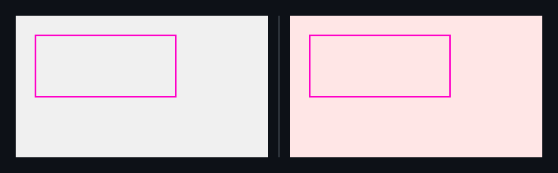

## 🗺️ StyleProof report

**1 computed-style difference(s)** across 1 distinct change(s) in 1 changed surface base with an existing baseline.
_**Surface base** = one product UI state; capture keys with `@width` or live-state/popup variants are width or state captures of that base._

## Element-level changes

### `main.panel` · 1 element restyled

_home @ 320_

◀ before  ·  after ▶ — home @ 320

🔍 magenta boxes mark each change — changed: `main.panel`

- **`main.panel`** — text black (`#000000`) → red (`#ff0000`)

Show the property change

**`main.panel`**

Style:

| Property | Before | After |
| --- | --- | --- |
| `color` | `#000000` | `#ff0000` |

<!-- styleproof-receipt head-sha:a7e34d38c0d002118149804b73c6be4002b573c9 run-id:30583952466 run-attempt:1 -->
