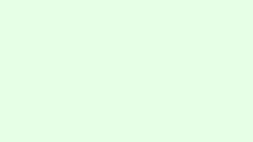

## 🗺️ StyleProof report

**Certification**
- **Coverage** — ✓ complete (all 2 registered surface(s) captured)
- **Determinism** — ✓ proven (base self-checked, head self-checked)
- **Inventory** — ✓ navigable set unchanged
- **Confidence** — ✓ complete (2 captured)

**Release confidence** — ✗ blocked (present; completeness; comparability-mismatch, connector-partial, integrity-mismatch)

**Product-state comparison** — ✓ comparable on 1 paired capture(s) using explicit consumer-owned identity.

⚠️ **1 baseline capture failure(s)** — these surfaces failed on the **base branch** and were omitted from the baseline bundle. **Repair base capture** on the base branch; do not approve indefinitely as if they were greenfield new surfaces. Failure details remain in the local capture manifest and are not echoed from untrusted artifacts.

⚠️ **1 head surface(s)** have no base map because baseline capture failed (not first adoption): `about @ 320`.

## 🆕 New pages, states, or surfaces — review first

### `about@320` · new surface <!-- styleproof-new -->

_about @ 320_

after · about @ 320

_No baseline to compare against — this surface is new. Review and approve it before it becomes part of the baseline._

<!-- styleproof-receipt head-sha:e06aa15ebd95db7f11ba11d78128fd7824ee36eb run-id:33682496107 run-attempt:1 -->
