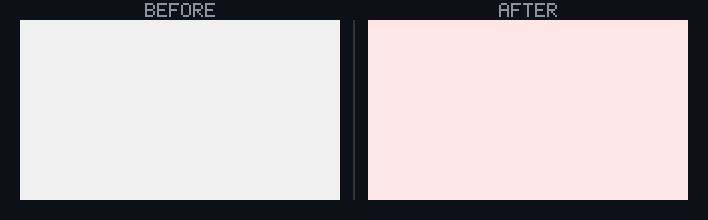
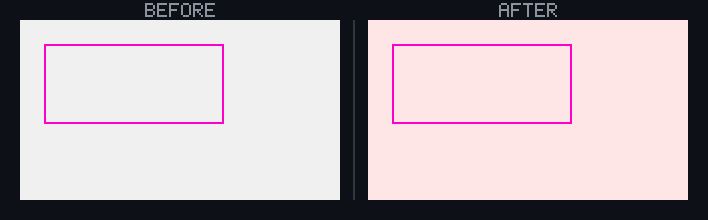

## 🗺️ StyleProof report

**Certification**
- **Coverage** — ✓ complete (all 1 registered surface(s) captured)
- **Determinism** — ✓ proven (base self-checked, head self-checked)
- **Inventory** — ⚠ not checked (no captured map carried an inventory — set `inventory: true` in the capture spec to arm the navigable-removal gate)
- **Confidence** — ✓ complete (1 captured)

**Product-state comparison** — ✓ comparable on 1 paired capture(s) using explicit consumer-owned identity.

**1 computed-style difference(s)** across 1 distinct change(s) in 1 changed surface base with an existing baseline.
_**Surface base** = one product UI state; capture keys with `@width` or live-state/popup variants are width or state captures of that base._

## Element-level changes

### `main.panel` · 1 element restyled

_home @ 320_

`color` `#000000` → `#ff0000`

◀ before  ·  after ▶ — home @ 320

🔍 magenta boxes mark each change — changed: `main.panel`

- **`main.panel`** — text black (`#000000`) → red (`#ff0000`)

Show the property change

**`main.panel`**

Style:

| Property | Before | After |
| --- | --- | --- |
| `color` | `#000000` | `#ff0000` |

<!-- styleproof-receipt head-sha:f2b6bf3c654cc9fb0706e8e387e7d88d62a68d92 run-id:34411871777 run-attempt:1 -->
