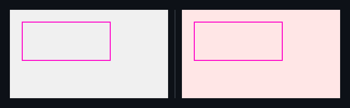

## 🗺️ StyleProof report

**1 change needs review**

**1 distinct change** (1 computed-style difference(s)) in 1 changed surface base with an existing baseline.

## Changes

### **Panel** `main.panel` · 1 element restyled

_home @ 320_

`color` `#000000` → `#ff0000`

◀ before  ·  after ▶ — home @ 320

Show highlight overlay

🔍 magenta boxes mark each change — changed: `main.panel`

- **`main.panel`** — text black (`#000000`) → red (`#ff0000`)

Show the property change

**Panel** `main.panel`

Style:

| Property | Before | After |
| --- | --- | --- |
| `color` | `#000000` | `#ff0000` |

Evidence (warnings & failures)

**Certification**
- **Inventory** — ⚠ not checked (no captured map carried an inventory — set `inventory: true` in the capture spec to arm the navigable-removal gate)

<!-- styleproof-receipt head-sha:eb801558328386602f60aba0be60ca2cc5b5343a run-id:36979867645 run-attempt:1 -->
