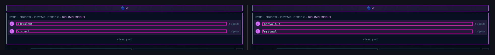
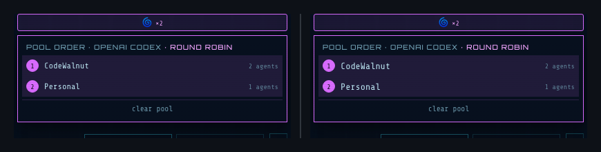
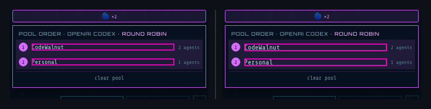

## 🗺️ StyleProof report

**Certification**
- **Coverage** — ✓ complete (all 41 registered surface(s) captured)
- **Determinism** — ✓ proven (base self-checked, head replayed)
- **Inventory** — ✓ navigable set unchanged
- **Data residue** — ✗ 12 failing data endpoint(s), unacknowledged: agentnet-comparison-drawer·/api/agent/avatar, agents-configuration-profile·/api/agent/avatar, agents-create-dialog·/api/agent/avatar, agents-cron-continuable-brief·/api/agent/avatar, agents-roster-team-badge-after-assignment·/api/agent/avatar, agents-scaffold-run-dialog·/api/agent/avatar, agents·/api/agent/avatar, credential-recovery-modal·/api/agent/avatar, …

**4 DOM change(s) · 32 computed-style difference(s)** across 2 distinct change(s) in 1 changed surface base (3 variants) with an existing baseline.
_**Surface base** = one product UI state; capture keys with `@width` or live-state/popup variants are width or state captures of that base._

## Element-level changes

### `div.flex` + 1 more · 2 elements added, 4 elements restyled

_Identical across 2 surfaces: model-config-pool-popover @ 1024, 768_

◀ before  ·  after ▶ — model-config-pool-popover @ 1024

🔍 magenta boxes mark each change — changed: `span.flex-[1]`

- **2** elements added
- **`button.flex`** ×2 — background magenta (`rgba(217, 107, 255, 0.12)`) → transparent, border colour `text` (`#bfe9f5`) → black (`#000000`), text size 12px → 13.3333px, +2 more
- **`span`** ×2 — text size 12px → 13.3333px

Show all 46 property changes

**Added** `div.flex` ×2

Style inventory (head-side — no baseline):

| Property | Value |
| --- | --- |
| `display` | `flex` |
| `align-items` | `center` |
| `gap` | `8px` |
| `border-color` | `#bfe9f5` |
| `background-color` | `rgba(217, 107, 255, 0.12)` |
| `color` | `#bfe9f5` |
| `font-family` | `"Share Tech Mono", ui-monospace, monospace` |
| `font-size` | `12px` |
| `font-weight` | `500` |
| `text-align` | `left` |
| `-webkit-font-smoothing` | `antialiased` |
| `-webkit-locale` | `"en"` |
| `box-sizing` | `border-box` |
| `row-rule-color` | `#bfe9f5` |
| `transition-property` | `none` |

**`button.flex`** ×2

Style:

| Property | Before | After |
| --- | --- | --- |
| `border-style` | `none` | `outset` |
| `border-color` | `#bfe9f5` | `#000000` |
| `background-color` | `rgba(217, 107, 255, 0.12)` | `transparent` |
| `font-size` | `12px` | `13.3333px` |
| `flex-basis` | `auto` | `0%` |
| `flex-grow` | `0` | `1` |
| `min-block-size` | `0px` | `auto` |

**`span`** ×2

Style:

| Property | Before | After |
| --- | --- | --- |
| `font-size` | `12px` | `13.3333px` |

### `div.flex` + 1 more · 2 elements added, 4 elements restyled

_model-config-pool-popover @ 1440_

◀ before  ·  after ▶ — model-config-pool-popover @ 1440

🔍 magenta boxes mark each change — changed: `span.flex-[1]`

- **2** elements added
- **`button.flex`** ×2 — background magenta (`rgba(217, 107, 255, 0.12)`) → transparent, border colour `text` (`#bfe9f5`) → black (`#000000`), text size 12px → 13.3333px, +2 more
- **`span`** ×2 — text size 12px → 13.3333px

Show all 46 property changes

**Added** `div.flex` ×2

Style inventory (head-side — no baseline):

| Property | Value |
| --- | --- |
| `display` | `flex` |
| `align-items` | `center` |
| `gap` | `8px` |
| `border-color` | `#bfe9f5` |
| `background-color` | `rgba(217, 107, 255, 0.12)` |
| `color` | `#bfe9f5` |
| `font-family` | `"Share Tech Mono", ui-monospace, monospace` |
| `font-size` | `12px` |
| `font-weight` | `500` |
| `text-align` | `left` |
| `-webkit-font-smoothing` | `antialiased` |
| `-webkit-locale` | `"en"` |
| `box-sizing` | `border-box` |
| `row-rule-color` | `#bfe9f5` |
| `transition-property` | `none` |

**`button.flex`** ×2

Style:

| Property | Before | After |
| --- | --- | --- |
| `border-style` | `none` | `outset` |
| `border-color` | `#bfe9f5` | `#000000` |
| `background-color` | `rgba(217, 107, 255, 0.12)` | `transparent` |
| `font-size` | `12px` | `13.3333px` |
| `flex-basis` | `auto` | `0%` |
| `flex-grow` | `0` | `1` |
| `min-block-size` | `0px` | `auto` |

**`span`** ×2

Style:

| Property | Before | After |
| --- | --- | --- |
| `font-size` | `12px` | `13.3333px` |

