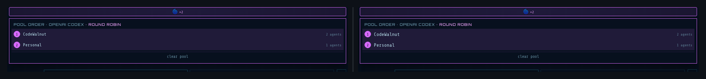
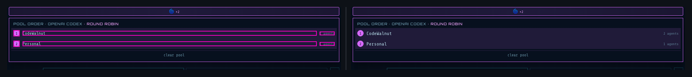
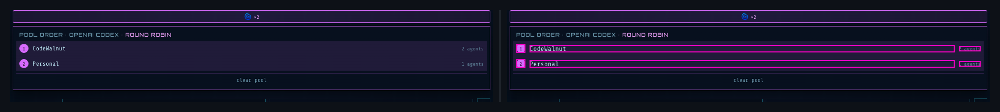
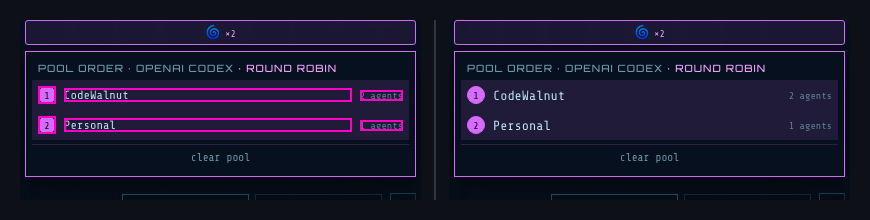
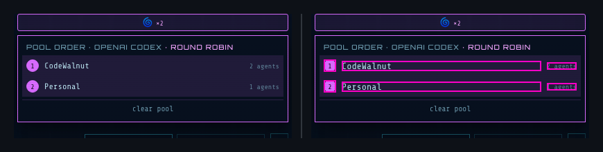

## 🗺️ StyleProof report

**Certification**
- **Coverage** — ✓ complete (all 41 registered surface(s) captured)
- **Determinism** — ✓ proven (base self-checked, head replayed)
- **Inventory** — ✓ navigable set unchanged
- **Data residue** — ✗ 12 failing data endpoint(s), unacknowledged: agentnet-comparison-drawer·/api/agent/avatar, agents-configuration-profile·/api/agent/avatar, agents-create-dialog·/api/agent/avatar, agents-cron-continuable-brief·/api/agent/avatar, agents-roster-team-badge-after-assignment·/api/agent/avatar, agents-scaffold-run-dialog·/api/agent/avatar, agents·/api/agent/avatar, credential-recovery-modal·/api/agent/avatar, …

**36 DOM change(s) · 360 computed-style difference(s) · 12 state-delta difference(s)** across 2 distinct change(s) in 1 changed surface base (3 variants) with an existing baseline.
_**Surface base** = one product UI state; capture keys with `@width` or live-state/popup variants are width or state captures of that base._

## Element-level changes

### `button.flex` + 1 more · 8 elements removed

_Identical across 2 surfaces: model-config-pool-popover @ 1024, 768_

◀ before  ·  after ▶ — model-config-pool-popover @ 1024

🔍 magenta boxes mark each change — changed: `span.inline-flex`, `span.flex-[1]`, `span.text-[color:var(--text-faint)]`

- **8** elements removed
- interaction states changed: `:focus`

Show all 2 property changes

**Removed** `button.flex` ×2

**Removed** `span.inline-flex` ×2

**Removed** `span` ×4

### `div.flex` + 1 more · 10 elements added

_Identical across 2 surfaces: model-config-pool-popover @ 1024, 768_

◀ before  ·  after ▶ — model-config-pool-popover @ 1024

🔍 magenta boxes mark each change — changed: `span.inline-flex`, `span.flex-[1]`, `span.text-[color:var(--text-faint)]`

- **10** elements added
- interaction states changed: `:focus`, `:active`

Show all 184 property changes

**Added** `div.flex` ×2

Style:

| Property | Value |
| --- | --- |
| `display` | `flex` |
| `align-items` | `center` |
| `gap` | `8px` |
| `border-color` | `#bfe9f5` |
| `background-color` | `rgba(217, 107, 255, 0.12)` |
| `color` | `#bfe9f5` |
| `font-family` | `"Share Tech Mono", ui-monospace, monospace` |
| `font-size` | `12px` |
| `font-weight` | `500` |
| `text-align` | `left` |
| `-webkit-font-smoothing` | `antialiased` |
| `-webkit-locale` | `"en"` |
| `box-sizing` | `border-box` |
| `row-rule-color` | `#bfe9f5` |
| `transition-property` | `none` |

**Added** `button.flex` ×2

Style:

| Property | Value |
| --- | --- |
| `display` | `flex` |
| `align-items` | `center` |
| `gap` | `8px` |
| `border-width` | `0px` |
| `background-color` | `transparent` |
| `color` | `#bfe9f5` |
| `font-family` | `"Share Tech Mono", ui-monospace, monospace` |
| `text-align` | `left` |
| `-webkit-font-smoothing` | `antialiased` |
| `-webkit-locale` | `"en"` |
| `cursor` | `pointer` |
| `flex-basis` | `0%` |
| `flex-grow` | `1` |
| `min-block-size` | `auto` |
| `padding-bottom` | `6px` |
| `padding-top` | `6px` |
| `row-rule-color` | `#bfe9f5` |
| `transition-property` | `none` |

Interactive states:

| State | Property | Value |
| --- | --- | --- |
| `:focus` | `outline` | `1px auto rgb(0, 95, 204)` |
| `:active` | `border-style` | `inset` |

**Added** `span.inline-flex` ×2

Style:

| Property | Value |
| --- | --- |
| `display` | `flex` |
| `justify-content` | `center` |
| `align-items` | `center` |
| `border-width` | `1px` |
| `border-style` | `solid` |
| `border-color` | `#d96bff` |
| `border-radius` | `50%` |
| `background-color` | `#d96bff` |
| `color` | `#03070e` |
| `font-family` | `"Share Tech Mono", ui-monospace, monospace` |
| `font-size` | `10px` |
| `text-align` | `left` |
| `-webkit-font-smoothing` | `antialiased` |
| `-webkit-locale` | `"en"` |
| `box-sizing` | `border-box` |
| `cursor` | `pointer` |
| `flex-shrink` | `0` |
| `min-block-size` | `auto` |
| `min-inline-size` | `auto` |
| `row-rule-color` | `#03070e` |
| `transition-property` | `none` |

**Added** `span` ×2

Style:

| Property | Value |
| --- | --- |
| `display` | `block` |
| `border-color` | `#bfe9f5` |
| `color` | `#bfe9f5` |
| `font-family` | `"Share Tech Mono", ui-monospace, monospace` |
| `font-size` | `13.3333px` |
| `text-align` | `left` |
| `-webkit-font-smoothing` | `antialiased` |
| `-webkit-locale` | `"en"` |
| `box-sizing` | `border-box` |
| `cursor` | `pointer` |
| `flex-basis` | `0%` |
| `flex-grow` | `1` |
| `min-block-size` | `auto` |
| `overflow-block` | `hidden` |
| `overflow-inline` | `hidden` |
| `overflow-x` | `hidden` |
| `overflow-y` | `hidden` |
| `row-rule-color` | `#bfe9f5` |
| `text-overflow` | `ellipsis` |
| `text-wrap-mode` | `nowrap` |
| `transition-property` | `none` |

**Added** `span` ×2

Style:

| Property | Value |
| --- | --- |
| `display` | `block` |
| `border-color` | `#61869b` |
| `color` | `#61869b` |
| `font-family` | `"Share Tech Mono", ui-monospace, monospace` |
| `font-size` | `10px` |
| `text-align` | `left` |
| `-webkit-font-smoothing` | `antialiased` |
| `-webkit-locale` | `"en"` |
| `box-sizing` | `border-box` |
| `cursor` | `pointer` |
| `min-block-size` | `auto` |
| `min-inline-size` | `auto` |
| `row-rule-color` | `#61869b` |
| `text-wrap-mode` | `nowrap` |
| `transition-property` | `none` |

### `button.flex` + 1 more · 8 elements removed

_model-config-pool-popover @ 1440_

◀ before  ·  after ▶ — model-config-pool-popover @ 1440

🔍 magenta boxes mark each change — changed: `span.inline-flex`, `span.flex-[1]`, `span.text-[color:var(--text-faint)]`

- **8** elements removed
- interaction states changed: `:focus`

Show all 2 property changes

**Removed** `button.flex` ×2

**Removed** `span.inline-flex` ×2

**Removed** `span` ×4

### `div.flex` + 1 more · 10 elements added

_model-config-pool-popover @ 1440_

◀ before  ·  after ▶ — model-config-pool-popover @ 1440

🔍 magenta boxes mark each change — changed: `span.inline-flex`, `span.flex-[1]`, `span.text-[color:var(--text-faint)]`

- **10** elements added
- interaction states changed: `:focus`, `:active`

Show all 184 property changes

**Added** `div.flex` ×2

Style:

| Property | Value |
| --- | --- |
| `display` | `flex` |
| `align-items` | `center` |
| `gap` | `8px` |
| `border-color` | `#bfe9f5` |
| `background-color` | `rgba(217, 107, 255, 0.12)` |
| `color` | `#bfe9f5` |
| `font-family` | `"Share Tech Mono", ui-monospace, monospace` |
| `font-size` | `12px` |
| `font-weight` | `500` |
| `text-align` | `left` |
| `-webkit-font-smoothing` | `antialiased` |
| `-webkit-locale` | `"en"` |
| `box-sizing` | `border-box` |
| `row-rule-color` | `#bfe9f5` |
| `transition-property` | `none` |

**Added** `button.flex` ×2

Style:

| Property | Value |
| --- | --- |
| `display` | `flex` |
| `align-items` | `center` |
| `gap` | `8px` |
| `border-width` | `0px` |
| `background-color` | `transparent` |
| `color` | `#bfe9f5` |
| `font-family` | `"Share Tech Mono", ui-monospace, monospace` |
| `text-align` | `left` |
| `-webkit-font-smoothing` | `antialiased` |
| `-webkit-locale` | `"en"` |
| `cursor` | `pointer` |
| `flex-basis` | `0%` |
| `flex-grow` | `1` |
| `min-block-size` | `auto` |
| `padding-bottom` | `6px` |
| `padding-top` | `6px` |
| `row-rule-color` | `#bfe9f5` |
| `transition-property` | `none` |

Interactive states:

| State | Property | Value |
| --- | --- | --- |
| `:focus` | `outline` | `1px auto rgb(0, 95, 204)` |
| `:active` | `border-style` | `inset` |

**Added** `span.inline-flex` ×2

Style:

| Property | Value |
| --- | --- |
| `display` | `flex` |
| `justify-content` | `center` |
| `align-items` | `center` |
| `border-width` | `1px` |
| `border-style` | `solid` |
| `border-color` | `#d96bff` |
| `border-radius` | `50%` |
| `background-color` | `#d96bff` |
| `color` | `#03070e` |
| `font-family` | `"Share Tech Mono", ui-monospace, monospace` |
| `font-size` | `10px` |
| `text-align` | `left` |
| `-webkit-font-smoothing` | `antialiased` |
| `-webkit-locale` | `"en"` |
| `box-sizing` | `border-box` |
| `cursor` | `pointer` |
| `flex-shrink` | `0` |
| `min-block-size` | `auto` |
| `min-inline-size` | `auto` |
| `row-rule-color` | `#03070e` |
| `transition-property` | `none` |

**Added** `span` ×2

Style:

| Property | Value |
| --- | --- |
| `display` | `block` |
| `border-color` | `#bfe9f5` |
| `color` | `#bfe9f5` |
| `font-family` | `"Share Tech Mono", ui-monospace, monospace` |
| `font-size` | `13.3333px` |
| `text-align` | `left` |
| `-webkit-font-smoothing` | `antialiased` |
| `-webkit-locale` | `"en"` |
| `box-sizing` | `border-box` |
| `cursor` | `pointer` |
| `flex-basis` | `0%` |
| `flex-grow` | `1` |
| `min-block-size` | `auto` |
| `overflow-block` | `hidden` |
| `overflow-inline` | `hidden` |
| `overflow-x` | `hidden` |
| `overflow-y` | `hidden` |
| `row-rule-color` | `#bfe9f5` |
| `text-overflow` | `ellipsis` |
| `text-wrap-mode` | `nowrap` |
| `transition-property` | `none` |

**Added** `span` ×2

Style:

| Property | Value |
| --- | --- |
| `display` | `block` |
| `border-color` | `#61869b` |
| `color` | `#61869b` |
| `font-family` | `"Share Tech Mono", ui-monospace, monospace` |
| `font-size` | `10px` |
| `text-align` | `left` |
| `-webkit-font-smoothing` | `antialiased` |
| `-webkit-locale` | `"en"` |
| `box-sizing` | `border-box` |
| `cursor` | `pointer` |
| `min-block-size` | `auto` |
| `min-inline-size` | `auto` |
| `row-rule-color` | `#61869b` |
| `text-wrap-mode` | `nowrap` |
| `transition-property` | `none` |

